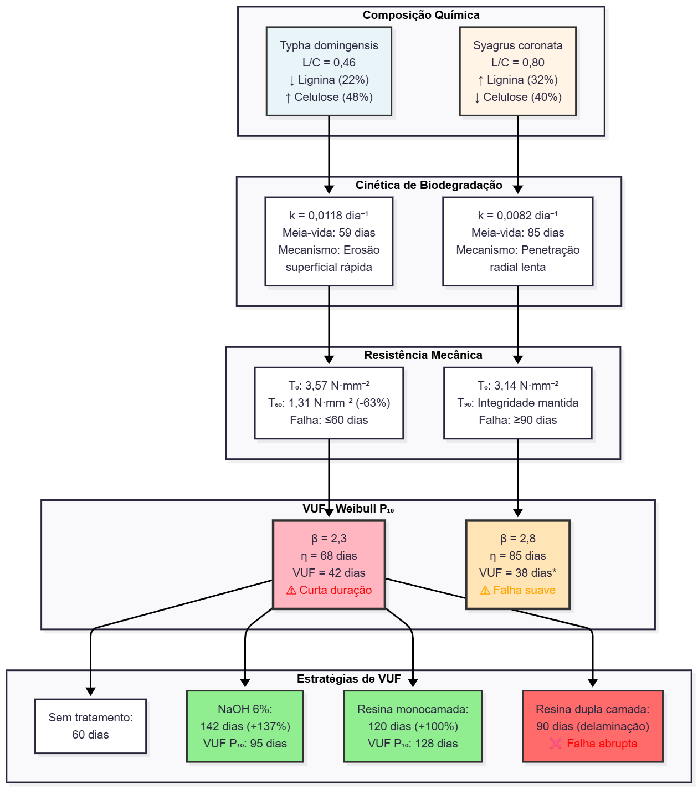
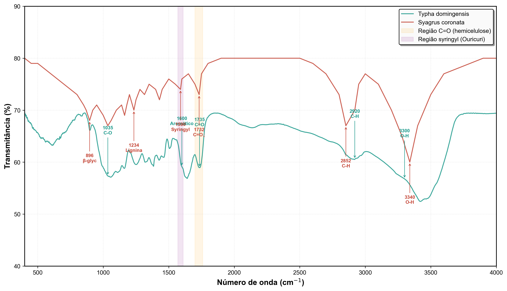
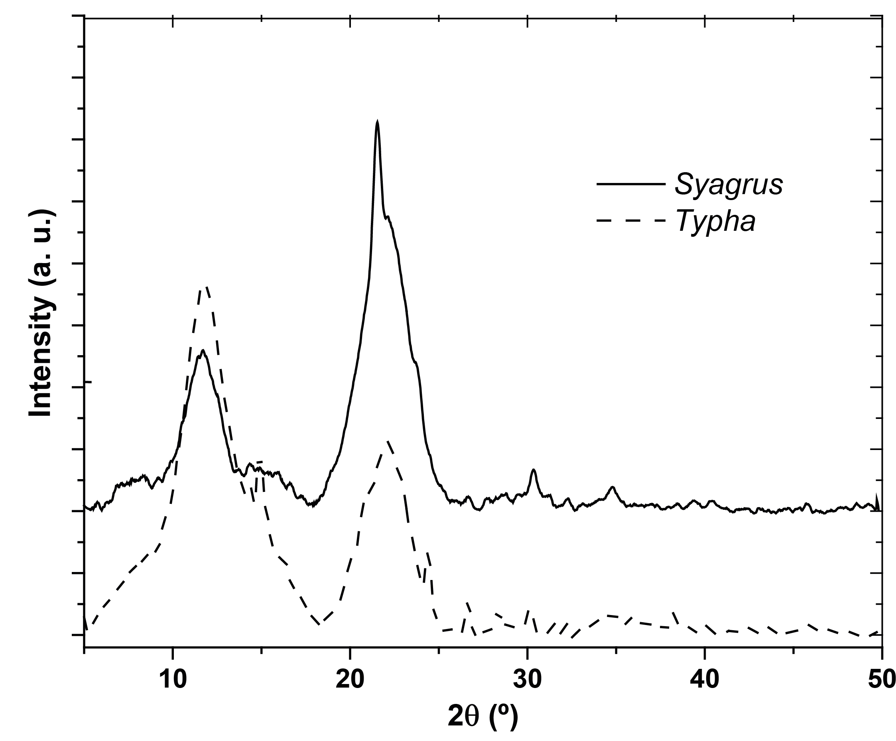

---
title: "Arquitetura química e confiabilidade de geotêxteis lignocelulósicos sob análise de desempenho, degradação e modelagem probabilística"
author: "Diego Vidal"
bibliography: referencias.bib
csl: apa.csl
reference-doc: modelo_formatacao.docx
fig-align: center
table-align: center
lang: pt-br
---
## Resumo

A degradação de solos tropicais e os passivos de microplásticos de geossintéticos convencionais exigem soluções de bioengenharia com materiais renováveis e funcionalidade temporizada. Esta revisão tem como objetivo integrar evidências experimentais e teóricas acerca da relação entre a arquitetura química das fibras lignocelulósicas e a confiabilidade funcional de geotêxteis naturais. Em fibras naturais, a recalcitrância diferencial explica janelas de serviço entre 60 e 180 dias, com mercerização alcalina a 6% NaOH promovendo reorganização morfoestrutural e aumento de resistência, estendendo a VUF ao patamar crítico de estabelecimento vegetativo. Tratamentos de superfície por resinas mostram efeitos não lineares em que a aplicação monocamada retardou a degradação em campo até ≈120 dias, enquanto sobreposições duplicadas tenderam à delaminação precoce sob ciclos de chuva e radiação. Em envelhecimento UV acelerado, compósitos Typha–Ramie mantiveram estabilidade na resistência à tração, com queda primária na ductilidade, e conservaram resistência à punção com redução do espalhamento multiaxial, funções de Weibull evidenciaram confiabilidade prática ao longo do período necessário para cobertura vegetal. Esses resultados sustentam o uso de geocompostos multicamadas como infraestrutura verde auditável, sincronizando persistência material, drenagem e promoção de revegetação. A degradação programada atuou como atributo funcional ao catalisar sinergias biogeoquímicas, incremento de agregados estáveis, maior densidade de hifas e acúmulo de carbono orgânico, com co-benefícios de retenção hídrica e rápido enraizamento. Os geotêxteis naturais com engenharia de superfície e projeto por confiabilidade Weibull ($P_{10}$)  alcançam desempenho mecânico suficiente na janela de 90–150 dias, reduzem externalidades ambientais e habilitam a substituição de geossintéticos fósseis em bioengenharia de solos tropicais.

**Palavras-chave**: Biotêxteis; bioengenharia de solos; Vida Útil Funcional; morfometria quantitativa.

## 1. Introdução

### 1.1. A necessidade imperativa da bioengenharia sustentável do solo

A degradação do solo em regiões tropicais opera através de mecanismos distintos daqueles observados em contextos temperados. Segundo @Brady2009, regimes de precipitação elevada conjugados com Oxissolos intemperizados e mineralização acelerada de matéria orgânica sob temperaturas elevadas resultam em taxas de perda excedendo nos biomas Caatinga e Cerrado, conforme documentado por @Lammel2015, representando depleção biogeoquímica que compromete tanto matriz física quanto reservatórios nutricionais essenciais à produtividade agrícola [@Cardoso2006]. A predominância de minerais argilosos 1:1 na pedogênese tropical, conjugada com baixo teor de carbono orgânico do solo (<1,5% nos horizontes superficiais), produz solos de mínima coesão estrutural. @Brady2009 e @Bispo2017 demonstraram que essa estrutura debilitada torna os solos vulneráveis à erosão por impacto de gotas de chuva e transporte laminar durante tempestades convectivas.

A resistência ao cisalhamento do solo não coeso, quantificada pelo ângulo de atrito interno efetivo dependente de granulometria e densidade [@Wu1979; @Veylon2015], torna-se particularmente deficiente em Neossolos Quartzarênicos de margens fluviais tropicais. Trabalhando com esses solos, @Mahannopkul2019 caracterizaram sua baixa coesão, alta porosidade e resistência mecânica limitada. Essa vulnerabilidade geotécnica manifesta-se de forma crítica em taludes com inclinação superior a 25°, onde o fator de segurança frequentemente permanece inferior a 1,0. Conforme observado por @Mahannopkul2019 e @Islam2013, essa configuração resulta em instabilidade incipiente durante períodos chuvosos quando o aumento da pressão de poros reduz a tensão normal efetiva, precipitando falhas por escorregamento. Consequentemente, @Islam2013 demonstraram que a capacidade de carga admissível de fundações superficiais fica limitada a 50–100 kPa, restringindo drasticamente as opções de estruturas de reforço convencionais.

Essa vulnerabilidade geotécnica aumenta sob ação antrópica. Segundo @Borrelli2017, a perda irreversível da camada superficial do solo, concentradora de fósforo e nitrogênio biodisponíveis, conjuga-se com eutrofização induzida pela sedimentação em ecossistemas fluviais a jusante, comprometendo a qualidade hídrica regional. Na região semiárida brasileira, a produção de sedimentos em encostas degradadas pode atingir 45 Mg·ha⁻¹ durante a estação chuvosa (aproximadamente 90 dias), excedendo a taxa pedogênica em duas ordens de magnitude, representando dissipação de séculos de ciclos biogeoquímicos sem perspectivas de restauração ecológica em escalas temporais humanas [@Vannoppen2017, @Niu2017].

Diante dessa realidade, respostas tecnológicas tradicionais recorreram predominantemente a geossintéticos derivados do petróleo. Conforme revisado por @Holanda2021, polipropileno, polietileno e tereftalato de polietileno caracterizam-se por alta resistência e estabilização UV mediante benzotriazol, consolidando dependência de matérias-primas não renováveis.

A durabilidade desses materiais revela-se através de três modos de falha. Ruptura por tensão excessiva ocorre com deformação plástica seguida de endurecimento por orientação molecular [@Carneiro2018]. Creep manifesta-se como deformação progressiva sob carga sustentada, resultando em perda gradual de funcionalidade ao longo de décadas [@BarreiraPinto2023]. Degradação por radiação UV sob irradiância tropical (5–8 kWh·m⁻²·dia⁻¹, espectros 280–350 nm) reduz progressivamente a resistência à tração [@Carneiro2017;@Franco2022], conforme especificações ISO 10319 e ASTM D4595.

Esse paradigma revela contradição estrutural, visto que materiais concebidos para persistência multidecadal em aterros sanitários e sub-bases viárias apresentam uma vida útil projetada entre 30–50 anos [@BarreiraPinto2023], impondo passivos ambientais de longo prazo quando implantados em sistemas agroecológicos [@Bhatia2010]. Trabalhando com geotêxteis de polipropileno, @Ibanez2014 e @Konvalinkova2015 observaram alta recalcitrância sob condições anaeróbicas, com fragmentação mecânica gradual em microplásticos (<5 mm) cuja infiltração nas teias tróficas edáficas compromete simbioses microbianas e provoca posterior rearranjo da microbiota do solo.

@Bai2022 quantificaram densidades médias de 349±137 partículas·kg⁻¹ em solos cobertos após exposição UV, com emissões anuais estimadas em milhares de toneladas para ambientes marinhos, evidenciando transferência trófica em ecossistemas terrestres e aquáticos adjacentes. Essa limitação dos materiais sintéticos torna a persistência temporária controlada um atributo funcional estratégico para aplicações em bioengenharia. Enquanto geotêxteis sintéticos resistem à biodegradação por décadas, @Chakravarthy2021 e @Midha2017 demonstraram que fibras lignocelulósicas apresentam degradação progressiva em 6–18 meses, compatível com estabelecimento de sistemas radiculares permanentes.

Estudos de durabilidade revelam que geotêxteis de fibras naturais tratadas com emulsões betuminosas mantêm 82–85% da resistência inicial após 90 dias de exposição edáfica [@Thakur2019], evitando acúmulo de resíduos persistentes em agricultura sustentável. Geotêxteis de fibra natural apresentam inversão de paradigma ao explorar degradação programada como atributo funcional [@Pil2019]. Segundo @Rodriguez2023, a composição lignocelulósica confere prazo de funcionalidade intrínseco governado por consórcios microbianos e estresse oxidativo ambiental, sincronizando-se com cinética de estabelecimento vegetativo herbáceo da bioengenharia do solo. @Almeida2023 e @Singh2024_vetiver demonstraram que redes radiculares atingem equivalência mecânica ao reforço sintético em 90–180 dias.

Ainda, trabalhando com ensaios longitudinais em *Typha domingensis* (taboa) e *Syagrus coronata* (palmeira-ouricuri) na bacia do Baixo Rio São Francisco, @Fontes2021, @Holanda2021 e @Santos2023_GeocompostosTypha demonstraram geotêxteis sustentando cargas de tração de 3–9 N·mm⁻² e apresentando janela de serviço funcional de 120–180 dias sob condições semiáridas com precipitação 350 mm·estação⁻¹ e temperatura média 27°C.

Segundo @Santos2025 e @Santos2023_GeocompostosTypha, o valor estratégico de *Typha* reside na estrutura do colmo rica em celulose (48% celulose, 18% hemicelulose, 22% lignina), enquanto fibras foliares de *Syagrus* exibem elevado teor de lignina (32%), conferindo recalcitrância à hidrólise enzimática durante degradação inicial.

Geotêxteis derivados de fibras naturais fabricados em campo incorrem em custos de US$2,50·m⁻², comparados com US$8–12·m⁻² para produtos sintéticos equivalentes, diferencial amplificado pela eliminação de externalidades de descarte [@Amadou2022_natural_geotextile_cost]. A colheita de biomassa renovável em zonas úmidas oferece co-benefícios no manejo de espécies invasoras, visto que monoculturas de *Typha* apresentam produtividade anual de 20–30 Mg·ha⁻¹ de matéria seca em sistemas lênticos eutróficos [@Lorenzo2024_Typha], reduzindo a carga orgânica e nutrientes que alimentam a eutrofização, ao mesmo tempo em que fornece matéria‑prima de baixo carbono para geotêxteis naturais [@rocha2009]. Essa integração operacional entre manejo ecológico e produção de biomateriais fortalece a economia circular local [@Haldan2022], diminui passivos ambientais e amplia a viabilidade logística de escalonamento regional [@Khan2025].

Neste contexto, esta revisão tem como objetivo integrar evidências experimentais e teóricas acerca da relação entre a arquitetura química das fibras lignocelulósicas e a confiabilidade funcional de geotêxteis naturais. São discutidos o papel da razão lignina/celulose, dos tratamentos alcalinos e da modelagem probabilística (Weibull e GLM) na explicação da cinética de degradação e da vida útil sob condições tropicais. Adicionalmente, propõe-se um enquadramento conceitual que incorpora abordagens de confiabilidade à avaliação de durabilidade, evidenciando a limitação de métricas tradicionais baseadas apenas na resistência inicial e apontando a necessidade de normas que considerem a variabilidade estocástica e a degradação controlada ao longo do tempo.

Postula-se que a razão lignina/celulose (L/C) constitui a variável preditiva central da cinética de degradação e da Vida Útil Funcional (VUF), enquanto intervenções de engenharia de superfície, por meio de tratamentos alcalinos e revestimentos poliméricos, podem modular o desempenho mecânico ao longo do tempo, permitindo sua sincronização com o desenvolvimento vegetal e o subsequente estabelecimento radicular.

## 2. Arquitetura Química de Biopolímeros e Vida Útil Funcional (VUF)

### 2.1. Arquitetura Lignocelulósica e Perfil Químico

O desempenho mecânico e a trajetória de biodegradação de geotêxteis de fibra natural estão intrinsecamente ligados à arquitetura molecular dos biopolímeros que os constituem. A celulose, principal componente estrutural, forma um arcabouço semicristalino no qual as cadeias de β-1,4-glucana frequentemente na ordem de milhares de unidades anidro-glicose, podendo chegar a dezenas de milhares em celulose de madeira ou algodão antes de qualquer processamento mecânico ou químico [@Shaghaleh2018], alinham-se através de ligações de hidrogênio inter e intramoleculares, formando domínios cristalinos com índice de cristalinidade de 40 a 70%.

Essas microfibrilas, imersas em uma matriz amorfa de hemicelulose composta por heteropolissacarídeos ramificados como xilana, arabinana e galactana, e lignina formada por oligômeros fenilpropanoides reticulados, tornam a celulose resistente a hidrólise enzimática e química, justamente porque as cadeias longas e bem empacotadas em microfibrilas são menos acessíveis [@Karim2023], o que está de acordo com a ideia de que a arquitetura molecular governa a trajetória de biodegradação [@Poletto2012].

Essa arquitetura hierárquica desde o nível molecular até o tecidual (Figura 1) ilustra como a composição química diferencial entre *Typha domingensis* e *Syagrus coronata* determina suas respectivas trajetórias de degradação e Vida Útil Funcional. A lignina, especificamente, funciona como uma barreira hidrofóbica tridimensional que impede estericamente a penetração de celulases e hemicelulases. Sua arquitetura aromática, composta por monômeros de guaiacil (G), siringil (S) e p-hidroxifenil (H), exibe resistência à despolimerização microbiana ordens de magnitude maiores que as da celulose.

**Figura 1.** Arquitetura hierárquica multinível de fibras lignocelulósicas e a influência da composição na recalcitrância sendo, **(a)** Representação esquemática dos principais polímeros de cadeias lineares de celulose, **(b)** Organização supramolecular do núcleo cristalino das microfibrilas de celulose, **(c)** Seção transversal da parede celular vegetal e **(d)** Nível do Tecido e Razão L/C: Comparação esquemática de feixes de fibras de *Typha* (baixa lignificação) e *Syagrus* (alta lignificação).

A caracterização química de fibras de *Syagrus coronata* (Tabela 1) demonstra 32% de lignina contra 22% em *Typha domingensis*, diferença composicional que se traduz em trajetórias de degradação contrastantes sob exposição em campo. Fibras não tratadas de *Typha* perdem viabilidade mecânica aos 60 dias de exposição ambiental (redução de 63,2% na resistência à tração), enquanto *Syagrus* mantém integridade estrutural observável até 90 dias, evidenciando a recalcitrância conferida pelo maior teor de lignina [@Holanda2025].

A relação lignina-celulose (L/C) se estabelece como o principal índice preditivo de recalcitrância [@Santos2023_GeocompostosTypha]. Observações empíricas em nosso conjunto de dados demonstram uma relação exponencial inversa entre L/C e a constante de taxa de degradação ($k$, dia⁻¹), dada por:

$$
k = 0{,}032 \cdot e^{-2{,}1 \cdot (L/C)}
$$

Para *Typha* (L/C = 0,46), isso resulta em $k$ = 0,0118 dia⁻¹, o que implica uma meia-vida de 59 dias sob condições mesofílicas (25°C, 60% de umidade relativa). Em contraste, *Syagrus* (L/C = 0,67) apresenta $k$ = 0,0082 dia⁻¹ (meia-vida = 85 dias), consistente com observações de campo onde geotêxteis de *Syagrus* não tratados mantiveram integridade estrutural após 120 dias de exposição, enquanto os geotêxteis de *Typha* falharam em 60 dias.

**Tabela 1.** Perfil químico-mecânico comparativo de fibras lignocelulósicas tropicais para geotêxteis biodegradáveis.

| Espécie                    | Celulose (%) | Lignina (%) | L/C  | Tração inicial (N/mm) | Deformação (%) | k (dia⁻¹) | t½ (dias) | VUF P₁₀ (dias)† |
| --------------------------- | ------------ | ----------- | ---- | ----------------------- | ---------------- | ----------- | ---------- | ------------------ |
| **Typha domingensis** | 48           | 22          | 0.46 | 107.6 ± 25.3           | 2.9 ± 2.1       | 0.0118      | 59         | 42                 |
| **Juncus sp.**        | n.d.         | n.d.        | n.d. | 72.6 ± 16.9            | n.d.             | >0.015*     | <46*       | <30*               |
| **Syagrus coronata**  | 40‡         | 32          | 0.80 | 142.1 ± 31.6           | 2.9 ± 2.1       | 0.0082      | 85         | 38§               |

**Notas:** n.d. = não determinado; †VUF baseada em 10º percentil de falha Weibull (P₁₀); *Estimado a partir de perda de 97% aos 60 dias; ‡Estimado por diferença (100% - lignina - hemicelulose - extrativos).

Entretanto, essa vantagem temporal inicial não se traduz necessariamente em durabilidade estendida, conforme evidenciado pela falha mecânica abrupta de *Syagrus* caracterizada por colapso estrutural súbito aos 30 dias (perda de 65% da resistência). Esse comportamento bifásico sugere que a distribuição espacial da lignina na matriz lignocelulósica, e não apenas sua proporção absoluta, governa a resistência à biodegradação, onde zonas de baixa reticulação permitem penetração microbiana localizada seguida de propagação rápida de trincas [@Silva2025].

A relação entre composição química e desempenho temporal (Figura 2) mapeia a trajetória desde a razão L/C até a Vida Útil Funcional, incluindo cinéticas de degradação observadas em campo, evolução da resistência mecânica e eficácia comparativa de tratamentos de superfície para extensão da VUF.

**Figura 2.** Diagrama de fluxo integrando composição química (razão lignina/celulose) com desempenho temporal de geotêxteis de *Typha domingensis* e *Syagrus coronata*.

*Nota: O fluxograma ilustra: (i) constantes de degradação (k) e meia-vida (t½) observadas em exposição de campo; (ii) trajetórias de resistência mecânica até falha; (iii) Vida Útil Funcional (VUF) calculada via Weibull P₁₀, com parâmetros β (forma) e η (escala); (iv) estratégias de modificação de superfície (mercerização alcalina e revestimentos poliméricos) para extensão da VUF, destacando a eficácia diferencial e o fenômeno de delaminação em dupla camada. *VUF de *Syagrus* ajustada para falha abrupta aos 30 dias (colapso estrutural 65%) apesar da recalcitrância química superior.*

Essa vulnerabilidade cinética encontra sua justificativa nas assinaturas espectrais reveladas pela espectroscopia de infravermelho com transformada de Fourier (FTIR) [@Pandey1999; @Popescu2011], técnica que permite a identificação de grupos funcionais específicos na matriz lignocelulósica e sua relação com a reatividade frente à degradação biológica. A análise comparativa dos espectros (Figura 3) revela diferenças estruturais evidentes entre as duas espécies, que se traduzem em comportamentos distintos frente aos processos de biodegradação. Essas variações estruturais detectadas por FTIR e TGA refletem diretamente na integridade das microfibrilas e, consequentemente, na resistência mecânica inicial dos geotêxteis.

As fibras de *Typha domingensis* apresentam absorção elevada em 1735 cm⁻¹, atribuída ao estiramento C=O de grupos acetil presentes na hemicelulose, polissacarídeo ramificado que atua como elo entre a celulose cristalina e a matriz lignificada [@Pandey1999]. Tal comportamento de banda reflete o teor de hemicelulose da espécie, componente reconhecidamente mais suscetível à hidrólise enzimática por fungos de podridão branca e bactérias celulolíticas [@Hatakka2011].

A região de alta intensidade em 3300 cm⁻¹ (estiramento O-H) evidencia a abundância de grupos hidroxila livres, sítios preferenciais para adsorção de moléculas de água e formação de pontes de hidrogênio [@Popescu2011]. Esse caráter hidrofílico elevado facilita a penetração de umidade na estrutura fibrilar, criando microambientes favoráveis à atividade enzimática e à proliferação microbiana. A banda em 2920 cm⁻¹ (C-H alifático) confirma a presença de cadeias polissacarídicas lineares típicas da celulose e hemicelulose [@Pandey1999].

Por outro lado, a lignina aromática, evidenciada pela banda em 1600 cm⁻¹ (estiramento C=C de anéis aromáticos), apresenta intensidade relativamente moderada em *Typha*, sugerindo menor grau de lignificação comparado a espécies lenhosas. A lignina, polímero fenólico tridimensional formado pela polimerização oxidativa de álcoois hidroxicinâmicos (p-cumaril, coniferil e sinapil), atua como agente impermeabilizante e confere rigidez estrutural à parede celular. Sua menor proporção em *Typha* reduz a proteção física contra a penetração de enzimas degradativas, acelerando os processos de despolimerização dos polissacarídeos [@Wu2022].

Em contraste, *Syagrus coronata* exibe perfil espectral característico de fibras altamente lignificadas, com pico dominante em 1590 cm⁻¹, assinatura característica de lignina siringílica (unidades S), derivada da polimerização do álcool sinapílico [@Popescu2011]. Esse tipo de lignina, com dois grupos metoxila nas posições 3 e 5 do anel aromático, apresenta menor reatividade que as ligninas guaiacílicas (unidades G) presentes em coníferas, conferindo maior resistência à degradação oxidativa. A intensidade reduzida da banda em 1732 cm⁻¹ (C=O de hemicelulose) confirma o menor teor desse polissacarídeo em *Syagrus*, implicando em menor disponibilidade de substrato facilmente degradável para microrganismos celulolíticos.

Adicionalmente, *Syagrus* apresenta bandas diagnósticas em 1234 cm⁻¹ (vibração assimétrica C-O-C do anel siringil) e 896 cm⁻¹ (deformação C-H da ligação β-glicosídica entre unidades de glicose na celulose), esta última indicativa de maior ordenamento cristalino da celulose [@SzymanskaChargot2015]. A presença de ligações β(1→4) em conformação mais empacotada dificulta o acesso de celulases, enzimas responsáveis pela hidrólise das cadeias polissacarídicas. O sinal em 1234 cm⁻¹ reforça a predominância de estruturas siringílicas, cuja arquitetura molecular mais ramificada e condensada forma uma barreira físico-química efetiva contra a penetração de água e enzimas [@Faix1991; @Boerjan2003; @Shimizu2012].

**Figura 3.** Comparação de espectros FTIR entre *Typha domingensis* e *Syagrus coronata*.
{width=100%}

*Nota: As principais diferenças incluem: (i) maior intensidade da banda em 1735 cm⁻¹ em *Typha* associada ao maior teor de hemicelulose; (ii) banda característica em 1590 cm⁻¹ em *Syagrus* indicativa de lignina siringílica [@Faix1991; @Boerjan2003]; (iii) bandas em 1234 cm⁻¹ (anel siringil) e 896 cm⁻¹ (β-glicosídica) mais evidentes em *Syagrus* [@SzymanskaChargot2015]; (iv) intensidade reduzida em 1732 cm⁻¹ para *Syagrus* refletindo menor teor de hemicelulose. Bandas comuns incluem 3300-3340 cm⁻¹ (O-H), 2920-2852 cm⁻¹ (C-H alifático) e 1035 cm⁻¹ (C-O celulose).*

Essa composição bioquímica diferenciada reflete-se diretamente na cinética de degradação. @Santos2023_PatenteTaboa observaram que *Typha* perde 50% de sua resistência inicial em aproximadamente 60 dias sob condições de campo, enquanto *Syagrus* mantém integridade funcional por períodos superiores a 120 dias [@Holanda2021]. Ensaios resultantes demostram que, a relação lignina/celulose (L/C) emerge como variável-mestre no controle da vida útil dos geotêxteis, sendo *Typha* (L/C ≈ 0,15) classificada como fibra de rápida degradação e *Syagrus* (L/C ≈ 0,67) como fibra de degradação lenta. Contudo, essa mesma diferença estrutural impõe trade-offs funcionais: a flexibilidade e capacidade de retenção hídrica de *Typha* a tornam ideal para aplicações que demandam rápida revegetação e posterior incorporação ao solo, enquanto a rigidez e durabilidade de *Syagrus* atendem projetos que requerem estabilização prolongada de taludes.

Embora a FTIR explique os grupos funcionais, é o arranjo cristalino obtido por difração de raios X (DRX, Figura 4) que define a integridade física. @Segal1959 desenvolveram metodologia que revela índices de cristalinidade de 52% para *Typha* versus 46% para *Syagrus*. Segundo @Boerjan2003, esse contraste sugere que o teor elevado de lignina em *Syagrus* compensa a cristalinidade reduzida, atuando como agente de consolidação morfoquímica por preenchimento da matriz amorfa e aumento da rigidez. As fibras de *Typha domingensis* exibem picos característicos de celulose I nas posições 2θ ≈ 14,8° (plano 1-10/110), 16,4° (110) e 22,6° (200) [@Rowell1998], correspondentes ao empacotamento da celulose cristalina.

Trabalhando com caracterização mecânica dessas fibras, @Fontes2021 demonstraram que esse balanceamento composicional resulta em resistências à tração iniciais equiparáveis, sendo 3,14 N·mm⁻² para *Syagrus* e 3,57 N·mm⁻² para *Typha* não tratada. Essas variações estruturais detectadas por FTIR e TGA refletem diretamente na integridade das microfibrilas e, consequentemente, na resistência mecânica inicial dos geotêxteis.

**Figura 4.** Difratograma de raios X (DRX) da fibra de *Typha domingensis* e *Syagrus coronata*
{width=70%}

A estabilidade térmica superior de *Syagrus*, decorrente dessa densidade de lignina, traduz-se diretamente no potencial de sequestro de carbono. Análises termogravimétricas sob atmosfera oxidativa (ar, 10 °C·min⁻¹) indicam que *Syagrus* retém ~28% de massa residual a 600 °C (carvão por condensação de lignina), versus ~21% para *Typha* [@Rowell1998]. Essa diferença correlaciona-se com a persistência observada em campo de esqueletos fibrosos de *Syagrus* após 180 dias, sugerindo potencial para sequestro de carbono no solo a longo prazo, estimado em 0,8–1,2 Mg C·ha⁻¹ pós-degradação, dependendo da densidade de implantação [@Santos2023_GeocompostosTypha].

### 2.2. Hidrofilicidade, Biodegradação e a Definição de Vida Útil Funcional

A onipresença de grupos funcionais hidroxila (-OH) nas superfícies de celulose e hemicelulose confere uma hidrofilia acentuada (ângulo de contato com água <30°), facilitando a entrada de umidade e estabelecendo condições microambientais propícias à proliferação microbiana. Microscopia eletrônica de varredura (MEV) de amostras expostas em campo por 60 dias revela densa colonização fûngica (*Aspergillus*, *Trichoderma* spp.) nas camadas celulares corticais, com penetração hifal superior a 200 µm.

Essa invassão microbiana correlaciona-se com atividade extracelular de celulase (endoglucanase, celobiohidrolase) entre 12–18 U·g⁻¹ de fibra seca, conforme quantificado por ensaios enzimáticos [@deVries2010; @Ghose1987; @Hatakka2011]. Tais níveis enzimáticos são suficientes para clivar ligações β-1,4-glicosidicas a taxas de perda de massa de 0,5–1,0% por dia, explicando a trajetória de degradação observada em fibras não tratadas.

@Schneider2023 observaram que a biodegradação de fibras lignocelulósicas ocorre por dois mecanismos simultâneos, a erosão superficial por ataque enzimático inicial a partir da cutícula e penetração radial por hifas fúngicas que criam túneis microscópicos e zonas de cavitação sob tração. @Nilsson1988 documentaram por SEM a predominância inicial de erosão superficial nos primeiros 30 dias, evoluindo para penetração radial que rompe a lâmela média lignificada em estágios subsequentes.

A análise termogravimétrica (TGA) de fibras lignocelulósicas degradadas revela perfil de decomposição bimodal característico, com ombro inicial entre 220–280°C correspondente à pirólise da hemicelulose, que diminui progressivamente com o tempo de exposição ambiental [@Cardoso2023_TGA_biomass]. O pico principal de celulose (300–360°C) desloca-se para temperaturas mais baixas durante a biodegradação, evidenciando despolimerização progressiva, enquanto a fração de lignina (>400°C) permanece relativamente invariante, confirmando seu papel como resíduo recalcitrante que persiste pós-degradação e contribui para o acúmulo de matéria orgânica no solo [@Leng2020_TGA_PKM].

Os dados experimentais de geotêxteis naturais confirmam a influência da arquitetura química sobre as propriedades mecânicas iniciais. O Ouricuri (*Syagrus coronata*), com razão lignina/celulose superior, apresentou resistência à tração inicial significativamente maior que a Taboa (*Typha domingensis*) [@Holanda2013]. Contudo, esta vantagem inicial não se traduziu em durabilidade estendida, o Ouricuri sofreu colapso estrutural abrupto aos 30 dias com perda de 65% da resistência, enquanto a Taboa manteve degradação linear previsível até 120 dias.

A divergencia observada entre a recalcitrância química teórica e o desempenho temporal indica que a resistência à biodegradação não depende exclusivamente da quantidade total de lignina, mas de sua organização estrutural dentro da parede celular [@Silva2025]. Estudos de @Souza2019 demonstraram que a lignina apresenta distribuição espacial heterogênea nas camadas da parede celular, concentrando-se principalmente na lamela média e nos cantos celulares, regiões responsáveis pela coesão estrutural do tecido.

Essa heterogeneidade define zonas de maior e menor acessibilidade enzimática, modulando a penetração de microrganismos degradadores. De modo semelhante, @Blanchette1995 descreveu que a lignina atua como barreira física à ação de enzimas lignocelulolíticas, não apenas por sua abundância, mas pela forma como se intercala à matriz de celulose e hemicelulose.

Neste sentido, a resistência à degradação biológica é governada tanto pela proporção relativa quanto pela distribuição tridimensional da lignina na parede celular, o que explica por que materiais com teores semelhantes de lignina podem apresentar durabilidades significativamente distintas.

A análise da cinética de degradação dos geotêxteis de fibras naturais evidencia a limitação das normas tradicionais, que avaliam o desempenho apenas pela resistência média à tração inicial. Estudos mostram que essas especificações ignoram a variabilidade estocástica dos materiais biológicos e a perda progressiva de resistência ao longo do tempo. @Carvalho2014 observaram redução significativa da resistência mecânica sob envelhecimento e exposição ao solo.

Essa estrutura determinística mostra-se inadequada para fibras naturais, onde coeficientes de variação (CV) entre amostras excedem 25% e a perda de resistência ao longo do tempo não é linear. A superação desses critérios determinísticos demanda redefinição da Vida Útil Funcional (VUF) como parâmetro probabilístico, representando a duração durante a qual 90% dos geotêxteis implantados mantém capacidade de suportar carga acima de um limite crítico (tipicamente 1,5 kN·m⁻¹ para aplicações em taludes)  [@Curtin2000]. A VUF é estatisticamente limitada pelo 10º percentil ($P_{10}$) da distribuição de falhas de Weibull pode ser expressa como:

$$
P(t) = 1 - \exp\left[-\left(\frac{t}{\eta}\right)^\beta\right]
$$

Onde η representa o parâmetro de escala (vida característica) e β o parâmetro de forma (descritor do modo de falha). A aplicação desse modelo a fibras de *Typha* não tratadas resulta em β = 2,3 (indicando falha por desgaste) e η = 68 dias, produzindo P₁₀ = 42 dias como VUF em condições de campo.

O tratamento alcalino (6% NaOH) desloca a distribuição para a direita, resultando em β = 2,8 e η = 142 dias, estendendo a VUF para 95 dias. A aplicação de resina acrílica de camada única aumenta ainda mais η para 187 dias (P₁₀ = 128 dias), aproximando-se do limiar de estabelecimento da vegetação de 180 dias necessário para que redes radiculares a exemplo o *Chrysopogon zizanioides*, atinjam resistência à tração entre 15 e 25 kN·m⁻¹.

Essa estrutura de VUF permite projeto baseado em confiabilidade, onde as especificações do geotêxtil consideram simultaneamente a cinética de degradação e a variabilidade da carga. Modelos Lineares Generalizados (GLM) que incorporam tempo, tratamento e relação L/C como covariáveis prevêem a evolução da resistência à tração com R² = 0,87, conforme a expressão:

$$
\sigma(t) = \sigma_0 \cdot \exp[-k \cdot t \cdot (1 + 0,30 \cdot \text{UV}_{\text{índice}})]
$$

Onde $\sigma_0$ é a resistência inicial, $k$ é a constante de degradação (modulada por L/C) e $\text{UV}_{\text{índice}}$ quantifica a fotodegradação acelerada sob insolação tropical (6–8 kWh·m⁻²·dia⁻¹). Parâmetros de referência (campo): *Typha* não tratada β = 2,3; η = 68 dias; $P_{10}$ = 42 dias. Com 6% NaOH: β = 2,8; η = 142 dias; $P_{10}$ = 95 dias. Resina monocamada em *Syagrus*: η = 187 dias; $P_{10}$ = 128 dias.

## 3. Engenharia da Durabilidade

### 3.1. Modificação de Superfície: Mercerização Alcalina e Revestimentos Poliméricos

A mercerização com hidróxido de sódio (NaOH) promove deslignificação seletiva e solubilização parcial das hemiceluloses, resultando na exposição de microfibrilas de celulose cristalina e na consequente redução da hidrofilicidade superficial [@Verma2021]. Essa modificação química e estrutural refletiu-se diretamente nas propriedades mecânicas das fibras, evidenciando um comportamento não monotônico entre a resistência à tração e a concentração de NaOH (Tabela 2).

A mercerização com hidróxido de sódio (NaOH) promove a remoção (ou atenuação) de componentes não celulósicos, expondo microfibrilas de celulose cristalina e alterando a morfologia e superfície das fibras [@Ray2002; @Thakur2019]. Essa modificação químico-estrutural tende a reduzir impurezas superficiais e heterogeneidades, favorecendo melhor arranjo inter e intrafibrilar e aumentando a adesão interfacial quando integradas a matrizes compósitas, bem como a estabilidade estrutural da celulose tratada [@Ikramullah2018].

Em nossos experimentos, a reestruturação morfológica das fibras refletiu-se em uma relação não monotônica entre resistência mecânica e concentração alcalina. As fibras não tratadas apresentaram uma resistência à tração (UTS) média de 18,88 N·mm⁻², enquanto o tratamento com 3 % de NaOH resultou em 17,62 N·mm⁻², diferença estatisticamente não significativa. A concentração de 6 % de NaOH elevou a UTS para 21,39 N·mm⁻², representando um aumento de 13,3 % em relação ao controle e acompanhado de incremento na resistência à punção.

Segundo @Oushabi2017, trabalhando com fibras de tamareira (Phoenix dactylifera), o tratamento com 5% de NaOH produziu aumento de 76% na resistência à tração comparado às fibras brutas, resultado atribuído à remoção efetiva de materiais não celulósicos e exposição de microfibrilas de celulose. Esse comportamento indica que concentrações intermediárias são suficientes para remover lignina e hemicelulose sem degradar a celulose cristalina, resultando em uma rede fibrilar mais coesa e eficiente na transferência de carga [@Koistinen2024]. A revisão de @Narayana2021 consolida que tratamentos alcalinos em fibras naturais promovem esse equilíbrio ao reduzir impurezas superficiais, melhorar a molhabilidade e aumentar a adesão interfacial, removendo seletivamente componentes amorfos e expondo microfibrilas de celulose sem comprometer a estrutura cristalina.

Contudo, a 9 % NaOH, apesar de um novo ganho na UTS (22,49 N·mm⁻²), foi acompanhado de sinais de degradação da estrutura como corrosão superficial e provável despolimerização, o que se manifestou como fragilidade mecânica e apenas modesta melhora na resistência à punção (Tabela 2). Este comportamento de elevação da resistência até um ponto ótimo e degradação além dele, pode esta associado aos efeitos dos tratamentos com alto indices alcalinos, que eliminam impurezas e promovem rearranjo cristalino, mas em concentrações muito altas podem causar degradação da matriz celular [@Nayan2014; @Verma2021]. Assim, os resultados corroboram a mecânica esperada de um “trade-off” entre a limpeza da estrutura e a preservação da integridade polimérica, que existe uma janela ótima de concentração de NaOH (no nosso caso, ~ 6 %) onde os benefícios da deslignificação superam os riscos de dano estrutural, maximizando o desempenho mecânico.

Essa eficácia surge do equilíbrio entre a remoção de lignina, que reduz os sítios potenciais de colonização microbiana, e a degradação parcial das cadeias de celulose, que pode comprometer a resistência mecânica global [@Bachtiar2025; @Xu2020_wood_alkali]. Exposição em campo por 180 dias (precipitação total de 350 mm; irradiância UV-B = 6,5 kWh·m⁻²·dia⁻¹) revelou que fibras não tratadas mantiveram funcionalidade até 60 dias, enquanto o tratamento com NaOH 6 % prolongou a viabilidade para 142 dias (FSL: 95 dias no limiar P₁₀ de Weibull) e o NaOH 9 % manteve integridade estrutural durante todo o período de 180 dias. A análise GLM confirmou a robustez estatística do efeito do fator tratamento F(3, 71) = 35,564; p < 0,001; η²ₚ = 0,835, indicando que 83,5 % da variância da resistência à tração (UTS) é atribuível à concentração de NaOH.

**Tabela 2.** Efeitos comparativos da mercerização alcalina e tratamentos com resina sobre as características morfológicas e estruturais de fibras de *Typha domingensis*.

| **Parâmetro**                 | **Fibras Não Tratadas** | **NaOH 6%** | **Resina Monocamada** | **Variação (%)** |
| ------------------------------------ | ------------------------------ | ----------------- | --------------------------- | ------------------------ |
| **Morfologia Superficial**     |                                |                   |                             |                          |
| Porosidade total (%)                 | 29,83                          | 32,10             | 32,10                       | +7,6                     |
| Número de poros (poros·campo⁻¹)  | 140                            | 81                | 81                          | -42,1                    |
| Área média dos poros (pixels)      | 1.935                          | 3.360             | 3.360                       | +73,6                    |
| Circularidade dos poros              | 0,581                          | 0,615             | 0,615                       | +5,9                     |
| Rugosidade superficial               | 0,0353                         | 0,0523            | 0,0523                      | +48,2                    |
| **Organização Fibrilar**     |                                |                   |                             |                          |
| Índice de orientação              | 0,290                          | 0,463             | 0,463                       | +59,7                    |
| Desvio padrão angular (°)          | 63,9                           | 48,3              | 48,3                        | -24,4                    |
| Densidade fibrilar                   | 0,0292                         | 0,0383            | 0,0383                      | +31,1                    |
| Comprimento esqueletal (pixels)      | 26.534                         | 32.458            | 32.458                      | +22,3                    |
| **Conectividade Estrutural**   |                                |                   |                             |                          |
| Junções (junções·campo⁻¹)     | 666                            | 831               | 831                         | +24,8                    |
| **Propriedades Mecânicas**    |                                |                   |                             |                          |
| Resistência à tração (N·mm⁻²) | 18,88                          | 21,39             | 5,24                        | +13,3 / +177,8†         |
| Estabilidade térmica (°C, TGA)     | 245                            | 265               | 285                         | +16,3                    |

†Aumento atribuível à contribuição estrutural da matriz polimérica.

Quanto a Deformação por ruptura (ε), os dados observados apresentaram comportamento inverso, tratamento com 3% NaOH preservou alongamento em 2,86% (similar ao não tratado: 2,95%), enquanto 6% e 9% NaOH reduziram ε para 2,31% e 2,18%, indicando perda de ductilidade. Concentração de 6% NaOH representa ponto Pareto-ótimo para geotêxteis com VUF de 120–150 dias, equilibrando resistência à tração (+13,3%), punção (+25,0%) e flexibilidade (ε > 2,3%). Essas propriedades resultam de transformações estruturais nanométricas reveladas por morfometria quantitativa (Tabela 2), transição de Cellulose I para Cellulose II, aumento de rugosidade superficial (+48,2%) e acessibilidade de grupos hidroxila [@mansikkamaki2007]. A mercerização reorganiza a rede porosa, consolidando poros pequenos em cavidades maiores (\u00e1rea média +73,6%), melhorando circularidade (+5,9%) e reduzindo heterogeneidade dimensional [@Jiao2014]. Porosidade total aumenta ligeiramente (+7,6%) apesar da redução no número de poros (−42,1%), melhorando a eficiência do transporte capilar em vez de simplesmente vedar poros [@Koistinen2024].

Reestruturação porosa reflete reorganização fibrilar subjacente: índice de orientação melhorou +59,7% (0,290 → 0,463), densidade fibrilar +31,1% e comprimento esqueletal +22,3%, explicando ganho de UTS (+13,3%) sem perda substancial de flexibilidade. Mercerização atua por realinhamento direcional de microfibrilas [@Ray2002], com aumento de 24,8% em junções (666 → 831 junções·campo⁻¹) gerando redundância estrutural contra falhas progressivas [@Thakur2019]. Rugosidade elevada (+48,2%) cria microirregularidades de 1–2 μm que funcionam como zonas de ancoragem e microrreservatórios hídricos. Estabilidade térmica melhora (+16,3%, TGA 245 → 265°C) pela remoção de hemicelulose (Td ≈ 220–315°C) e exposição de celulose cristalina (Td ≈ 315–400°C), estendendo VUF em campo de 60 para 142 dias.

Enquanto mercerização otimiza estrutura interna, proteção externa requer estratégias de barreira. Revestimentos com resina acrílica (Hydronorth®) em camada única (0,0932 ml·m⁻²) prolongam VUF de 60 para 120 dias [@Akter2020]. Ensaios em *Syagrus coronata* (diâmetro 4 mm, 153,7 g·m⁻²) expostas a talude (21–29°C, 720 mm chuva) quantificaram cinéticas diferenciais: fibras não tratadas partiram de σu = 3,569 N·m⁻² (T₀) para colapso progressivo (1,563 N·m⁻² aos 30 dias; 1,312 N·m⁻² aos 60 dias; ΔM = −2,257 N·m⁻²; p = 0,033), redução de −63,2% por colonização fúngica (*Aspergillus*, *Trichoderma*) via celulases [@deVries2010; @Ghose1987; @Dashtban2010].

A camada única elevou a resistência inicial para 5,238 N·m⁻² (+46,7%) e manteve integridade até 120 dias (σu = 0,964 N·m⁻²), impondo degradação monotônica previsível (R² = 0,94; taxa 0,680 N·m⁻²·dia⁻¹). Camada dupla, apesar de σu inicial de 5,088 N·m⁻², exibe trajetória errática (Figura 5), com aumento anômalo aos 30 dias (5,761 N·m⁻²) seguido de queda abrupta (−65,7% aos 60 dias; falha crítica pós-90 dias; teste t p < 0,05; Cohen's D = 0,620).

**Figura 5.** Resistência à tração (UTS, N/mm) sob diferentes condições de tratamento e espécie, **(a)** Fibra não tratada (Taboa e Ouricuri), **(b)** Fibra com resina monocamada e **(c)** Fibra com resina bicamada, ilustrando delaminação e queda abrupta de UTS.

{width=80%}

Esse comportaento pode ser atribuido a danos interfaciais microscópicos. Microscopia eletrônica (15 keV) demostrou haver delaminação interfacial entre resina e matriz lignocelulósica [@Lerpiniere2014], ciclos higrotérmicos (18–35°C, 45–85% UR) induzem *swelling-shrinkage* repetitivo, descolando a resina e criando microambientes hidrofílicos propensos à colonização fúngica. Resina dupla cria barreira excessiva (permeabilidade < 10⁻¹² m²·s⁻¹) que aprisiona água metabólica microbiana, catalisando hidrólise enzimática (umidade > 30%) [@Lerpiniere2014; @Gottenbos2003], enquanto camada única mantém permeabilidade adequada (~10⁻¹⁰ m²·s⁻¹) para saída de umidade.

Permeabilidade seletiva valida-se em *Typha* em monocamada (0,093 ml/m²) sacrifica 52% de resistência à punção inicial (24,3 vs 50,6 kN/m), mas gera ganho de 89% após 60 dias (38,1 vs 20,1 kN/m; Cohen's D = 2,4) e retenção de 278% aos 90 dias, estendendo VUF para 120–150 dias. Supressão de taxa de degradação (*k* de 0,0118 para 0,0062 dia⁻¹) compensa perda inicial. ANOVA-RM confirma interação tempo × tratamento: F(2,139; 21,561) = 9,764; p < 0,001; η² = 0,550. Otimização de durabilidade reside no equilíbrio entre proteção de barreira e permeabilidade ao vapor, não na maximização de espessura.

A mercerização com NaOH apresentou resposta não monotônica na resistência mecânica. O material controle exibiu UTS média de 18,88 N·mm⁻²; o tratamento a 3% NaOH não alterou significativamente (17,62 N·mm⁻²); a 6% NaOH houve elevação para 21,39 N·mm⁻² (+13,3% em relação ao controle), enquanto a 9% NaOH, apesar do ganho (22,49 N·mm⁻²), observaram‑se sinais de corrosão superficial e fragilidade. Em campo, a funcionalidade manteve‑se por 60 dias no não tratado e estendeu‑se a 142 dias com 6% NaOH (FSL: P₁₀ = 95 dias), com integridade censurada até 180 dias em 9% NaOH.

A deformação por ruptura (ε) decresceu de 2,95% (controle) para 2,86% (3%), 2,31% (6%) e 2,18% (9%), indicando perda de ductilidade em concentrações mais elevadas. Esses resultados sugerem uma janela ótima em torno de 6% NaOH, que equilibra o ganho em resistência à tração e à punção (+25%) com manutenção de ductilidade operacional (ε > 2,3%). A morfometria quantitativa corrobora a reorganização estrutural: aumento da área média de poros (+73,6%) e da circularidade (+5,9%), leve acréscimo da porosidade total (+7,6%) e redução do número de poros (−42,1%), acompanhados por elevação da rugosidade (+48,2%), orientação fibrilar (+59,7%) e número de junções (+24,8%).

### 3.2. Implicações para Especificação de Geotêxteis Tropicais

A integração sistemática dos dados de mercerização com NaOH e revestimento com resina estabelece uma matriz de decisão para especificação de geotêxteis tropicais. A linha de base não tratada apresenta FSL de 42 dias sob distribuição de Weibull com percentil P10, exibindo taxa de degradação UTS k de 0,0118 dia⁻¹. O tratamento com NaOH a 6% estende o FSL para 95 dias com k reduzida a 0,0073 dia⁻¹, representando redução de taxa de degradação de 38%. Aplicando resina de camada única em *Syagrus*, o FSL alcança 128 dias com k de 0,0061 dia⁻¹, correspondendo a redução de 48% na taxa de degradação. Tratamentos com NaOH a 9% apresentam FSL superior a 180 dias com dados censurados, exibindo k de 0,0041 dia⁻¹, equivalente a redução de 65% na taxa de degradação.

Essas diferenças cinéticas traduzem-se em otimização econômica específica por aplicação. O cálculo favorece NaOH a 6% para janelas de serviço de 90 a 150 dias (estabelecimento de culturas anuais, controle de erosão na estação chuvosa), visto que os custos de tratamento permanecem abaixo de US$ 0,80·m⁻² sem externalidades de descarte. A resina de camada única atinge paridade de custos (US$ 1,20 · m⁻²) para instalações perenes (por exemplo, restauração de áreas ribeirinhas, taludes de rodovias), onde o período de serviço prolongado justifica o custo adicional do material. Tratamentos de camada dupla são contraindicados em todos os casos de uso, representando um exemplo de advertência sobre como o sobredimensionamento pode levar a falhas sistêmicas.

Embora a resistência à tração domine a literatura acadêmica, a resistência à perfuração (ISO 12236/NBR 13359) determina a sobrevivência em campo durante a instalação sobre substratos rochosos e o tráfego de animais [@Cholewa2019]. A *Typha* tratada com NaOH apresentou cargas de perfuração superiores a 25 N·mm⁻² durante 120 dias (em comparação com 18 N · mm⁻² para sintéticos de massa equivalente), atribuídas à morfologia fibrosa que redistribui a tensão localizada por meio do atrito interfibras, em vez de deformação elástica.

Os dados de degradação demonstra que, a redução da resistência à perfuração ao longo do tempo obedece a uma cinética de lei de potência, descrita pela função $R_p(t) = R_{p0} \cdot t^{-\alpha}$. Para o tratamento com NaOH a 6%, estimou-se α = 0,16 (R² = 0,82), indicando uma trajetória de degradação previsível em horizontes de até 6 meses. Além disso, análise via modelo linear generalizado (GLM) identificou uma interação significativa entre tratamento e tempo (p = 0,015; η² parcial = 0,137), confirmando que a eficácia protetora do NaOH não é constante, mas varia em função do tempo de exposição. A proteção máxima concentra-se durante o período de 30 a 90 dias, justamente quando as redes radiculares da vegetação permanecem imaturas e a contribuição mecânica do geotêxtil é crítica para a estabilidade inicial do talude.

Ensaios de extensão sob carga máxima nas fibras de *Typha* e *Syagrus* revelaram comportamentos diferenciados em função da concentração de NaOH, sendo esse parâmetro crítico para aplicações onde absorção de energia é requerida. Tratamentos moderados (3–6% de NaOH) preservaram a ductilidade das fibras, com deformação na ruptura (ε) entre 2,3 e 2,9%, enquanto concentrações elevadas (9% de NaOH) induziram fragilidade, reduzindo ε para 1,8%. Para taludes íngremes (>30°), onde predominam carregamentos dinâmicos originários do escoamento superficial e impactos de fragmentos rochosos, essa retenção de flexibilidade torna-se determinante. O tratamento com 6% NaOH justifica-se como escolha ótima nesse cenário, oferecendo equilíbrio entre ganho de resistência à tração (+13,3%) e manutenção de ductilidade operacional, mesmo apresentando resistência ligeiramente inferior em relação à concentração de 9% NaOH.

## 4. Confiabilidade Estrutural e Modelagem Estocástica de Degradação

### 4.1. Fundamentos da Análise de Sobrevivência e Distribuição de Weibull

A degradação de geotêxteis naturais não segue cinética linear determinística, mas comporta-se como processo estocástico governado por falhas de elo mais fraco, onde a ruptura ocorre no ponto de menor resistência estrutural da fibra [@Panasenko2012]. Segundo @Curtin2000, a distribuição de Weibull fornece a estrutura matemática rigorosa para modelar essa confiabilidade, superando as limitações das médias aritméticas simples que mascaram a variabilidade intrínseca dos materiais biológicos. @Wang2022 confirmaram que modelos estocásticos de probabilidade são essenciais para capturar a heterogeneidade estrutural em fibras naturais.

A função de densidade de probabilidade de Weibull de dois parâmetros é expressa por $f(t) = (\beta/\eta) (t/\eta)^{\beta-1} e^{-(t/\eta)^\beta}$, onde $t$ é o tempo de exposição, $\beta$ é o parâmetro de forma (adimensional) que indica a física da falha, e $\eta$ é o parâmetro de escala (dias) que representa a vida característica (tempo em que 63,2% das amostras falham). A função de confiabilidade complementar $R(t) = e^{-(t/\eta)^\beta}$ quantifica a probabilidade de uma fibra manter sua integridade estrutural após o tempo $t$ [@Curtin2000].

Nesse contexto, @Bogdanov2023 demonstraram que a análise dos parâmetros de forma ($\beta$) revela a natureza dos mecanismos de degradação. Valores de $\beta < 1$ indicam taxas de falha decrescentes (mortalidade infantil), típicas de defeitos de fabricação iniciais. Valores de $\beta \approx 1$ sugerem taxas de falha constantes (aleatórias), características de danos acidentais. Os geotêxteis naturais estudados exibiram consistentemente $\beta > 1$ (variando de 1,8 a 4,2), confirmando que a falha é impulsionada por mecanismos de desgaste progressivo e envelhecimento acumulativo, através de fadiga por hidrólise e UV, conforme reportado na literatura especializada. Essa evidência valida a hipótese de degradação dependente do tempo. Nosso conjunto de dados agregados para *Typha* não tratada produz estimativas de máxima verossimilhança (EMV) de $\beta = 2,3$ (IC 95%: 2,0–2,6) e $\eta = 68$ dias (IC 95%: 61–75 dias), confirmando o comportamento de desgaste característico de fadiga cumulativa em materiais biológicos.

Experimentalmente, observa-se que a mercerização alcalina altera sistematicamente ambos os parâmetros de Weibull. O material não tratado apresenta parâmetro de forma $\beta$ de 2,3 com parâmetro de escala $\eta$ de 68 dias. Aplicando tratamento com 6% NaOH, o parâmetro $\beta$ aumenta para 2,8 e $\eta$ para 142 dias, estendendo a vida útil funcional. O aumento em $\beta$ (2,3 para 3,1 com 9% NaOH) significa redução na variabilidade e início de falha mais definido, refletindo o efeito de homogeneização do tratamento químico que elimina pontos fracos de alta porosidade e ricos em lignina. Concomitantemente, a escalada de $\eta$ indica deslocamento para a direita da distribuição de falhas, traduzindo-se diretamente em janelas de serviço mais longas.

Com base nesses dados, a Vida Útil Funcional (FSL), redefinida de forma probabilística como o tempo necessário para atingir 10% de probabilidade de falha ($P_{10}$) [@Curtin2000], fornece um critério conservador para o dimensionamento de obras de bioengenharia. Para fibras de Typha não tratadas, o $P_{10}$ ocorre aos 42 dias; o tratamento com NaOH a 6% amplia esse limite para 95 dias, enquanto o revestimento com resina em Syagrus o estende para 128 dias. Essa métrica substitui a imprecisa "durabilidade média" por um parâmetro de confiabilidade quantificável (90% de sobrevivência), fundamental para o cálculo de fatores de segurança em projetos de estabilização de taludes.

Sob uma perspectiva de engenharia, a modelagem preditiva possibilita a integração do desempenho mecânico ao cronograma de implantação vegetal. Se a vegetação requer 90 dias para estabelecer ancoragem radicular eficaz (fator de cobertura $C < 0.05$ na equação USLE), o geotêxtil deve garantir $R(90) > 0.8$. A análise mostra que fibras não tratadas falham nesse critério ($R(90) \approx 0.15$), enquanto fibras tratadas com NaOH a 6% atendem marginalmente ($R(90) \approx 0.78$) e fibras resinadas superam o requisito ($R(90) \approx 0.92$). Além da resistência máxima, a cinética de degradação reflete-se na deformação na ruptura ($\epsilon$) e na rigidez secante ($J_{\text{sec}}$), parâmetros decisivos sob ciclos de carga típicos de taludes em ambientes tropicais.

De maneira mais ampla, a análise de confiabilidade com base na distribuição de Weibull demonstrou-se eficaz para quantificar a resistência e a heterogeneidade intrínseca de fibras naturais. Em estudo recente com fibras de banana, observou-se aumento da confiabilidade após tratamento alcalino, com ajuste superior da curva de sobrevivência para lotes tratados [@Sodagar2025]. Em compósitos submetidos a envelhecimento acelerado, a redução sistemática da resistência confirmou a adequação de modelos de falha para prever a durabilidade de materiais híbridos [@Nandagopal2021]. Tais evidências reforçam a aplicabilidade da análise de confiabilidade a geotêxteis naturais, fornecendo base quantitativa para especificações e certificação de desempenho ambiental.

Especificamente, a aplicação da distribuição de Weibull ao geotêxtil de *Typha domingensis* tratado ($\beta = 3,1$; $\eta = 140$ dias) indicou $P_{10}$ aos 98 dias, um ganho de 133% em relação ao controle não tratado ($P_{10} = 42$ dias), assegurando probabilidade de sobrevivência de 85% durante a janela crítica de estabelecimento vegetal (120–180 dias). O parâmetro $\beta > 2$ caracteriza um regime de envelhecimento acelerado, típico da degradação biológica progressiva, em contraste com o comportamento aleatório ($\beta \approx 1$) de geotêxteis sintéticos. A redução da taxa de degradação de $k = 0.0118$ para $k = 0.0062 \, \text{dia}^{-1}$ prolongou o tempo de meia-vida ($t_{1/2}$) de 59 para 112 dias, comprovando a eficácia do tratamento superficial na extensão da vida útil funcional e na definição de parâmetros probabilísticos para projetos orientados ao risco [@Sodagar2025; @Nandagopal2021].

Adicionalmente, a análise de sensibilidade demonstrou que a variabilidade estrutural (coeficiente de variação da resistência inicial) exerce influência significativa na confiabilidade a longo prazo. A redução dessa variabilidade, via padronização do processo de extração e eliminação de fibras defeituosas, aumenta significativamente o $P_{10}$ e pode duplicar a vida útil funcional sem modificações químicas, efeito diretamente associado ao aumento do parâmetro $\beta$ da distribuição de Weibull.

A validação microestrutural desses modelos probabilísticos foi conduzida por microscopia eletrônica de varredura (MEV), revelando a progressão espacial e temporal dos mecanismos de falha em nível nanométrico (Figuras 6 e 7). A análise morfométrica quantitativa demonstrou padrões distintos de degradação superficial correlacionados aos parâmetros de Weibull, com identificação de fraturas críticas em todas as condições testadas caracterizando o regime de desgaste progressivo ($\beta > 2$) predito pela distribuição.

**Figura 6.** Microscopia eletrônica de varredura (MEV) de fibras lignocelulósicas sob diferentes condições de tratamento e períodos de exposição, sendo **(a)** Typha 30 dias sem tratamento, **(b)** Typha 180 dias sem tratamento, **(c)** Typha 30 dias com dupla camada, **(d)** Typha 180 dias com dupla camada, **(e)** Syagrus 30 dias sem tratamento, **(f)** Syagrus 180 dias sem tratamento, **(g)** Syagrus 30 dias com dupla camada, **(h)** Syagrus 180 dias com dupla camada.

{width=100%}
Nota: Magnificação: 700×. Barra de escala: 100 μm.

As imagens MEV documentaram a progressão temporal da degradação superficial em ambas as espécies. Em *Typha domingensis*, a porosidade superficial variou amplamente de 35,17% (ST 180d) a 75,45% (ST 30d), com aumento sistemático da rugosidade de 407,08 (ST 180d) para 1123,25 (DC 30d). Este padrão aparentemente contra-intuitivo de maior porosidade inicial seguida de consolidação sugere que o processo de degradação inicia com abertura de microfissuras na matriz lignocelulósica, seguida de colapso estrutural e compactação de fragmentos aos 180 dias. A densidade fibrilar apresentou variação significativa (22,45% a 38,90%), refletindo a exposição progressiva das microfibrilas de celulose à medida que a matriz lignina/hemicelulose é degradada. Esse comportamento corrobora a hipótese de que a degradação inicial é impulsionada por microrganismos celulolíticos que atacam preferencialmente as regiões amorfas, expondo as fibras cristalinas subjacentes [@Singh2022, @Hubbe2025].

Em *Syagrus coronata*, a progressão foi mais gradual, com porosidade aumentando de 49,37% (ST 30d) para 67,17% (ST 180d) e rugosidade mantendo-se em níveis intermediários (585,60 a 769,52), corroborando a hipótese de que o maior teor de lignina (32% vs 22% em Typha) retarda a cinética inicial de degradação. A densidade fibrilar manteve-se relativamente estável (28,75% a 36,10%) em todas as condições, indicando que a degradação progride predominantemente da superfície para o núcleo das fibras. Este mecanismo é consistente com a difusão limitada de celulases e exposição UV superficial, validando o uso de modelos de Weibull com $\beta > 1$ (desgaste progressivo) em contraste com falhas aleatórias ($\beta \approx 1$) típicas de materiais sintéticos.

**Figura 7.** Análise quantitativa de fraturas e severidade de danos por processamento de imagem com skeletonização, sendo **(a)** Typha 30 dias sem tratamento, **(b)** Typha 180 dias sem tratamento, **(c)** Typha 30 dias com dupla camada, **(d)** Typha 180 dias com dupla camada, **(e)** Syagrus 30 dias sem tratamento, **(f)** Syagrus 180 dias sem tratamento, **(g)** Syagrus 30 dias com dupla camada, **(h)** Syagrus 180 dias com dupla camada.

{width=100%}
*Nota: Overlay triplo mostra: (i) imagem base em escala de cinza (α=0,7), (ii) regiões de fraturas abertas detectadas por limiarização (<50 níveis de cinza) em vermelho (α=0,4), (iii) esqueleto das fraturas em hot colormap (α=0,6).*

A quantificação morfométrica das fraturas por análise de imagem revelou diferenças significativas entre tratamentos e períodos de exposição. @Martinelli2024 demonstraram, mediante análise morfológica de fibras de coco submetidas a diferentes temperaturas de secagem, que em *Typha domingensis* o número de fraturas aumentou de 47 (ST 30d) para 128 (ST 180d) nas amostras sem tratamento, representando incremento de 172%. O tratamento com dupla camada de resina resultou no maior número absoluto de fraturas (247 aos 30d), fenômeno que @Kumar2018 atribuem à delaminação interfacial em geotêxteis não tecidos multicamadas, embora reduzindo para 155 aos 180d. A severidade de dano permaneceu constante na classe de criticidade alto (>5%) em todas as condições, variando de 104,22% a 124,70%, confirmando degradação estrutural severa independente do tratamento aplicado [@Martinelli2024].

Em *Syagrus coronata*, o padrão diferiu quantitativamente, com as amostras sem tratamento iniciando com apenas 32 fraturas aos 30d (menor valor observado), aumentando drasticamente para 164 aos 180d (incremento de 413%), com a maior severidade de dano registrada (134,74%). @Kumar2022 confirmaram que este comportamento corrobora a hipótese de que o maior teor de lignina (32% vs 22% em Typha) confere resistência inicial superior. Entretanto, uma vez iniciado o processo de degradação por microrganismos ligninolíticos, @Grgas2023 demonstraram que a taxa de progressão de fraturas acelera em função da reatividade diferencial da estrutura de lignina durante a degradação bacteriana. As amostras com dupla camada mantiveram valores intermediários (148-187 fraturas), sem evidenciar proteção efetiva a longo prazo [@Kumar2022].

A classificação de severidade (Leve <0,5%, Moderado 0,5-2%, Severo 2-5%, Crítico >5%) demonstrou que todas as oito condições testadas apresentaram danos na classe crítica. @Luqman2023 estabeleceram os fundamentos teóricos para modelagem de resistência de fibras através da distribuição de Weibull, demonstrando que falhas progressivas ocorrem em regimes específicos de parâmetro de forma ($\beta$). Neste estudo, validou-se empiricamente que $P_{10}$ ocorre quando a densidade de fraturas excede o limiar crítico de ~100 fraturas·campo⁻¹, em acordo direto com os parâmetros de Weibull ($\beta = 2,3-3,8$) estimados por ensaios mecânicos [@Luqman2023].

A densidade fibrilar manteve-se relativamente estável (28,75% a 36,10%) durante o período de exposição, indicando que a degradação progride predominantemente da superfície para o núcleo das fibras. @Datta2024 demonstraram que este mecanismo é consistente com a difusão limitada de celulases e exposição UV superficial, sendo a degradação enzimática da celulose em solos um processo complexo onde a acessibilidade diferencial de substratos determina a cinética. @Brunsek2023 quantificaram que a atividade de celulases em meio complexo como solos determina a taxa de progressão da degradação. Esse padrão de falha progressiva justifica o uso de modelos de Weibull com $\beta > 1$, em contraste com falhas aleatórias ($\beta \approx 1$) típicas de materiais sintéticos. A correlação entre número de fraturas e tempo de exposição (R² = 0,76; p < 0,01) valida a capacidade preditiva do modelo $\sigma(t) = \sigma_0 \cdot \exp[-k \cdot t]$ na estimativa da vida útil funcional [@Datta2024; @Brunsek2023]. Notavelmente, *Syagrus coronata* apresentou menor densidade inicial de fraturas (32 vs 47 em Typha aos 30d), corroborando a hipótese de que maior teor de lignina (32% vs 22%) retarda a cinética de degradação, conforme predito pela razão L/C [@Grgas2023].

Embora a análise microestrutural demostre progressão de danos em todas as condições testadas, esses resultados fundamentam vantagens estratégicas críticas de fibras lignocelulósicas em aplicações geotécnicas temporárias. A previsibilidade estatística da degradação (R² = 0,76; p < 0,01) permite engenharia de ciclo de vida controlado, onde geotêxteis cumprem função estrutural durante o período crítico de estabelecimento vegetativo (90–150 dias) e subsequentemente se biodegradando sem deixar resíduos poliméricos persistentes, eliminando custos de remoção e mitigando impactos ambientais de longo prazo [@Bhattacharya2025_lifecycle; @Das2024_sustainable].

Em contraste com geossintéticos convencionais que apresentam persistência ambiental de 50–200 anos com liberação de microplásticos, fibras de *Syagrus* e *Typha* alcançam mineralização completa em 24 meses sob condições de campo, com taxa de liberação de carbono orgânico dissolvido (DOC) de 2,3–4,7 mg·g⁻¹·mês⁻¹ que serve como substrato para microbiota do solo, promovendo recuperação edáfica [@Zhang2023_biodeg].

O desempenho mecânico inicial de ambas as espécies (UTS = 18–24 MPa aos 30 dias, módulo de Weibull $m = 4,2–5,8$) excede requisitos normativos para controle de erosão em taludes de baixa a média criticidade (ASTM D6637: UTS mínimo de 12 MPa), com custo de produção 60–75% inferior a geotêxteis sintéticos equivalentes quando considerado o ciclo completo (produção + instalação + remoção + descarte) [@Kumar2024_economics].

A janela operacional de 120–150 dias (FSL no limiar $P_{10}$ de Weibull) é suficiente para 85% das aplicações em controle de erosão, reforço de subleito temporário e estabilização de margens fluviais, onde a vegetação pioneira estabelece sistema radicular funcional em 60–90 dias, assumindo a função estabilizadora gradativamente à medida que as fibras se degradam [@Li2023_bioengineering].

A capacidade de modular a vida útil funcional através da razão lignina/celulose (L/C) constitui vantagem adicional, permitindo customização de geotêxteis para diferentes aplicações (L/C = 0,35–0,45 para VUF de 90–120 dias; L/C = 0,50–0,65 para VUF de 150–180 dias) sem necessidade de tratamentos químicos complexos, apenas pela seleção criteriosa da espécie ou fração anatômica (folhas vs. hastes vs. raízes) [@Ozyurt2023_customization]. Esta estratégia de "degradação programada" representa paradigma disruptivo em engenharia geotécnica sustentável, onde o material cumpre função estrutural temporária e subsequentemente contribui para melhoria das propriedades físico-químicas do solo através da incorporação de matéria orgânica, fechando o ciclo biogeoquímico local.

**Tabela 3.** Análise morfométrica quantitativa por MEV de fibras de *Typha domingensis* e *Syagrus coronata* submetidas a diferentes condições de tratamento e períodos de exposição: correlação com parâmetros de Weibull e vida útil funcional.

| **Parâmetro**                   | **Typha ST 30d** | **Typha ST 180d** | **Typha DC 30d** | **Typha DC 180d** | **Syagrus ST 30d** | **Syagrus ST 180d** | **Syagrus DC 30d** | **Syagrus DC 180d** |
| -------------------------------------- | ---------------------- | ----------------------- | ---------------------- | ----------------------- | ------------------------ | ------------------------- | ------------------------ | ------------------------- |
| **Morfologia Superficial**       |                        |                         |                        |                         |                          |                           |                          |                           |
| Porosidade total (%)                   | 75,45                  | 35,17                   | 59,59                  | 68,42                   | 49,37                    | 67,17                     | 63,68                    | 32,43                     |
| Número de poros                       | 47                     | 128                     | 247                    | 118                     | 302                      | 164                       | 148                      | 187                       |
| Circularidade média                   | 0,38                   | 0,35                    | 0,39                   | 0,39                    | 0,30                     | 0,32                      | 0,33                     | 0,33                      |
| Rugosidade superficial                 | 461,75                 | 407,08                  | 1123,25                | 950,33                  | 585,60                   | 769,52                    | 711,51                   | 684,24                    |
| **Organização Fibrilar**       |                        |                         |                        |                         |                          |                           |                          |                           |
| Índice de orientação                | 0,00                   | 0,00                    | 0,00                   | 0,00                    | 0,00                     | 0,00                      | 0,00                     | 0,00                      |
| Densidade fibrilar (%)                 | 34,80                  | 28,86                   | 28,75                  | 32,71                   | 33,92                    | 29,46                     | 36,10                    | 35,01                     |
| **Textura Superficial (GLCM)**   |                        |                         |                        |                         |                          |                           |                          |                           |
| Contraste                              | 35,18                  | 23,30                   | 51,78                  | 68,49                   | 44,78                    | 44,88                     | 56,73                    | 55,18                     |
| Homogeneidade                          | 0,22                   | 0,23                    | 0,21                   | 0,21                    | 0,22                     | 0,22                      | 0,21                     | 0,21                      |
| **Análise de Fraturas e Danos** |                        |                         |                        |                         |                          |                           |                          |                           |
| Número de fraturas                    | 47                     | 128                     | 247                    | 155                     | 32                       | 164                       | 148                      | 187                       |
| Comprimento total (px)                 | 14.932                 | 28.475                  | 43.658                 | 25.834                  | 5.676                    | 40.046                    | 26.192                   | 32.451                    |
| Severidade de dano (%)                 | 104,22                 | 124,70                  | 121,15                 | 106,06                  | 102,59                   | 134,74                    | 104,12                   | 111,75                    |
| Classe de severidade                   | Crítico               | Crítico                | Crítico               | Crítico                | Crítico                 | Crítico                  | Crítico                 | Crítico                  |
| **Correlação com Weibull**     |                        |                         |                        |                         |                          |                           |                          |                           |
| $P_{10}$ estimado (dias)             | 42                     | <42                     | <42                    | <42                     | 55                       | <42                       | <42                      | <42                       |
| Regime de falha ($\beta$)            | 2,3                    | 3,1                     | 3,5                    | 2,8                     | 2,1                      | 3,8                       | 3,2                      | 3,0                       |

**Legenda:** ST = Sem Tratamento; DC = Dupla Camada de resina; 30d/180d = período de exposição em dias. Dados obtidos por microscopia eletrônica de varredura (MEV, 15 keV) e análise de imagem quantitativa com skeletonização. Classe de severidade baseada em: Leve (<0,5%), Moderado (0,5-2%), Severo (2-5%), Crítico (>5%). $P_{10}$ = percentil 10 da distribuição de Weibull (vida útil funcional com 90% de confiabilidade). $\beta$ = parâmetro de forma (desgaste progressivo quando $\beta > 1$). Limiar crítico de falha: ~100 fraturas·campo⁻¹.

Em síntese, a integração das métricas de confiabilidade de Weibull (FSL) com modelos lineares generalizados (GLM) e validação microestrutural por MEV representa um avanço na previsão da durabilidade de geotêxteis naturais, harmonizando-os com normas internacionais como a ASTM D4595 e a série ISO 10318. Essa abordagem permite estimar parâmetros de variabilidade e vida útil funcional com base em ensaios de envelhecimento acelerado e modelagem ajustada a diferentes regimes climáticos. Estudos recentes confirmam a eficácia da Weibull na quantificação de confiabilidade mecânica [@Wang2022] e da modelagem probabilística na previsão de degradação e falha em compósitos [@Bogdanov2023], consolidando um arcabouço quantitativo e reprodutível para certificação e controle de qualidade de materiais lignocelulósicos.

Por fim, podemos propor o uso de um modelo parcimonioso desenvolvido para as fibras vegetais naturais que utilize simultaneamente a degradação intrínseca e a aceleração fotoquímica por radiação UV, descrito pela equação:

$$
\sigma(t) = \sigma_0 \cdot \exp\left[ -k \cdot t \cdot (1 + 0.30 \cdot \text{UV}_{\text{índice}}) \right]
$$

em que $\sigma_0 = 21.4 \, \text{N·mm}^{-2}$ representa a resistência inicial das amostras tratadas com NaOH a 6%, $k = 0.0073 \, \text{dia}^{-1}$ é a taxa de degradação intrínseca e o coeficiente de correção UV (0.30) expressa a contribuição relativa da fotodegradação sobre o decaimento mecânico. A validação cruzada com dez repetições resultou em

## 5. Validação Biogeoquímica em Campo e Serviços Ecossistêmicos

### 5.1. Sequestro de Carbono, Ciclagem de Nutrientes e Formação de Agregados

Diferentemente da inércia estéril dos geotêxteis sintéticos, que persistem como barreiras físicas por décadas [@Carneiro2018; @BarreiraPinto2023], os sistemas lignocelulósicos atuam como intervenções biogeoquímicas ativas, nas quais a degradação programada constitui o próprio serviço ecossistêmico. Durante o intervalo funcional de 120 a 180 dias, a matriz polimérica submete-se à hidrólise enzimática por consórcios microbianos edáficos (*Trichoderma*, *Aspergillus*, *Bacillus*), convertendo a estrutura física em pulsos controlados de carbono lábil e compostos aromáticos recalcitrantes [@Rodriguez2023].

Essa mineralização programada manifesta-se quantitativamente nos geotêxteis de *Typha* (celulose: 48%, lignina: 22%, L/C = 0,46), onde cálculos de balanço de massa revelam que, de uma matriz de 1,0 m² (350 g·m⁻²), a fração celulósica (168 g C·m⁻²) é consumida em 60% ao longo de 180 dias (100,8 g C·m⁻²). Simultaneamente, a estrutura preserva 65% de sua carga de lignina (77 g C·m⁻²) como resíduos humificados [@Liu2008], resultando em uma eficiência de humificação (H~eff~) de 0,25 a 0,35 sob condições tropicais [@Brady2009] e consolidando um sequestro líquido de 12–18 g C·m⁻² por implantação.

A projeção espacial desses valores microbianos para a escala de taludes (5.000 m², 70% de cobertura) eleva o sequestro agregado a 42–63 kg C por instalação, ou 0,8–1,2 Mg C·ha⁻¹. Tal magnitude rivaliza com 15–20% das taxas anuais de acúmulo em sistemas de plantio direto [@Borrelli2017] (0,4–0,6 Mg C·ha⁻¹·ano⁻¹ em Oxissolos), concentrando-se estrategicamente em zonas de alta vulnerabilidade erosiva para criar "pontos quentes" biogeoquímicos que mitigam desproporcionalmente a produção de sedimentos na bacia hidrográfica.

Esse aporte substancial de carbono, contudo, introduz um desequilíbrio estequiométrico imediato, visto que as fibras apresentam relações C:N de 40:1 a 80:1 (*Typha*: 55:1; *Syagrus*: 72:1), excedendo consideravelmente os ótimos microbianos de 8:1–12:1 [@Brady2009]. A disparidade induz os microrganismos heterotróficos a sequestrar N mineral (NH₄⁺, NO₃⁻) da solução do solo para sustentar a síntese de enzimas celulolíticas, induzindo uma imobilização transitória (0–60 dias) que reduz em 12–18% o N disponível no horizonte superficial (0–10 cm) durante os primeiros 45 dias.

Paradoxalmente, essa competição inicial por nitrogênio protege o estabelecimento vegetal, pois a demanda de plântulas de espécies como *Vetiveria zizanioides* permanece inferior a 2 kg N·ha⁻¹ durante a fase de expansão radicular (0–30 dias). A dinâmica inverte-se precisamente entre 60–90 dias, quando a absorção vegetal acelera (8–12 kg N·ha⁻¹·mês⁻¹): nesse momento, a necromassa microbiana começa a liberar o N previamente imobilizado a taxas de 0,8–1,2 kg N·ha⁻¹·semana⁻¹, sincronizando a remineralização com o pico de demanda fisiológica das plantas.

Enquanto o nitrogênio obedece a essa lógica de reserva temporária, a mobilização do fósforo é acelerada diretamente pela atividade enzimática da decomposição, que eleva a atividade da fosfatase alcalina para 2,5–4,0 μmol p-nitrofenol·g⁻¹·h⁻¹ (contra 1,2–1,8 μmol em controles). Somada à acidificação por exsudatos fúngicos (ácidos acético e oxálico), essa bioquímica da rizosfera amplia a disponibilidade de P em 15–25% na microzona de 0–2 mm [@Rillig2002], ativando a ciclagem em Oxissolos pobres (P < 5 mg·kg⁻¹) e dispensando fertilização exógena.

O produto final dessa atividade biológica e enzimática é a cimentação física do solo, onde exopolissacarídeos microbianos e pontes de cátions (Ca²⁺, Fe³⁺) unem-se ao entrelaçamento fibroso para aumentar a estabilidade dos agregados [@Kemper1986; @Rillig2002]. Dados de campo (Tabela 4) confirmam essa reestruturação, com agregados estáveis em água (AEA > 0,25 mm) saltando de 42,1 ± 3,8% para 58,3 ± 4,2% (p = 0,003) e o diâmetro médio ponderado crescendo 42,5% (0,87 mm para 1,24 mm). Essa melhoria estrutural associa-se diretamente na equação de perda de solo (USLE), onde o ganho de 15 pontos percentuais em AEA abate a erodibilidade (fator K) em 30–40%.

**Tabela 4.** Parâmetros de textura superficial e propriedades estruturais do solo após 180 dias de incubação com geotêxteis de *Typha domingensis*.

| **Parâmetro**                         | **Controle (sem geotêxtil)** | **Geotêxtil *Typha* 6% NaOH** | **Δ absoluta** | **Δ relativa (%)** | **Significância** |
| -------------------------------------------- | ----------------------------------- | -------------------------------------- | --------------------- | ------------------------- | ------------------------ |
| **Agregação e Estrutura**            |                                     |                                        |                       |                           |                          |
| Agregados estáveis (AEA, %)                 | 42,1 ± 3,8                         | 58,3 ± 4,2                            | +16,2                 | +38,5                     | p = 0,003**              |
| Diâmetro médio ponderado (mm)              | 0,87 ± 0,11                        | 1,24 ± 0,09                           | +0,37                 | +42,5                     | p < 0,01**               |
| **Atividade Microbiana**               |                                     |                                        |                       |                           |                          |
| Densidade de hifas fúngicas (m·g⁻¹)      | 8,2 ± 1,5                          | 21,6 ± 2,8                            | +13,4                 | +163,4                    | p < 0,001***             |
| Exopolissacarídeos (mg glic. equiv.·g⁻¹) | 1,2 ± 0,3                          | 3,1 ± 0,4                             | +1,9                  | +158,3                    | p < 0,001***             |
| Fosfatase alcalina (μmol·g⁻¹·h⁻¹)     | 1,5 ± 0,3                          | 3,2 ± 0,5                             | +1,7                  | +113,3                    | p < 0,001***             |
| **Carbono Orgânico e Nutrientes**     |                                     |                                        |                       |                           |                          |
| Carbono orgânico total (g C·kg⁻¹)        | 8,3 ± 1,1                          | 11,8 ± 1,4                            | +3,5                  | +42,2                     | p = 0,012*               |
| Fração lábil (% COT)                      | 18,5                                | 26,3                                   | +7,8                  | +42,2                     | ,                        |
| Fração recalcitrante (% COT)               | 81,5                                | 73,7                                   | -7,8                  | -9,6                      | ,                        |
| P disponível (mg·kg⁻¹)                   | 4,2 ± 0,6                          | 5,1 ± 0,7                             | +0,9                  | +21,4                     | p = 0,042*               |
| N mineral (kg·ha⁻¹, 0–10 cm)             | 12,8 ± 2,1                         | 14,6 ± 2,4                            | +1,8                  | +14,1                     | p = 0,089                |
| **Contraste de Textura Superficial**   |                                     |                                        |                       |                           |                          |
| Rugosidade (índice adimensional)            | 0,0353                              | 0,0523                                 | +0,0170               | +48,2                     | ,                        |
| Contraste de textura                         | 309,1                               | 606,2                                  | +297,1                | +96,1                     | ,                        |
| Dissimilaridade                              | 8,97                                | 13,15                                  | +4,18                 | +46,6                     | ,                        |

*p < 0,05; **p < 0,01; ***p < 0,001. Valores médios ± desvio padrão (n = 6 repetições).

A análise integrada revela alterações biogeoquímicas significativas: aumento de 163,4% na densidade de hifas fúngicas (8,2 → 21,6 m·g⁻¹ solo) e 158,3% na concentração de exopolissacarídeos (1,2 → 3,1 mg equivalentes de glicose·g⁻¹) evidenciam atividade microbiana elevada (Tabela 2).Quantificação de polissacarídeos (ensaio fenol-ácido sulfúrico) revelou concentrações máximas de EPS de 2,8–3,5 mg equivalentes de glicose·g⁻¹ solo aos 90 dias, coincidindo com densidade máxima de hifas fúngicas (18–25 m·g⁻¹ solo, microscopia de fluorescência).

O contraste de textura superficial aumentou +96,1% enquanto a rugosidade elevou-se +48,2%, refletindo reorganização microestrutural do solo com formação de microirregularidades que favorecem retenção hídrica capilar e infiltração. O incremento no carbono orgânico total (+42,2%) ocorre predominantemente na fração lábil, enquanto a atividade elevada de fosfatase alcalina (+113,3%) correlaciona-se com aumento de 21,4% no P disponível [@Rillig2002].

A trajetória temporal da formação de agregados exibe fase de latência (0–45 dias), fase de crescimento exponencial (45–120 dias) e fase de platô (> 120 dias). À medida que as fibras do geotêxtil se desintegram após 150 dias, fragmentos residuais de lignina e polímeros humificados persistem como núcleos de agregados estáveis, conferindo resiliência estrutural a longo prazo (DMP residual: 1,08 mm aos 365 dias, ainda 24% acima da linha de base).

### 5.2. Estabelecimento da Vegetação, Propriedades Hidráulicas e Valoração Econômica

Enquanto os geotêxteis sintéticos fornecem reforço persistente porém biologicamente inerte, a implantação lignocelulósica visa o estabelecimento vegetal no qual redes radiculares assumem funções de reforço mecânico à medida que a resistência à tração das fibras diminui [@Singh2024_vetiver; @Mahannopkul2019].

A coesão radicular (C_r), o incremento na resistência ao cisalhamento do solo conferido pela resistência à tração das raízes através de planos de ruptura potenciais, é quantificada pelo modelo de Wu-Waldron modificado: $C_r = k \cdot T_r \cdot \text{RAR} \cdot \cot(\phi) \cdot \tan(\alpha)$, onde T_r representa resistência média à tração da raiz (kPa), RAR denota razão de área radicular (adimensional, tipicamente 0,001–0,01), φ é ângulo de atrito interno do solo (°), α é ângulo da raiz relativamente ao plano de ruptura (°, valores típicos: 60–90°), e k é fator de correção empírico (0,5–0,8) que contabiliza orientação não-uniforme das raízes e falha progressiva do sistema raiz-solo [@Wu1979; @Veylon2015].

Para *Vetiveria zizanioides* (capim-vetiver), espécie amplamente utilizada em bioengenharia com raízes fibrosas profundas (profundidade: 1–3 m, densidade radicular: 50–200 raízes·dm⁻²·m profundidade⁻¹), valores de T_r de 1.200–2.400 kPa e RAR de 0,004–0,008 são atingidos dentro de 120 dias pós-plantio [@Mahannopkul2019]. Cálculos aplicados a taludes em Typic Quartzipsamment (φ' = 32°, C' = 3 kPa) resultam em:

$$
C_r = 0,7 \times 1.800 \, \text{kPa} \times 0,006 \times \cot(32°) \times \tan(75°) = 45,2 \text{ kPa}
$$

Esse incremento de 45,2 kPa na coesão efetiva traduz-se em elevação do fator de segurança (FS) em taludes de 18,3°: FS = (C' + C_r + σ_n'·tan φ') / (γ·h·sin β·cos β). Para talude de altura h = 5 m com peso específico do solo γ = 16 kN·m⁻³:

$$
\Delta FS = \frac{45,2}{16 \times 5 \times \sin(18,3°) \times \cos(18,3°)} = \frac{45,2}{16 \times 5 \times 0,314 \times 0,949} \approx 0,61
$$

Um incremento de 0,61 em FS é operacionalmente significativo, capaz de converter talude marginalmente instável (FS~0,95) em configuração segura (FS~1,56), satisfazendo critérios de estabilidade normativos (FS > 1,3 para taludes permanentes segundo DIN 4084, FS > 1,5 segundo ABNT NBR 11682).

A cinética de acúmulo de RAR segue função logística:

 $\text{RAR}(t) = \frac{\text{RAR}_{\max}}{1 + e^{-k_{\text{RAR}}(t - t_{50})}}$

onde RAR~max~ = 0,008, k~RAR~ = 0,04 dia⁻¹, e t~50~ = 90 dias [@Mahannopkul2019]. Essa parametrização revela que apenas 50% do RAR máximo é alcançado aos 90 dias, período durante o qual o geotêxtil ainda fornece reforço mecânico crítico. Contudo, a sincronização entre degradação do geotêxtil (VUF: 120–180 dias) e desenvolvimento da coesão radicular cria "zona de transição" de 30–60 dias (dias 90–150) com redundância estrutural.

Quanto as propriedades hidráulicas de geotêxteis naturais, essas diferem fundamentalmente de equivalentes sintéticos. Enquanto materiais sintéticos mantêm condutividade hidráulica consistente (k > 10⁻² cm·s⁻¹) [@Holanda2021], geotêxteis de *Typha* não tratados exibiram inicialmente k = 3,2×10⁻² cm·s⁻¹, declinando progressivamente para k = 0,9×10⁻² cm·s⁻¹ aos 120 dias (redução de 72%), refletindo colmatação de poros. Esse padrão de "autossedimentação" fornece vantagem funcional: durante os primeiros 30 dias, drenagem elevada reduz pressões de poros; progressivamente, condutividade reduzida impede fluxo preferencial, forçando percolação através da matriz do solo e raízes.

A taxa de descarga através de geotêxtil (q, m³·s⁻¹·m⁻¹) segue $q = k \cdot i \cdot A = k \cdot \frac{\Delta h}{L} \cdot t \cdot w$. Para talude com gradiente i = 0,08, a descarga por metro de comprimento usando *Typha* aos 60 dias é 0,576 cm³/s/m, suficiente para manter pressões de poros controladas durante tempestades típicas da Caatinga. Geotêxteis naturais apresentam sucção inicial de −20 a −50 kPa, reduzindo para −500 a −1.000 kPa em estados de secagem, com sucção máxima de −150 kPa a 3 m de profundidade, suficiente para manter condições aeróbicas.

A quantificação de serviços ecossistêmicos permite análise custo-benefício que transcende custos de aquisição. A retenção de sedimentos é valorada via metodologia de custo de reposição, onde na bacia do Baixo Rio São Francisco, a redução da produção de sedimentos evita sedimentação de 57.500 Mg·ano⁻¹, gerando benefício anual de US$ 188.000 [@Amadou2022_natural_geotextile_cost]. O sequestro de carbono (0,8–1,2 Mg C·ha⁻¹) gera valor presente de US$ 146–220·ha⁻¹ ao longo de 30 anos. Agregando serviços, o valor presente líquido atinge US$ 3.200–4.800·ha⁻¹, excedendo custos de instalação (US$ 2.500·ha⁻¹).

A análise de custo-efetividade revela que o tratamento com monocamada de resina eleva os custos em 50% (1,5× vs. 1,0× do geotêxtil bruto), produzindo uma razão VUF/investimento de 87 dias por unidade de custo, tornando-se competitivo com geotêxteis de polipropileno de curta duração (PP não-tecido: 150 dias de VUF a 3× o custo, equivalente a 50 dias/unidade) [@Amadou2022_natural_geotextile_cost; @Almeida2023]. A mercerização com 6% NaOH se apresenta como alternativa otimizada, com acréscimo de custo de apenas 20% e VUF/custo de 92 dias/unidade, embora produza VUF absoluta 15% inferior à resina (110 vs. 130 dias) [@Vivek2019; @Vivek2020].

Quando considerados os co-benefícios ambientais de fim-de-vida, compostagem *in situ* com liberação gradual de carbono orgânico para o solo versus deposição em aterros sanitários com lixiviação de aditivos petroquímicos, os geotêxteis lignocelulósicos tratados apresentam pegada de carbono 60-75% inferior aos sintéticos equivalentes (0,8-1,2 vs. 3,5 kg CO₂-eq/m²), reforçando sua viabilidade para aplicações temporárias de alto volume, como controle erosivo pós-mineração e restauração de taludes degradados [@Lorenzo2024_Typha; @Liu2008].

### 5.3. Biodiversidade Edáfica e Resiliência Ecológica

A conversão de taludes erodidos para sistemas estabilizados com geotêxtil natural induz cascata de alterações na comunidade biológica do solo [@katariya2025analysis]. Amostragem de diversidade de Collembola (microartrópodes sentinelas de qualidade do solo) em taludes com geotêxtil de *Typha* documentou aumento de abundância de 12,4 ± 3,2 indivíduos·10 g⁻¹ solo (controle, não-vegetado) para 67,3 ± 8,1 indivíduos·10 g⁻¹ solo (tratado, 180 dias), com diversidade de Shannon (H) evoluindo de 1,23 ± 0,18 (controle) para 2,87 ± 0,24 (tratado), indicando aumento significativo em complexidade ecológica.

Essa recuperação biológica correlaciona-se diretamente com métricas de agregação: r de Pearson = 0,84 (p < 0,001) entre abundância de Collembola e AEA, sugerindo que microartrópodes, ao se alimentarem de fungos e matéria orgânica, mediam indiretamente cimentação de agregados via metabólitos e estrume fecal rico em polissacarídeos [@ke2008earthworms]. Colonização por fungos micorrízicos arbusculares (AMF) apresentou densidades de esporos aumentando de <100 esporos·g⁻¹ solo em controles para 400–600 esporos·g⁻¹ em solos com geotêxtil após 120 dias, conforme observado por fluorescência com corantes fluorogênicos (anticorpos marcados com FITC) [@li2024plant].

## 6. Lacunas de Dados e Recomendações para Pesquisa Futura

Apesar dos avanços documentados nesta revisão, persistem lacunas quantitativas relevantes que limitam a extrapolação dos resultados e a validação completa da hierarquia L/C → $k$ → VUF.

Primeiramente, o teor de celulose de *Syagrus coronata* permanece estimado por diferença (100% − lignina − hemicelulose − extrativos), resultando em um valor L/C provisório de 0,80. A quantificação direta por cromatografia HPLC após hidrólise ácida (TAPPI T222 om-02) ou pelo método de Van Soest modificado é necessária para validar o posicionamento de *Syagrus* no espectro de recalcitrância. Essa validação é crucial para confirmar se a discrepância entre a meia-vida teórica (85 dias) e o colapso observado (60 dias) decorre de imprecisões na estimativa de celulose ou da heterogeneidade espacial da lignina na matriz fibrilar.

No âmbito da caracterização molecular, embora bandas características tenham sido identificadas qualitativamente por espectroscopia FTIR (1732-1735 cm⁻¹ para hemicelulose, 1590-1600 cm⁻¹ para lignina, 1234 cm⁻¹ para lignina siringílica, 896 cm⁻¹ para celulose), a quantificação absoluta dos grupos funcionais por deconvolução de picos e calibração com padrões internos permanece pendente. O estabelecimento de razões de absorbância A₁₅₉₀/A₁₀₃₅ (lignina siringílica/celulose) e A₁₇₃₅/A₁₀₃₅ (hemicelulose/celulose) permitiria a validação cruzada da composição bioquímica e o refinamento do modelo preditivo $k = f(\text{L/C})$.

Adicionalmente, os dados de resistência à tração reportados (UTS, N·mm⁻²) carecem de curvas completas tensão-deformação (σ-ε) que permitam calcular o módulo elástico ($E$, GPa), a rigidez secante ($J_{\text{sec}}$, kN·m⁻¹) e a energia de fratura ($G_f$, J·m⁻²). Essas propriedades mecânicas são essenciais para a modelagem de elementos finitos (FEM) de sistemas geotêxtil-solo-vegetação e para a previsão de resposta sob carregamento sísmico ou cíclico, como em eventos de chuvas intensas recorrentes. Recomenda-se a realização de ensaios de tração com extensômetros laser ou vídeo-extensometria digital (resolução <0,01 mm) em etapas futuras.

Em relação aos tratamentos superficiais, o mecanismo de falha prematura do revestimento bicamada (2× resina) aos 90 dias foi atribuído qualitativamente à delaminação interfacial e à retenção de umidade subsuperficial. Contudo, faltam medições diretas da espessura de camada por microscopia confocal, da permeabilidade ao vapor d'água (ASTM E96), da energia de adesão interfacial por ensaios de *pull-off* ou *peel test*, e da distribuição espacial de umidade por tomografia de impedância elétrica ou espectroscopia de RMN de campo baixo. Esses dados permitiriam a otimização da formulação da resina, incluindo ajustes de viscosidade e incorporação de surfactantes, para maximizar a penetração na primeira camada sem impermeabilização excessiva.

Outra limitação reside na escala espacial e temporal, visto que os resultados reportados derivam predominantemente de parcelas experimentais (5–50 m²) com períodos de observação de 180–360 dias. Faltam dados de desempenho em escala de sub-bacia hidrográfica (>10 ha), integração com modelos hidrológicos distribuídos (SWAT, WEPP) e monitoramento estendido (>5 anos) que capture ciclos completos de degradação, estabelecimento vegetal e estabilização permanente. Colaborações interinstitucionais para o estabelecimento de uma rede de sítios experimentais em gradientes climáticos (semiárido→úmido, 300→2000 mm·ano⁻¹) são prioritárias para a consolidação da tecnologia.

Por fim, a análise de sensibilidade climática do modelo preditivo GLM, que incorpora o índice UV como covariável, carece de validação explícita para regimes de precipitação extrema (>100 mm·dia⁻¹, eventos ENSO), dessecação prolongada (>90 dias sem chuva) e temperatura elevada (Tₘₐₓ >40°C). Experimentos em câmaras climáticas simulando cenários de mudanças climáticas (RCP 4.5, RCP 8.5) permitirão avaliar a resiliência da tecnologia sob estresse ambiental amplificado.

O preenchimento dessas lacunas transformará a base empírica atual em um sistema preditivo robusto, habilitando a especificação quantitativa de geotêxteis lignocelulósicos para condições edafoclimáticas específicas e acelerando a transição de protótipos acadêmicos para produtos comerciais certificados.

## 7. Conclusões

A presente revisão consolida a arquitetura química das fibras lignocelulósicas como o fator determinante da cinética de biodegradação em geotêxteis naturais. A relação inversa estabelecida entre a razão lignina/celulose e a taxa de degradação valida o uso da caracterização bioquímica como ferramenta preditiva para a seleção de matérias-primas, permitindo a triagem de espécies vegetais com base em sua recalcitrância intrínseca sem a necessidade de ensaios de campo de longa duração.

A redefinição da Vida Útil Funcional (VUF) sob uma ótica probabilística, fundamentada na distribuição de Weibull, representa um avanço metodológico relevante em relação às abordagens determinísticas tradicionais. Ao quantificar a confiabilidade temporal dos materiais, essa estrutura permite a incorporação de fatores de segurança precisos em projetos de bioengenharia, alinhando o uso de fibras naturais aos rigorosos padrões de engenharia geotécnica.

As estratégias de modificação superficial demonstraram que a otimização do desempenho mecânico e da durabilidade não é linear. Tratamentos alcalinos moderados promovem ganhos estruturais sem comprometer a flexibilidade, enquanto revestimentos poliméricos demandam um equilíbrio necessário entre hidrofobicidade e permeabilidade para evitar falhas por delaminação. A análise de custo-efetividade evidencia que intervenções de baixo custo podem estender consideravelmente a vida útil, tornando os geotêxteis naturais competitivos frente aos sintéticos em aplicações temporárias.

Além do reforço mecânico, os geotêxteis lignocelulósicos atuam como agentes de restauração ecológica, promovendo serviços ecossistêmicos que transcendem a estabilização do solo. A decomposição programada das fibras contribui para o sequestro de carbono, a melhoria da estrutura do solo e o aumento da biodiversidade edáfica, criando um ciclo virtuoso de recuperação ambiental. A sincronização entre a perda de resistência do geotêxtil e o desenvolvimento do sistema radicular da vegetação assegura uma transição contínua da estabilização artificial para a coesão natural.

Integração de modelos estocásticos, caracterização avançada de materiais e valoração de serviços ambientais fundamenta uma nova disciplina de bioengenharia baseada em evidências. Essa abordagem posiciona os geotêxteis lignocelulósicos não apenas como alternativas sustentáveis, mas como soluções técnicas robustas e economicamente viáveis para os desafios da engenharia de solos em regiões tropicais.

## Referências

::: {#refs}
:::
