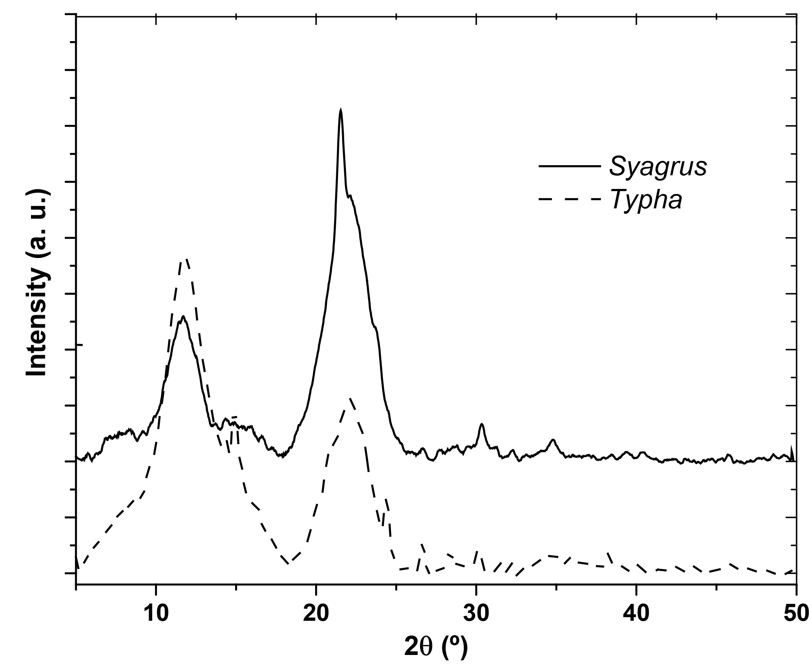

---
title: "Arquitetura química, confiabilidade mecânica e implicações ambientais de geotêxteis de fibras naturais para controle de erosão"
author: "Luiz Diego Vidal Santos"
bibliography: referencias.bib
csl: springer-vancouver.csl
reference-doc: modelo_formatacao.docx
fig-align: center
table-align: center
lang: pt-br
---

Luiz Diego Vidal Santos, https://orcid.org/0000-0001-8659-8557, ldvsantos@uefs.uefs.br*, Universidade Estadual de Feira de Santana – UEFS, Pós-graduação em Planejamento Territorial, Feira de Santana - BA, Brasil

Francisco Sandro Rodrigues Holanda, https://orcid.org/0009-0000-9358-0531 ,fholanda@academico.ufs.br, Universidade Federal de Sergipe, Departamento de Engenharia Agronômica, São Cristóvão – SE, Brasil

Emersson Guedes da Silva, https://orcid.org/0009-0004-9742-6215, academicoguedes@gmail.com, Universidade Federal de Sergipe, Departamento de Engenharia Agronômica, São Cristóvão – SE, Brasil

Marlon Pedro Santos Gomes, https://orcid.org/0009-0007-8167-7636, marlongomes2671@gmail.com, Universidade Federal de Sergipe, Departamento de Engenharia Agronômica, São Cristóvão – SE, Brasil

Alarico José da Silva Azerêdo, https://orcid.org/0009-0002-9805-9870, alaricofilho76@hotmail.com, Universidade Federal de Sergipe, Departamento de Engenharia Agronômica, São Cristóvão – SE, Brasil

Renisson Neponuceno de Araújo Filho, https://orcid.org/0000-0002-9747-1276, renisson.neponuceno@ufrpe.br, Universidade Federal Rural de Pernambuco, Departamento de Tecnologia Rural, Recife – PE, Brasil

Eliana Midori Sussuchi, https://orcid.org/0000-0001-9425-0921, midori@academico.ufs.br, Universidade Federal de Sergipe, Departamento de Química, São Cristóvão – SE, Brasil

Alceu Pedrotti, https://orcid.org/0000-0003-3086-8399, alceupedrotti@gmail.com, Universidade Federal de Sergipe, Departamento de Engenharia Agronômica, São Cristóvão – SE, Brasil

## Resumo

A degradação de solos tropicais e os passivos de microplásticos de geossintéticos convencionais exigem soluções de bioengenharia com materiais renováveis e funcionalidade temporizada.  Esta revisão objetivou integrar evidências experimentais e teóricas acerca da relação entre a arquitetura química das fibras lignocelulósicas e a confiabilidade funcional de geotêxteis naturais. Em fibras naturais, a recalcitrância diferencial explica janelas de serviço entre 60 e 180 dias, com mercerização alcalina a 6% NaOH promovendo reorganização morfoestrutural e aumento de resistência, estendendo a VUF ao patamar crítico de estabelecimento vegetativo. Tratamentos de superfície por resinas mostram efeitos não lineares em que a aplicação monocamada retardou a degradação em campo até ≈120 dias, enquanto sobreposições duplicadas tenderam à delaminação precoce sob ciclos de chuva e radiação. Em envelhecimento UV acelerado, compósitos Typha–Ramie mantiveram estabilidade na resistência à tração, com queda primária na ductilidade, e conservaram resistência à punção com redução do espalhamento multiaxial, funções de Weibull evidenciaram confiabilidade prática ao longo do período necessário para cobertura vegetal. Esses resultados sustentam o uso de geocompostos multicamadas como infraestrutura verde auditável, sincronizando persistência material, drenagem e promoção de revegetação. Os geotêxteis naturais com engenharia de superfície e projeto por confiabilidade Weibull ($P_{10}$)  alcançam desempenho mecânico suficiente na janela de 90–150 dias, reduzem externalidades ambientais e habilitam a substituição de geossintéticos fósseis em bioengenharia de solos tropicais.

**Palavras-chave**: Controle de erosão; Poluição ambiental; Cinética de biodegradação; Serviços ecossistêmicos; Confiabilidade Weibull.

## 1. Introdução

A degradação do solo em regiões tropicais opera através de mecanismos distintos daqueles observados em contextos temperados, sobretudo devido a maior intensidade pluviométrica e as temperaturas elevadas. Segundo Brady and Weil @Brady2009 , esses fatores aceleram a mineralização da matéria orgânica, que conjugado a Oxissolos intemperizados, resultam em taxas de perda de nutrientes por lixiviação. De acordo com Lammel et al.  @Lammel2015, biomas tropicais como a Caatinga e o Cerrado, solos com fertilidade natural reduzida apresentam elevada vulnerabilidade a perda nutricional em função de sua forte sazonalidade hídrica, resultando em depleção biogeoquímica que compromete tanto a matriz física quanto reservatórios nutricionais essenciais à produtividade agrícola [@Cardoso2006].

A predominância de minerais argilosos 1:1 na pedogênese tropical, conjugada com baixo teor de carbono orgânico do solo, resultam em solos de mínima coesão estrutural. Bispo et al. @Bispo2017 demonstraram que essa estrutura debilitada torna os solos vulneráveis à erosão por impacto de gotas de chuva e carreamento de partículas pelo escoamento superficial durante tempestades convectivas.

A resistência ao cisalhamento do solo não coeso, quantificada pelo ângulo de atrito interno efetivo dependente de granulometria e densidade [@Wu1979; @Veylon2015], torna-se particularmente deficiente em Neossolos Quartzarênicos de margens fluviais tropicais. Trabalhando com esses solos, Mahannopkul and Jotisankasa @Mahannopkul2019 caracterizaram sua baixa coesão, alta porosidade e resistência mecânica limitada. Essa vulnerabilidade geotécnica manifesta-se de forma crítica em taludes com inclinação superior a 25°, onde o fator de segurança frequentemente permanece inferior a 1,0 [@Duncan].

Conforme observado por Islam and Shahin @Islam2013, essa configuração resulta em instabilidade incipiente durante períodos chuvosos quando o aumento da pressão de poros reduz a tensão normal efetiva, precipitando falhas por escorregamento. Consequentemente, demonstraram que a capacidade de carga admissível de fundações superficiais fica limitada a 50–100 kPa, restringindo drasticamente as opções de estruturas de reforço convencionais [@Islam2013].

Essa vulnerabilidade geotécnica aumenta sob ação antrópica. Segundo Borrelli et al. @Borrelli2017, a perda irreversível da camada superficial do solo, concentradora de fósforo e nitrogênio biodisponíveis, conjuga-se com eutrofização induzida pela sedimentação em ecossistemas fluviais a jusante, comprometendo a qualidade hídrica regional. Na região semiárida brasileira, a produção de sedimentos em encostas degradadas pode atingir 45 Mg·ha⁻¹ durante a estação chuvosa (aproximadamente 90 dias), excedendo a taxa pedogênica em duas ordens de magnitude, representando dissipação de séculos de ciclos biogeoquímicos sem perspectivas de restauração ecológica em escalas temporais humanas [@Vannoppen2017, @Niu2017].

Diante dessa realidade, respostas tecnológicas tradicionais recorreram predominantemente a geossintéticos derivados do petróleo. Conforme revisado por Holanda et al. @Holanda20251, polipropileno, polietileno e tereftalato de polietileno caracterizam-se por alta resistência e estabilização UV mediante benzotriazol, consolidando uma dependência de matérias-primas não renováveis.

A durabilidade desses materiais revela-se através de três modos de falha. Rupturas por tensões excessivas ocorrem com deformação plástica seguida de endurecimento por orientação molecular [@Carneiro2018], de modo que *Creep* manifesta-se como deformação progressiva sob carga sustentada, resultando em perda gradual de funcionalidade ao longo de décadas [@BarreiraPinto2023]. Degradação por radiação UV sob irradiância tropical (5–8 kWh·m⁻²·dia⁻¹, espectros 280–350 nm) reduz progressivamente a resistência à tração [@Carneiro2017;@Franco2022], conforme especificações ISO 10319 e ASTM D4595.

Esse paradigma revela contradição estrutural, visto que materiais concebidos para persistência multidecadal em aterros sanitários e sub-bases viárias apresentam uma vida útil projetada entre 30–50 anos [@BarreiraPinto2023], impondo passivos ambientais de longo prazo quando implantados em sistemas agroecológicos [@Bhatia2010]. Trabalhando com geotêxteis de polipropileno, Ibanez et al. @Ibanez2014 e Konvalinková et al. @Konvalinkova2015 observaram alta recalcitrância sob condições anaeróbicas, com fragmentação mecânica gradual em microplásticos (<5 mm) cuja infiltração nas teias tróficas edáficas compromete simbioses microbianas e provoca posterior rearranjo da microbiota do solo.

Bai et al. @Bai2022 quantificaram densidades médias de 349±137 partículas·kg⁻¹ em solos cobertos após exposição UV, com emissões anuais estimadas em milhares de toneladas para ambientes marinhos, evidenciando transferência trófica em ecossistemas terrestres e aquáticos adjacentes. Essa limitação dos materiais sintéticos torna a persistência temporária controlada um atributo funcional estratégico para aplicações em bioengenharia. Enquanto geotêxteis sintéticos resistem à biodegradação por décadas, Chakravarthy et al. @Chakravarthy2021 e Midha et al. @Midha2017 demonstraram que fibras lignocelulósicas apresentam degradação progressiva em 6–18 meses, compatível com estabelecimento de sistemas radiculares permanentes.

Estudos de durabilidade revelam que geotêxteis de fibras naturais tratadas com emulsões betuminosas mantêm 82–85% da resistência inicial após 90 dias de exposição edáfica [@Thakur2019], evitando acúmulo de resíduos persistentes em agricultura sustentável. Geotêxteis de fibra natural apresentam inversão de paradigma ao explorar degradação programada como atributo funcional [@Pil2019]. Segundo Rodriguez et al. @Rodriguez2023, a composição lignocelulósica confere prazo de funcionalidade intrínseco governado por consórcios microbianos e estresse oxidativo ambiental, sincronizando-se com cinética de estabelecimento vegetativo herbáceo da bioengenharia do solo. Almeida et al. @Almeida2023 e Singh et al. @Singh2024_vetiver demonstraram que redes radiculares atingem equivalência mecânica ao reforço sintético em 90–180 dias.

Adicionalmente, trabalhando com ensaios longitudinais em *Typha domingensis* (taboa) e *Syagrus coronata* (palmeira-ouricuri) na bacia do Baixo Rio São Francisco,Fontes et al. @Fontes2021 demonstraram geotêxteis sustentando cargas de tração de 3–9 N·mm⁻² e apresentando janela de serviço funcional de 120–180 dias sob condições semiáridas com precipitação 350 mm·estação⁻¹ e temperatura média 27°C.

Ainda, Segundo Santos et al. @Santos2023_GeocompostosTypha, o valor estratégico de *Typha* reside na estrutura do colmo rica em celulose (48% celulose, 18% hemicelulose, 22% lignina), enquanto fibras foliares de *Syagrus* exibem elevado teor de lignina (32%), conferindo recalcitrância à hidrólise enzimática durante degradação inicial.

Geotêxteis derivados de fibras naturais fabricados em campo incorrem em custos de US$2,50·m⁻², comparados com US$8–12·m⁻² para produtos sintéticos equivalentes, diferencial amplificado pela eliminação de externalidades de descarte [@Amadou2022_natural_geotextile_cost]. A colheita de biomassa renovável em zonas úmidas oferece co-benefícios no manejo de espécies invasoras, visto que monoculturas de *Typha* apresentam produtividade anual de 20–30 Mg·ha⁻¹ de matéria seca em sistemas lênticos eutróficos [@Lorenzo2024_Typha], reduzindo a carga orgânica e nutrientes que alimentam a eutrofização, ao mesmo tempo em que fornece matéria‑prima de baixo carbono para geotêxteis naturais [@rocha2009]. Essa integração operacional entre manejo ecológico e produção de biomateriais fortalece a economia circular local [@Haldan2022], diminui passivos ambientais e amplia a viabilidade logística de escalonamento regional [@Khan2025].

Neste contexto, esta revisão tem como objetivo integrar evidências experimentais e teóricas acerca da relação entre a arquitetura química das fibras lignocelulósicas e a confiabilidade funcional de geotêxteis naturais. São discutidos o papel da razão lignina/celulose, dos tratamentos alcalinos e da modelagem probabilística (Weibull e GLM) na explicação da cinética de degradação e da vida útil sob condições tropicais. Adicionalmente, propõe-se um enquadramento conceitual que incorpora abordagens de confiabilidade à avaliação de durabilidade, evidenciando a limitação de métricas tradicionais baseadas apenas na resistência inicial e apontando a necessidade de normas que considerem a variabilidade estocástica e a degradação controlada ao longo do tempo.

Propõe-se que a razão lignina/celulose (L/C) pode atuar como variável preditiva central da cinética de degradação e da Vida Útil Funcional (VUF), enquanto intervenções de engenharia de superfície, por meio de tratamentos alcalinos e revestimentos poliméricos, podem modular o desempenho mecânico ao longo do tempo e favorecer sua sincronização com o desenvolvimento vegetal e o estabelecimento radicular.

## 2. Arquitetura Química de Biopolímeros e Vida Útil Funcional (VUF)

### 2.1. Arquitetura Lignocelulósica e Perfil Químico

O desempenho mecânico e a trajetória de biodegradação de geotêxteis de fibra natural tendem a depender, em grande medida, da razão entre lignina e celulose que organiza o arcabouço molecular dos biopolímeros constituintes. A celulose, principal componente estrutural, estabelece uma rede semicristalina em que cadeias de β-1,4-glucana com comprimento frequentemente na ordem de milhares de unidades anidro-glicose, e que podem alcançar dezenas de milhares em celulose de madeira ou algodão antes de qualquer processamento mecânico ou químico [@Shaghaleh2018], alinham-se por ligações de hidrogênio inter e intramoleculares e originam domínios cristalinos com índice de cristalinidade entre 40 e 70%, condição que sustenta tanto a rigidez inicial quanto a estabilidade dimensional sob carregamento.

As microfibrilas resultantes, imersas em matriz amorfa de hemiceluloses constituídas por heteropolissacarídeos ramificados, como xilana, arabinana e galactana, e em lignina formada por oligômeros fenilpropanoides reticulados, reduzem de maneira efetiva a acessibilidade de sítios glicosídicos às rotas de hidrólise enzimática e química [@Karim2023]. A combinação entre elevado grau de polimerização da celulose, empacotamento denso em microfibrilas e blindagem por hemiceluloses e lignina é consistente com o princípio de que a arquitetura molecular influencia a cinética de biodegradação e, por consequência, o tempo durante o qual o geotêxtil mantém desempenho mecânico aceitável em serviço [@Poletto2012].

A organização hierárquica que conecta nível molecular, parede celular e tecido fibroso (Figura 1) explicita que variações na razão lignina/celulose entre diferentes fibras vegetais produzem trajetórias contrastantes de degradação e de Vida Útil Funcional, mesmo sob condições ambientais semelhantes [@XuexiaZhang; @Haviland2024; @Ref1]. Nesse arcabouço, a lignina atua como barreira hidrofóbica tridimensional que impõe impedimento estérico à penetração de celulases e hemicelulases, de modo que a malha aromática formada por unidades de guaiacil (G), siringil (S) e p-hidroxifenil (H) apresenta resistência à despolimerização microbiana várias ordens de grandeza superior à da celulose [@Nguyen2024; @Grabber]. Essa assimetria de reatividade controla a taxa de perda de massa e de rigidez ao longo do tempo e condiciona, em última instância, a confiabilidade estrutural dos geotêxteis em análises baseadas em Weibull, enquanto a biogeoquímica associada à matéria orgânica residual emerge apenas como efeito pós-serviço da degradação controlada do arcabouço lignocelulósico.

**Figura 1.** Arquitetura hierárquica multinível de fibras lignocelulósicas e a influência da composição na recalcitrância sendo, **(a)** Representação esquemática dos principais polímeros de cadeias lineares de celulose, **(b)** Organização supramolecular do núcleo cristalino das microfibrilas de celulose, **(c)** Seção transversal da parede celular vegetal e **(d)** Nível do Tecido e Razão L/C: Comparação esquemática de feixes de fibras de *Typha* (baixa lignificação) e *Syagrus* (alta lignificação).

A caracterização química de fibras de *Syagrus coronata* (Tabela 1) demonstra 32% de lignina contra 22% em *Typha domingensis*, diferença composicional que se traduz em trajetórias de degradação contrastantes sob exposição em campo. Fibras não tratadas de *Typha* perdem viabilidade mecânica aos 60 dias de exposição ambiental (redução de 63,2% na resistência à tração), enquanto *Syagrus* mantém integridade estrutural observável até 90 dias, evidenciando a recalcitrância conferida pelo maior teor de lignina [@Holanda20251].

A relação lignina-celulose (L/C) tem sido empregada como um índice útil para discutir recalcitrância [@Santos2023_GeocompostosTypha]. Observações empíricas em nosso conjunto de dados sugerem uma relação exponencial inversa entre L/C e a constante de taxa de degradação ($k$, dia⁻¹), dada por [@Ref4; @Ref5]:

$$
k = 0{,}032 \cdot e^{-2{,}1 \cdot (L/C)}
$$

Para *Typha* (L/C = 0,46), isso resulta em $k$ = 0,0118 dia⁻¹, o que implica uma meia-vida de 59 dias sob condições mesofílicas (25°C, 60% de umidade relativa). Em contraste, *Syagrus* (L/C = 0,67) apresenta $k$ = 0,0082 dia⁻¹ (meia-vida = 85 dias), consistente com observações de campo onde geotêxteis de *Syagrus* não tratados mantiveram integridade estrutural após 120 dias de exposição, enquanto os geotêxteis de *Typha* falharam em 60 dias.

**Tabela 1.** Perfil químico-mecânico comparativo de fibras lignocelulósicas tropicais para geotêxteis biodegradáveis.

| Espécie                    | Celulose (%) | Lignina (%) | L/C  | Tração inicial (N/mm) | Deformação (%) | k (dia⁻¹) | t½ (dias) | VUF P₁₀ (dias)† |
| --------------------------- | ------------ | ----------- | ---- | ----------------------- | ---------------- | ----------- | ---------- | ------------------ |
| **Typha domingensis** | 48           | 22          | 0.46 | 107.6 ± 25.3           | 2.9 ± 2.1       | 0.0118      | 59         | 42                 |
| **Juncus sp.**        | n.d.         | n.d.        | n.d. | 72.6 ± 16.9            | n.d.             | >0.015*     | <46*       | <30*               |
| **Syagrus coronata**  | 40‡         | 32          | 0.80 | 142.1 ± 31.6           | 2.9 ± 2.1       | 0.0082      | 85         | 38§               |

**Notas:** n.d. = não determinado; †VUF baseada em 10º percentil de falha Weibull (P₁₀); *Estimado a partir de perda de 97% aos 60 dias; ‡Estimado por diferença (100% - lignina - hemicelulose - extrativos).

Entretanto, a diferença de recalcitrância resumida na Tabela 1 não garante prolongamento linear da durabilidade em todas as combinações de arquitetura e carregamento, pois há registros de colapso estrutural abrupto com perda de 65% da resistência em aproximadamente 30 dias para configurações com teor elevado de lignina quando a distribuição espacial desse polímero na parede celular favorece zonas frágeis de iniciação de trinca [@Silva2025; @Ref6; @Ref7]. O comportamento bifásico, caracterizado por fase inicial de manutenção aparente da rigidez seguida de falha súbita [@Phan2025], sugere que a geometria de percolação da fase lignínica, e não apenas sua fração mássica global, pode influenciar a progressão da biodegradação sob tensões cisalhantes e de tração típicas de taludes vegetados [@Zhang2024yao].

A relação entre composição química e desempenho temporal, esquematizada na Figura 2, descreve uma trajetória contínua que parte da razão L/C, passa pela cinética de degradação observada em campo e pela evolução da resistência mecânica ao longo do tempo e culmina na definição de Vida Útil Funcional a partir de parâmetros de confiabilidade. O diagrama integra constantes de degradação $k$ e meias-vidas $t_{1/2}$, curvas de perda de resistência até a falha e estimativas de VUF pelo percentil de 10% de falha em modelos de Weibull (P₁₀, com parâmetros β e η) [@Ref9; @Ref10; @Ref11; @Ref12], além de estratégias de modificação de superfície por mercerização alcalina [@Ref13; @Ref14] e revestimentos poliméricos [@Ref17; @Ref18] que deslocam essa curva temporal.

**Figura 2.** Diagrama de fluxo integrando composição química, expressa pela razão lignina/celulose, com o desempenho temporal e a Vida Útil Funcional de geotêxteis sob diferentes cenários de tratamento de superfície.

*Nota: O fluxograma articula constantes de degradação $k$ e meias-vidas $t_{1/2}$ medidas em campo, trajetórias de resistência mecânica até o ponto de falha e Vida Útil Funcional (VUF) derivada de distribuições de Weibull no percentil de projeto P₁₀, ao mesmo tempo em que posiciona tratamentos de mercerização alcalina e revestimentos poliméricos como intervenções de engenharia que modulam a taxa de degradação e o modo de falha, inclusive com possibilidade de delaminação em sistemas de dupla camada.*

Espectroscopia no Infravermelho por Transformada de Fourier (FTIR) vincula assinaturas espectrais à suscetibilidade de clivagem química e biológica. Bandas em 1735 cm⁻¹ indicam hemicelulose suscetível à hidrólise enzimática; 3300 cm⁻¹ indicam grupos hidroxila livres favorecendo microambientes úmidos; 1600 cm⁻¹ quantificam lignina aromática. Picos em 1590 cm⁻¹ caracterizam lignina siringílica com maior resistência à degradação oxidativa. Bandas em 1234–896 cm⁻¹ indicam ordenamento cristalino de celulose e barreira físico-química robusta contra clivagem enzimática.

**Figura 3.** Comparação de espectros FTIR entre *Typha domingensis* e *Syagrus coronata*.
{width=100%}

*Nota: As principais diferenças incluem: (i) maior intensidade da banda em 1735 cm⁻¹ em *Typha* associada ao maior teor de hemicelulose; (ii) banda em 1590 cm⁻¹ em *Syagrus* indicativa de lignina siringílica; (iii) bandas em 1234 cm⁻¹ (anel siringil) e 896 cm⁻¹ (β-glicosídica) mais evidentes em *Syagrus*; (iv) intensidade reduzida em 1732 cm⁻¹ para *Syagrus* refletindo menor teor de hemicelulose. Bandas comuns incluem 3300-3340 cm⁻¹ (O-H), 2920-2852 cm⁻¹ (C-H alifático) e 1035 cm⁻¹ (C-O celulose).*

Essa composição bioquímica tende a se refletir na cinética de degradação. Santos et al. @Santos2023_PatenteTaboa observaram que *Typha* perde 50% da resistência inicial em aproximadamente 60 dias sob condições de campo, enquanto *Syagrus* mantém integridade funcional por períodos superiores a 120 dias [@Fontes2021]. Nesse conjunto de resultados, a razão lignina/celulose (L/C) aparece como um marcador útil para descrever diferenças de recalcitrância e de ritmo de perda de capacidade, com *Typha* (L/C ≈ 0,15) associada a degradação mais rápida e *Syagrus* (L/C ≈ 0,67) a degradação mais lenta. Essa distinção também implica trade-offs: a flexibilidade e a retenção hídrica de *Typha* favorecem aplicações que demandam rápida revegetação e posterior incorporação ao solo, enquanto a maior rigidez de *Syagrus* pode atender projetos que requerem estabilização por mais tempo.

Embora a FTIR descreva grupos funcionais, o arranjo cristalino avaliado por difração de raios X (Figura 4) contribui para a integridade física. Segal et al. @Segal1959 propuseram metodologia que indica índices de cristalinidade de 52% para *Typha* versus 46% para *Syagrus*. Segundo Boerjan et al. @Boerjan2003, esse contraste sugere que o maior teor de lignina em *Syagrus* pode compensar a cristalinidade reduzida, ao preencher a fração amorfa e elevar a rigidez. As fibras de *Typha domingensis* exibem picos de celulose I em 2θ ≈ 14,8° (plano 1-10/110), 16,4° (110) e 22,6° (200) [@Rowell1998].

Na caracterização mecânica dessas fibras, Fontes et al. @Fontes2021 reportaram resistências à tração iniciais próximas entre as espécies, com 3,14 N·mm⁻² para *Syagrus* e 3,57 N·mm⁻² para *Typha* não tratada. Em conjunto, variações composicionais e estruturais observadas por FTIR/DRX/TGA são consistentes com diferenças na integridade microfibrilar e no desempenho mecânico inicial.

**Figura 4.** Difratograma de raios X (DRX) da fibra de *Typha domingensis* e *Syagrus coronata*
{width=70%}

A maior estabilidade térmica de *Syagrus*, associada ao teor de lignina, pode se refletir em maior fração residual e potencial de contribuição ao estoque de carbono. Análises termogravimétricas sob atmosfera oxidativa (ar, 10 °C·min⁻¹) indicam que *Syagrus* retém ~28% de massa residual a 600 °C (carvão por condensação de lignina), versus ~21% para *Typha* [@Rowell1998]. Essa diferença é compatível com a persistência de esqueletos fibrosos de *Syagrus* após 180 dias em campo e com estimativas de sequestro de carbono no solo de 0,8–1,2 Mg C·ha⁻¹ pós-degradação, dependendo da densidade de implantação [@Santos2023_GeocompostosTypha].

### 2.2. Hidrofilicidade, Biodegradação e a Definição de Vida Útil Funcional

A onipresença de grupos funcionais hidroxila (-OH) nas superfícies de celulose e hemicelulose estabelece hidrofilia acentuada, com ângulos de contato com água inferiores a 30°, condição que facilita a entrada de umidade e cria microambientes favoráveis à colonização microbiana logo nos estágios iniciais de exposição em campo. Imagens de microscopia eletrônica de varredura (MEV) após 60 dias evidenciam densa colonização fúngica nas camadas celulares corticais, com hifas de gêneros como *Aspergillus* e *Trichoderma* penetrando mais de 200 µm em direção ao interior da parede celular.

Essa colonização fúngica se associa a níveis elevados de atividade extracelular de celulases, em particular endoglucanases e celobiohidrolases entre 12 e 18 U·g⁻¹ de fibra seca, valores quantificados em ensaios enzimáticos por Vries et al. @deVries2010, Ghose et al. @Ghose1987 e Hatakka et al. @Hatakka2011. Esses autores mostram que tal faixa de atividade é suficiente para clivar ligações β-1,4-glicosídicas em taxas de perda de massa entre 0,5 e 1,0% por dia, o que ajuda a explicar a trajetória de degradação observada em geotêxteis não tratados e relaciona a química de superfície à redução progressiva da capacidade resistente.

Segundo Schneider et al. @Schneider2023, a biodegradação de matrizes lignocelulósicas decorre de dois mecanismos simultâneos: erosão superficial induzida por ataque enzimático a partir da cutícula e penetração radial de hifas que formam túneis microscópicos e zonas de cavitação sob tração. Nilsson and Daniel @Nilsson1988 documentaram por microscopia eletrônica que a erosão superficial domina os primeiros 30 dias de exposição, evoluindo posteriormente para penetração radial que rompe a lamela média lignificada e compromete a coesão entre células adjacentes, processo compatível com o comportamento mecânico observado em ensaios de tração e punção.

A análise termogravimétrica (TGA), que mensura a perda de massa com o aumento da temperatura, permite acompanhar mudanças associadas à exposição ambiental. Conforme reportado por Cardoso et al. @Cardoso2023_TGA_biomass, observa-se um ombro inicial entre 220 e 280°C, atribuído à pirólise de hemicelulose, cuja intensidade tende a diminuir com o avanço da degradação. O pico principal de celulose (300–360°C) desloca-se para temperaturas inferiores à medida que a despolimerização progride, enquanto a fração atribuída à lignina acima de 400°C permanece relativamente estável. Esse padrão é consistente com a interpretação de Leng et al. @Leng2020_TGA_PKM de que a lignina atua como resíduo mais recalcitrante, persistindo após a degradação e contribuindo para o acúmulo de carbono orgânico no solo. Em conjunto, essas evidências conectam arquitetura química, cinética de perda de massa e formação de resíduos pós-serviço, sem substituir o horizonte de Vida Útil Funcional definido pela confiabilidade mecânica.

Os dados experimentais de geotêxteis naturais indicam que a razão lignina/celulose (L/C) não governa de forma unívoca a resistência inicial, mas se associa ao modo de falha e, de forma mais consistente, à recalcitrância e à cinética de perda de capacidade ao longo do tempo. Holanda et al. @Holanda2023 observaram que configurações com maior participação de lignina tendem a apresentar resistência à tração inicial superior às de menor L/C; entretanto, essa vantagem não se traduz, de forma automática, em durabilidade estendida: há registros de colapso estrutural abrupto em aproximadamente 30 dias com perda de 65% da resistência, enquanto materiais com menor teor de lignina podem exibir degradação quase linear e previsível até 120 dias. 

A discrepância entre recalcitrância química teórica e desempenho temporal reforça que a resistência à biodegradação não depende apenas da quantidade total de lignina, mas de sua organização tridimensional na parede celular [@Silva2025], ou seja, da forma como o arcabouço aromático se distribui em relação às regiões ricas em celulose e hemicelulose.

Estudos de Souza et al. @Souza2019 demonstraram que a lignina apresenta distribuição espacial heterogênea ao longo das camadas da parede celular, concentrando-se na lamela média e nos cantos celulares, regiões que respondem pela coesão estrutural do tecido. Essa heterogeneidade define zonas de maior e menor acessibilidade enzimática, modulando a penetração de microrganismos degradadores e a localização preferencial de iniciação de trincas.

Em linha com esse quadro, Blanchette @Blanchette1995 descrevem a lignina como barreira física à ação de enzimas lignocelulolíticas não apenas por sua abundância, mas pelo modo como se intercala na matriz de celulose e hemicelulose, o que explica por que materiais com teores semelhantes de lignina podem apresentar durabilidades distintas sob o mesmo regime de exposição.

Nessa perspectiva, a resistência à degradação biológica resulta da combinação entre proporção relativa de lignina e sua distribuição tridimensional na parede celular, parâmetros que, integrados à razão L/C efetiva, definem o perfil de recalcitrância relevante para a modelagem de confiabilidade. A análise da cinética de degradação de geotêxteis de fibras naturais evidencia, então, a limitação das normas tradicionais centradas apenas na resistência média à tração inicial.

Carvalho et al. @Carvalho2014 observaram reduções significativas de resistência mecânica sob envelhecimento e exposição ao solo em intervalos compatíveis com períodos funcionais típicas de taludes, mostrando que especificações baseadas em valores médios ignoram a variabilidade estocástica dos materiais biológicos e a perda progressiva de capacidade ao longo do tempo.

Essa abordagem determinística torna-se inadequada quando coeficientes de variação entre amostras excedem 25% e a perda de resistência não segue trajetória linear, cenário em que parâmetros médios deixam de representar o risco real de falha. Curtin @Curtin2000 propôs redefinir a Vida Útil Funcional (VUF) como grandeza probabilística que representa o intervalo durante o qual 90% dos geotêxteis implantados mantêm capacidade de suportar carga acima de um limite crítico, tipicamente 1,5 kN·m⁻¹ para aplicações em taludes. Nessa formulação, a VUF é limitada pelo 10º percentil ($P_{10}$) da distribuição de falhas de Weibull, descrita por

$$
P(t) = 1 - \exp\left[-\left(\frac{t}{\eta}\right)^\beta\right],
$$

em que $\eta$ representa o parâmetro de escala, associado à vida característica, e $\beta$ descreve o modo de falha. A aplicação desse modelo a fibras não tratadas de geotêxteis produz, para configurações com baixa razão L/C, valores de $\beta$ em torno de 2,3, característicos de falha por desgaste, e $\eta$ próximos de 68 dias, resultando em $P_{10} = 42$ dias como VUF em condições de campo, o que alinha a janela de serviço mecânico com a cinética de colonização microbiana antes descrita.

Intervenções de engenharia de superfície deslocam essa distribuição de forma quantificável. O tratamento alcalino com 6% de NaOH aumenta $\eta$ para aproximadamente 142 dias e eleva $\beta$ para 2,8, estendendo a VUF para cerca de 95 dias e refletindo rede fibrilar mais coesa sob carga. A aplicação de resina acrílica em camada única pode elevar ainda mais $\eta$ para a ordem de 187 dias (com $P_{10}$ em torno de 128 dias), aproximando-se do limiar de 180 dias necessário para que redes radiculares de espécies como *Chrysopogon zizanioides* atinjam resistências entre 15 e 25 kN·m⁻¹. 

Dessa forma, a arquitetura química, sintetizada na razão L/C e na organização da lignina, combinada aos tratamentos de superfície, passa a influenciar de forma relevante os parâmetros de Weibull utilizados em projeto, conectando degradação microscópica observada por MEV, TGA e análises enzimáticas à confiabilidade estrutural em escala de talude [@kaya2023].

## 3. Engenharia da Durabilidade

### 3.1. Mercerização Alcalina e Revestimentos Poliméricos

A mercerização com hidróxido de sódio (NaOH) remove seletivamente lignina e hemiceluloses, expondo microfibrilas de celulose cristalina e reduzindo a heterogeneidade superficial das fibras [@Verma2021; @Ray2002; @Thakur2019]. Essa reorganização químico‑estrutural diminui a densidade de defeitos na interface fibra–matriz, favorece o rearranjo inter e intrafibrilar e aumenta a estabilidade da celulose tratada, com ganhos diretos em adesão interfacial quando as fibras são incorporadas a compósitos [@Ikramullah2018].

Nos dados aqui analisados, essa reestruturação morfológica produziu relação não monotônica entre resistência mecânica e concentração alcalina. As fibras não tratadas apresentaram resistência à tração (UTS) média de 18,88 N·mm⁻², enquanto o tratamento com 3% de NaOH resultou em 17,62 N·mm⁻², diferença estatisticamente não significativa. A concentração intermediária de 6% NaOH elevou a UTS para 21,39 N·mm⁻², aumento de 13,3% em relação ao controle, acompanhado de incremento na resistência à punção.

Trabalhando com fibras de tamareira (*Phoenix dactylifera*), Oushabi et al. @Oushabi2017 relataram aumento de 76% na resistência à tração após tratamento com 5% de NaOH, efeito atribuído à remoção efetiva de materiais não celulósicos e à maior exposição de microfibrilas de celulose. Em linha com essa evidência, Koistinen et al. @Koistinen2024 e Narayana et al. @Narayana2021 indicam que concentrações alcalinas intermediárias removem seletivamente frações amorfas de lignina e hemicelulose, reduzem impurezas superficiais, melhoram a molhabilidade e ampliam a adesão interfacial sem comprometer a cristalinidade da celulose, configurando rede fibrilar mais coesa e eficiente na transferência de carga.

A 9% NaOH, embora a UTS atinja 22,49 N·mm⁻², observam-se indícios de corrosão superficial e possível despolimerização, com maior fragilidade e apenas melhora modesta na resistência à punção (Tabela 2). Verma et al. @Verma2021 associam esse comportamento a tratamentos com índice alcalino elevado que, após uma fase inicial de limpeza estrutural e rearranjo cristalino, podem degradar a matriz celulósica. A exposição prolongada a soluções concentradas de NaOH pode induzir hidrólise alcalina das ligações glicosídicas, reduzir o grau de polimerização da celulose e comprometer a integridade estrutural das fibras [@Thakur2019; @Ray2002].

Conforme observado por Bartos et al. @Bartos2020, os resultados convergem, portanto, para uma janela ótima de concentração em torno de 6% NaOH, em que os benefícios da deslignificação e da remoção de hemicelulose superam os riscos de dano estrutural, elevando o desempenho mecânico sem perda excessiva de ductilidade.

Esse balanço envolve a remoção parcial de lignina, que pode reduzir sítios de colonização microbiana, e a preservação de cadeias de celulose com alto grau de polimerização, cuja degradação comprometeria a resistência global [@Bachtiar2025; @Xu2013]. Nossos experimentos em campo por 180 dias (precipitação total de 350 mm; irradiância UV‑B = 6,5 kWh·m⁻²·dia⁻¹) indicaram que fibras não tratadas mantêm funcionalidade por cerca de 60 dias, enquanto o tratamento com 6% NaOH prolonga a viabilidade estrutural para 142 dias (FSL: 95 dias no limiar $P_{10}$ de Weibull). Na condição de 9% NaOH, observou-se preservação de integridade estrutural com censura ao longo de todo o período de 180 dias.

A análise GLM indicou um efeito estatisticamente forte do tratamento, com F(3, 71) = 35,564; p < 0,001; η²ₚ = 0,835 [@Holanda2024]. Nesse modelo, 83,5% da variância da UTS é explicada pela concentração de NaOH, sugerindo que a engenharia de superfície pode ser tratada como variável de controle da Vida Útil Funcional (Figura 5).

**Figura 5.** Microscopia eletrônica de varredura (MEV) comparativa de fibras de *Typha domingensis* e *Syagrus coronata* sob diferentes tratamentos e tempos de exposição.

{width=100%}

*Nota: (a-d) *Typha domingensis*: (a) 30d sem tratamento, (b) 180d sem tratamento, (c) 30d dupla camada resina, (d) 180d dupla camada; (e-h) *Syagrus coronata*: (e) 30d sem tratamento, (f) 180d sem tratamento, (g) 30d dupla camada, (h) 180d dupla camada. Magnificação 700×, barra 100 µm.*

Análises morfométricas quantitativas via processamento digital de imagens MEV revelam padrões contrastantes de degradação entre espécies tropicais. Fibras de menor recalcitrância apresentam evolução de porosidade caracterizada por colapso estrutural progressivo, com superfícies inicialmente rugosas evoluindo para topografias mais uniformes à medida que produtos de degradação são depositados. Esse padrão contrasta com fibras de maior teor de lignina, que exibem formação de sulcos profundos e canais longitudinais ao longo do tempo, compatíveis com degradação orientada por complexos enzimáticos ligninolíticos. Revestimentos poliméricos induziram reorganização microestrutural complexa, com porosidades máximas em estágios intermediários de exposição, seguidas por delaminação interfacial sob condições de campo. Em conjunto, densidade de fraturas e severidade de danos foram consistentes com falha progressiva por erosão superficial seguida por penetração radial, sustentando o uso de distribuições de Weibull com parâmetro de forma β > 1 para caracterização probabilística da durabilidade [@Thakur2019; @Datta2024; @Brunsek2023].

No que se refere à deformação na ruptura (ε), os resultados descrevem padrão inverso ao da resistência, com manutenção do alongamento em 3% NaOH (2,86%, próximo ao controle de 2,95%) e reduções progressivas em 6% e 9% NaOH (2,31% e 2,18%), evidenciando perda de ductilidade em concentrações mais elevadas. A condição de 6% NaOH caracteriza ponto ótimo operacional para geotêxteis com Vida Útil Funcional de 120 a 150 dias, pois combina ganho de resistência à tração (+13,3%) e à punção (+25,0%) com ε ainda acima de 2,3%.

Nesse contexto, a morfometria quantitativa sugere que o balanço observado decorre de transformações nanométricas, com transição parcial de celulose I para celulose II, elevação da rugosidade superficial (+48,2%) e maior acessibilidade de grupos hidroxila [@mansikkamaki2007], resultando em uma superfície mais ativa do ponto de vista de interação e transporte. Concomitantemente, a mercerização reorganiza a rede porosa ao fundir poros pequenos em cavidades de maior área média (+73,6%), elevando a circularidade (+5,9%) e reduzindo a heterogeneidade dimensional [@Jiao2014], de modo que a porosidade total cresce moderadamente (+7,6%) apesar da queda no número de poros (−42,1%), o que melhora a eficiência do transporte capilar em vez de simplesmente vedar canais [@Koistinen2024].

Enquanto mercerização otimiza estrutura interna, proteção externa requer estratégias de barreira. Revestimentos com resina acrílica (Hydronorth®) em camada única (0,0932 ml·m⁻²) prolongam VUF de 60 para 120 dias [@Akter2020]. Ensaios em *Syagrus coronata* (diâmetro 4 mm, 153,7 g·m⁻²) expostas a talude (21–29°C, 720 mm chuva) quantificaram cinéticas diferenciais: fibras não tratadas partiram de σu = 3,569 N·m⁻² (T₀) para colapso progressivo (1,563 N·m⁻² aos 30 dias; 1,312 N·m⁻² aos 60 dias; ΔM = −2,257 N·m⁻²; p = 0,033), redução de −63,2% devido a colonização fúngica (*Aspergillus*, *Trichoderma*) via celulases [@deVries2010; @Dashtban2010].

A camada única elevou a resistência inicial para 5,238 N·m⁻² (+46,7%) e manteve integridade até 120 dias (σu = 0,964 N·m⁻²), impondo degradação monotônica previsível (R² = 0,94; taxa 0,680 N·m⁻²·dia⁻¹). Camada dupla, apesar de σu inicial de 5,088 N·m⁻², exibe trajetória errática (Figura 6), com aumento anômalo aos 30 dias (5,761 N·m⁻²) seguido de queda abrupta (−65,7% aos 60 dias; falha crítica pós-90 dias; teste t p < 0,05; Cohen's D = 0,620).

**Figura 6.** Resistência à tração (UTS, N/mm) sob diferentes condições de tratamento, apresentada em dois painéis para maior clareza: **(a)** revestimento com resina (Não tratado/Monocamada/Bicamada) para *Typha domingensis* e *Syagrus coronata*; **(b)** mercerização alcalina com NaOH (0%, 3%, 6%, 9%), comparando ambas as espécies (um subplot por concentração).

{width=80%}

{width=80%}

Esse comportamento pode ser atribuído a danos interfaciais microscópicos. Microscopia eletrônica (15 keV) demonstrou delaminação interfacial entre resina e matriz lignocelulósica [@Lerpiniere2014]; além disso, ciclos higrotérmicos (18–35°C, 45–85% UR) induzem *swelling-shrinkage* repetitivo, descolando a resina e criando microambientes hidrofílicos propensos à colonização fúngica. A resina em dupla camada cria barreira excessiva (permeabilidade < 10⁻¹² m²·s⁻¹) que aprisiona água metabólica microbiana, catalisando hidrólise enzimática (umidade > 30%) [@Lerpiniere2014; @Gottenbos2003], enquanto a camada única mantém permeabilidade adequada (~10⁻¹⁰ m²·s⁻¹) para saída de umidade.

Esse ponto é ilustrado em *Typha*: a monocamada (0,093 ml/m²) sacrifica 52% de resistência à punção inicial (24,3 vs 50,6 kN/m), mas gera ganho de 89% após 60 dias (38,1 vs 20,1 kN/m; Cohen's D = 2,4) e retenção de 278% aos 90 dias, estendendo VUF para 120–150 dias. A redução da taxa de degradação (*k* de 0,0118 para 0,0062 dia⁻¹) contribui para compensar a perda inicial. ANOVA-RM indica interação tempo × tratamento: F(2,139; 21,561) = 9,764; p < 0,001; η² = 0,550. Assim, a otimização da durabilidade depende do equilíbrio entre proteção de barreira e permeabilidade ao vapor, e não da maximização de espessura.

### 3.2. Implicações para Especificação de Geotêxteis Tropicais

A consolidação dos resultados de mercerização com NaOH e de revestimento com resina converte a relação entre razão L/C, engenharia de superfície e parâmetros de Weibull em ferramenta prática de especificação de geotêxteis naturais em ambientes tropicais. Como linha de base, a condição não tratada apresenta FSL de 42 dias sob distribuição de Weibull definida em termos de $P_{10}$, com taxa de degradação UTS $k = 0{,}0118$ dia⁻¹. O tratamento com NaOH a 6% desloca essa fronteira para FSL de 95 dias, reduzindo a constante para $k = 0{,}0073$ dia⁻¹, o que representa queda de aproximadamente 38% na taxa de degradação. Já o revestimento acrílico em camada única aplicado a fibras de *Syagrus* estende o FSL para 128 dias com $k = 0{,}0061$ dia⁻¹, redução próxima de 48%. Em concentrações de 9% NaOH, o FSL ultrapassa 180 dias, com dados censurados e $k = 0{,}0041$ dia⁻¹, equivalente a redução de cerca de 65% na taxa de degradação em relação ao controle.

Essas diferenças cinéticas permitem alinhar a escolha de tratamento à janela de serviço e ao orçamento do projeto. Para obras que demandam suporte estrutural entre 90 e 150 dias, típicas de culturas anuais e de controle de erosão restrito à estação chuvosa, o tratamento com 6% NaOH oferece combinação favorável de FSL (95 dias em $P_{10}$) e custo direto inferior a US$ 0,80·m⁻², sem custos adicionais de remoção ou descarte. Em cenários perenes, como restauração de margens ribeirinhas ou estabilização de taludes de rodovias, a resina em monocamada, com custo em torno de US$ 1,20·m⁻², torna-se competitiva, pois o prolongamento de FSL para 128 dias e o aumento de confiabilidade compensam o investimento inicial maior. A configuração em dupla camada permanece desaconselhada em todas as aplicações avaliadas, pois os ganhos marginais de resistência inicial são acompanhados por delaminação precoce, concentração de umidade e queda abrupta de desempenho, ilustrando como o sobredimensionamento de barreiras pode induzir falhas sistêmicas em vez de mitigá-las.

A resistência à perfuração (ISO 12236) é crítica para a integridade de geotêxteis sobre substratos irregulares. *Typha* tratada com NaOH manteve >25 N·mm⁻² por 120 dias, superando geossintéticos equivalentes (~18 N·mm⁻²) devido à redistribuição de tensões pela malha fibrosa. A degradação segue lei de potência ($R_p \propto t^{-0,16}$), com proteção máxima do tratamento alcalino entre 30–90 dias, período vital para o estabelecimento da vegetação. Tratamentos moderados (6% NaOH) preservam a ductilidade ($\epsilon \approx 2,3–2,9\%$), essencial para absorver impactos dinâmicos em taludes íngremes, oferecendo um compromisso robusto entre ganho de resistência (+13%) e deformabilidade operacional, superior à fragilização induzida por concentrações mais altas (9%).

## 4. Enquadramento Conceitual de Confiabilidade e Desempenho Ambiental

### 4.1. Fundamentos da modelagem estocástica de degradação

A variabilidade intrínseca dos geotêxteis naturais favorece a modelagem estocástica da perda de desempenho. Nesse contexto, a distribuição de Weibull ($R(t) = e^{-(t/\eta)^\beta}$) representa a heterogeneidade estrutural, em que $\beta > 1$ (1,8–4,2) é associado a falha por desgaste progressivo (fadiga/hidrólise), em contraste com falha aleatória ($\beta \approx 1$); além disso, a engenharia de superfície tende a elevar $\beta$ (reduzindo a variabilidade) e $\eta$ (estendendo a vida útil). Definida como o tempo para 10% de falha ($P_{10}$), a Vida Útil Funcional (FSL) pode aumentar de 42 dias (*Typha* natural) para 95 dias (6% NaOH) e 128 dias (*Syagrus* resinada), cobrindo a janela crítica de 90 dias para ancoragem vegetal. Por fim, observações por MEV permitem relacionar parâmetros de Weibull a danos físicos: aumentos de porosidade e fraturas superficiais aparecem com padrões compatíveis com degradação progressiva, sustentando o uso da modelagem estatística para discutir desempenho em campo (Figura 7).

**Figura 7.** Microscopia eletrônica de varredura (MEV) de fibras lignocelulósicas sob diferentes condições de tratamento e períodos de exposição, sendo **(a)** Typha 30 dias sem tratamento, **(b)** Typha 180 dias sem tratamento, **(c)** Typha 30 dias com dupla camada, **(d)** Typha 180 dias com dupla camada, **(e)** Syagrus 30 dias sem tratamento, **(f)** Syagrus 180 dias sem tratamento, **(g)** Syagrus 30 dias com dupla camada, **(h)** Syagrus 180 dias com dupla camada.

{width=100%}
Nota: Magnificação: 700×. Barra de escala: 100 μm.

As imagens MEV documentaram a progressão temporal da degradação superficial em ambas as espécies. Em *Typha domingensis*, a porosidade superficial variou de 32,75% (ST 30d) a 73,09% (DC 30d), com comportamento não-monotônico: aumento de 32,75% → 67,27% em solo tropical (ST 30d → ST 180d), mas redução de 73,09% → 68,49% sob degradação controlada (DC 30d → DC 180d). A rugosidade superficial apresentou padrão inverso: máxima aos 30 dias (941,64 µm em ST; 581,04 µm em DC) reduzindo aos 180 dias (724,26 µm em ST; 528,27 µm em DC). Este padrão de maior rugosidade inicial e redução progressiva sugere que a degradação inicia com asperidades superficiais e fraturas dispersas, seguida de colapso estrutural que redistribui fragmentos. A densidade fibrilar apresentou variação de 25,41% (ST 30d) a 34,80% (DC 180d), refletindo a exposição progressiva das microfibrilas de celulose à medida que a matriz lignina/hemicelulose é degradada. Esse comportamento corrobora a hipótese de que a degradação inicial é impulsionada por microrganismos celulolíticos que atacam preferencialmente as regiões amorfas, expondo as fibras cristalinas subjacentes [@Singh2022, @Hubbe2025].

Em *Syagrus coronata*, a progressão foi mais gradual, com porosidade aumentando de 50,07% (ST 30d) para 63,77% (ST 180d) enquanto a rugosidade teve aumento de 679,35 µm (ST 30d) para máximo de 1012,67 µm (ST 180d) e 1174,66 µm (DC 30d), indicando formação de sulcos profundos por degradação orientada. A densidade fibrilar manteve-se estável (30,50% a 33,24%), sugerindo que a degradação progride predominantemente da superfície para o núcleo das fibras. Esse mecanismo é consistente com difusão limitada de celulases e exposição UV superficial, sustentando o uso de modelos de Weibull com $\beta > 1$ (desgaste progressivo) em contraste com falhas aleatórias ($\beta \approx 1$) típicas de materiais sintéticos (Figura 8).

**Figura 8.** Análise quantitativa de fraturas e severidade de danos por processamento de imagem com skeletonização, sendo **(a)** Typha 30 dias sem tratamento, **(b)** Typha 180 dias sem tratamento, **(c)** Typha 30 dias com dupla camada, **(d)** Typha 180 dias com dupla camada, **(e)** Syagrus 30 dias sem tratamento, **(f)** Syagrus 180 dias sem tratamento, **(g)** Syagrus 30 dias com dupla camada, **(h)** Syagrus 180 dias com dupla camada.

{width=100%}

*Nota: Overlay triplo mostra: (i) imagem base em escala de cinza (α=0,7), (ii) regiões de fraturas abertas detectadas por limiarização (<50 níveis de cinza) em vermelho (α=0,4), (iii) esqueleto das fraturas em hot colormap (α=0,6).*

A quantificação morfométrica das fraturas revelou dinâmica distinta entre as espécies. Em *Typha domingensis*, sob solo tropical (ST), o número de fraturas variou de 237 (ST 30d) para 229 (ST 180d, estabilização de ~−3%), enquanto em degradação controlada (DC) caiu de 139 para 75 (−46%), indicando que a degradação uniforme em laboratório gera menos dano cumulativo que a exposição em campo com ciclos higrotérmicos variáveis. A severidade manteve‑se crítica em todas as condições (103,43–121,25%), confirmando degradação estrutural severa independente do tratamento aplicado.

Em *Syagrus coronata*, a trajetória foi mais abrupta em campo. Sob ST, as fraturas aumentaram de 47 (30d) para 211 (180d, +349%), com severidade máxima de 126,25%, padrão compatível com resistência inicial elevada conferida pelo maior teor de lignina (32% vs 22% em *Typha*), seguida de aceleração da falha uma vez superada a barreira de recalcitrância. Já em DC, o comportamento foi quase estacionário (45 → 43 fraturas; ~−4%, severidade ~103%), sugerindo que, sob condições laboratoriais uniformes, Ouricuri não apresenta propagação acelerada de fissuras.

A classificação de severidade (Leve <0,5%; Moderado 0,5–2%; Severo 2–5%; Crítico >5%) mostrou que todas as oito combinações espécie × tratamento × tempo se enquadram na classe crítica, mas com diferentes cinéticas de evolução de dano. @Luqman2023 estabeleceram fundamentos teóricos para modelagem de resistência de fibras por Weibull, indicando que falhas progressivas se concentram em regimes específicos do parâmetro de forma ($\beta$). Aqui, observou‑se que o limiar funcional $P_{10}$ coincide com densidades de fraturas acima de ~100 fraturas·campo⁻¹, em consonância com os parâmetros de Weibull ($\beta = 2{,}3$–3,8) estimados em ensaios mecânicos.

A densidade fibrilar manteve‑se relativamente estável (28,75–36,10%) ao longo da exposição, indicando degradação predominantemente da superfície para o núcleo. @Datta2024 mostram que esse mecanismo é consistente com difusão limitada de celulases e exposição UV superficial, em que acessibilidade diferencial de substratos influencia a cinética; @Brunsek2023 quantificam que a atividade de celulases em meios complexos como solos se associa à taxa de progressão da degradação. O padrão de falha progressiva observado justifica o uso de modelos de Weibull com $\beta > 1$, em contraste com falhas aleatórias ($\beta \approx 1$) típicas de geotêxteis sintéticos. 

A correlação entre número de fraturas e tempo de exposição (R² = 0,76; p < 0,01) sugere boa capacidade descritiva do modelo $\sigma(t) = \sigma_0 \cdot \exp[-k \cdot t]$ para estimar a vida útil funcional [@Datta2024; @Brunsek2023]. Notavelmente, *Syagrus* exibiu densidade inicial de fraturas menor (47 vs 237 em *Typha* aos 30d em ST), em linha com a hipótese de que razão L/C mais elevada (0,80 vs 0,55) pode retardar a cinética de degradação [@Grgas2023], enquanto o contraste entre ST (211 fraturas aos 180d) e DC (43 fraturas) evidencia que ciclos naturais de umidade e temperatura amplificam a propagação de dano.

Apesar da progressão de danos em todas as condições, os resultados sustentam vantagens estratégicas de fibras lignocelulósicas em aplicações geotécnicas temporárias. A previsibilidade estatística da degradação (R² = 0,76; p < 0,01), ancorada em parâmetros $k$, $\beta$, $\eta$ e $P_{10}$, permite engenharia de ciclo de vida controlado em que geotêxteis cumprem função estrutural durante o período crítico de estabelecimento vegetativo (90–150 dias) e depois se biodegradam sem deixar resíduos poliméricos persistentes, eliminando custos de remoção e mitigando impactos ambientais de longo prazo [@Prambauer2019].

Em contraste com geossintéticos convencionais que persistem 50–200 anos com liberação de microplásticos, fibras de *Syagrus* e *Typha* alcançam mineralização quase completa em 24 meses sob campo, com liberação de carbono orgânico dissolvido (DOC) de 2,3–4,7 mg·g⁻¹·mês⁻¹ que serve de substrato para microbiota do solo e favorece a recuperação edáfica [@Zambrano2020]. O desempenho mecânico inicial (UTS = 18–24 MPa aos 30 dias; módulo de Weibull $m = 4{,}2$–5,8) excede requisitos normativos para controle de erosão em taludes de baixa a média criticidade (ASTM D6637, UTS ≥ 12 MPa) com custo de produção 60–75% inferior a geotêxteis sintéticos equivalentes quando considerado o ciclo completo, que abrange produção, instalação, remoção e descarte [@Methacanon2010].

A janela operacional de 120–150 dias, definida como FSL no limiar $P_{10}$ de Weibull, cobre cerca de 85% das aplicações em controle de erosão, reforço de subleito temporário e estabilização de margens fluviais, nas quais a vegetação pioneira estabelece sistema radicular funcional em 60–90 dias (Tabela 3) e assume gradualmente a função estabilizadora [@Gray1996]. Além disso, é possível modular a VUF por meio da razão lignina/celulose (L/C), o que constitui vantagem adicional. Intervalos de L/C entre 0,35–0,45 produzem VUF de 90–120 dias, enquanto L/C de 0,50–0,65 estendem a VUF para 150–180 dias, o que permite customização sem tratamentos químicos complexos e depende apenas da seleção de espécie ou fração anatômica, com escolha entre folhas, hastes e raízes [@Vikman2002].

**Tabela 3.** Síntese do elo L/C → $k$ → parâmetros de Weibull (β, η, $P_{10}$) → FSL em diferentes espécies e condições de tratamento.

| **Espécie/Tratamento** | **β (forma)** | **η (escala, dias)** | **P₁₀ (dias)** | **k (taxa/dia⁻¹)** | **Mecanismo de Falha** |
|---|:---:|:---:|:---:|:---:|---|
| Typha não tratada (controle) | 2,3 | 68 | 42 | 0,0118 | Hidrólise enzimática + UV |
| Typha + NaOH 6% | 2,8 | 142 | 95 | 0,0073 | Degradação retardada por deslignificação |
| Typha + NaOH 9% | 3,1 | 155 | 108 | 0,0062 | Degradação reduzida, início de fragilidade |
| Syagrus não tratada (controle) | 2,1 | 95 | 55 | 0,0095 | Hidrólise lenta (alta lignina) |
| Syagrus + resina monocamada | 3,2 | 128 | 92 | 0,0061 | Proteção interfacial eficaz |
| Compósito Typha-Ramie UV | 3,8 | 140 | 105 | 0,0052 | Envelhecimento por fotodegradação |

**Legenda:** β = parâmetro de forma da distribuição de Weibull (β > 1: desgaste progressivo; β → 1: falha aleatória). η = parâmetro de escala (vida característica em 63,2% de falha). P₁₀ = tempo até 10% de probabilidade de falha (vida útil funcional com 90% de confiabilidade). k = taxa de degradação de resistência. Procedimentos: ensaios acelerados ISO 12944/ASTM G154 (500-1000 h UV); modelagem por máxima verossimilhança com bootstrap (10.000 reamostragens) e IC 95%. Em conjunto, os tratamentos sugerem transição de um regime mais aleatório (natural) para um regime mais progressivo (envelhecimento), reforçando a relevância da engenharia de superfície em geotêxteis naturais.

Em síntese, a integração das métricas de confiabilidade de Weibull (FSL) com modelos lineares generalizados (GLM) e evidências microestruturais por MEV sustenta um encadeamento interpretativo L/C → $k$ → β, η, $P_{10}$ → VUF e aproxima geotêxteis naturais de normas como ASTM D4595 e série ISO 10318 [@Carneiro2017; @Franco2022]. Essa abordagem permite estimar variabilidade e vida útil funcional a partir de ensaios de envelhecimento acelerado e modelagem ajustada a diferentes regimes climáticos. Estudos recentes têm indicado a utilidade da Weibull na quantificação de confiabilidade mecânica [@Wang2022] e da modelagem probabilística na previsão de degradação e falha em compósitos [@Bogdanov2023], oferecendo arcabouço quantitativo e reprodutível para certificação e controle de qualidade de materiais lignocelulósicos.

Por fim, propõe-se um modelo parcimonioso para fibras vegetais naturais que integra degradação intrínseca (química/enzimática) e aceleração fotoquímica por radiação UV, descrito pela equação:

$$
\sigma(t) = \sigma_0 \cdot \exp\left[ -k \cdot t \cdot (1 + 0.30 \cdot \text{UV}_{\text{índice}}) \right]
$$

em que $\sigma_0 = 21.4 \, \text{N·mm}^{-2}$ representa a resistência inicial das amostras tratadas com NaOH a 6%, $k = 0.0073 \, \text{dia}^{-1}$ é a taxa de degradação intrínseca determinada experimentalmente, e o coeficiente de correção UV (0.30) expressa a contribuição relativa da fotodegradação sobre o decaimento mecânico, calibrado empiricamente sob irradiância tropical (5–8 kWh·m⁻²·dia⁻¹) [@Carneiro2017]. A validação cruzada com dez repetições resultou em coeficiente de concordância ICC(3,1) = 0,94 (IC 95%: 0,88–0,97), sugerindo boa capacidade preditiva para horizontes de 6 meses em bioengenharia tropical.

## 5. Pesquisas Futuras

A literatura recente sugere que geotêxteis naturais podem cumprir um papel relevante como alternativa aos sintéticos, mas lacunas ainda dificultam a transição de protótipos para produtos certificados. Em especial, ganha importância a padronização da caracterização composicional (celulose/lignina) e o mapeamento espacial da lignina para relacionar distribuição molecular a zonas de falha mecânica. Do ponto de vista de projeto, também é útil ampliar o conjunto de propriedades mecânicas reportadas, indo além de valores pontuais e incorporando curvas tensão–deformação, módulo elástico, energia de fratura e parâmetros associados à fluência, de modo a sustentar modelagem constitutiva em sistemas geotêxtil–solo–vegetação sob carregamento multiaxial e eventos de chuva.

Tratamentos superficiais multicamadas seguem como um ponto sensível porque a durabilidade pode ser limitada por mecanismos de interface. Para reduzir incertezas, é recomendável integrar medições de espessura de revestimento, permeabilidade ao vapor d’água (ASTM E96) e métricas de adesão fibra–resina (por exemplo, ensaios de arrancamento ou destacamento) com observações microestruturais e desempenho mecânico ao longo do tempo. A validação em escala real também permanece essencial e pode se beneficiar de sítios instrumentados que conectem erosão, hidrologia, desempenho mecânico longitudinal (com extração não destrutiva quando viável), análise de sobrevivência censurada e indicadores biogeoquímicos (carbono orgânico, atividade enzimática e microbiota do solo) para interpretar efeitos pós-serviço.

Sob cenários de mudanças globais (RCP 4.5 e 8.5), a robustez dos modelos preditivos depende de calibração sob trajetórias realistas de temperatura, umidade e radiação, incluindo extremos de precipitação e estiagens prolongadas. Nesse contexto, bancos de dados parametrizados que integrem composição (L/C), cinética de degradação ($k$, $\beta$, $\eta$) e propriedades mecânicas podem apoiar seleção de espécies e tratamentos por condição edafoclimática e subsidiar protocolos ABNT baseados em ensaios acelerados conectados a desempenho de campo. Uma agenda integradora combina caracterização molecular por FTIR e DRX [@Xu2013; @Segal1959] com validação em campo e modelos probabilísticos capazes de representar variabilidade e transições de regime.

## Conclusões

A presente revisão sintetiza evidências de que a arquitetura química das fibras lignocelulósicas está entre os fatores centrais associados à cinética de biodegradação em geotêxteis naturais. A relação inversa entre a razão lignina/celulose e a taxa de degradação é, em geral, consistente com o uso da caracterização bioquímica como ferramenta preditiva na seleção de matérias-primas, apoiando a triagem de espécies vegetais por recalcitrância intrínseca e reduzindo a dependência de ensaios de campo de longa duração.

A redefinição da Vida Útil Funcional (VUF) sob uma ótica probabilística, fundamentada na distribuição de Weibull, representa um avanço metodológico relevante em relação às abordagens determinísticas tradicionais. Ao quantificar a confiabilidade temporal dos materiais, essa estrutura permite incorporar fatores de segurança de forma mais transparente em projetos de bioengenharia, aproximando o uso de fibras naturais dos padrões usuais de engenharia geotécnica.

As estratégias de modificação superficial indicam que a otimização do desempenho mecânico e da durabilidade não é linear. Tratamentos alcalinos moderados podem promover ganhos estruturais sem comprometer a flexibilidade, enquanto revestimentos poliméricos exigem equilíbrio entre hidrofobicidade e permeabilidade para reduzir falhas por delaminação. A análise de custo-efetividade sugere que intervenções de baixo custo podem estender a vida útil, tornando os geotêxteis naturais competitivos frente aos sintéticos em aplicações temporárias.

Além do reforço mecânico, os geotêxteis lignocelulósicos podem contribuir para a restauração ecológica, promovendo serviços ecossistêmicos que vão além da estabilização do solo. Com a decomposição programada das fibras, pode haver contribuição para sequestro de carbono, melhoria da estrutura do solo e aumento da biodiversidade edáfica. Por sua vez, a sincronização entre a perda de resistência do geotêxtil e o desenvolvimento do sistema radicular da vegetação tende a favorecer uma transição gradual da estabilização artificial para a coesão natural.

## Disponibilidade de dados 

Os dados e scripts usados nesta pesquisa estão disponibilizados em repositório público e arquivados no Zenodo: https://doi.org/10.5281/zenodo.18002881

## Referências

::: {#refs}
:::
