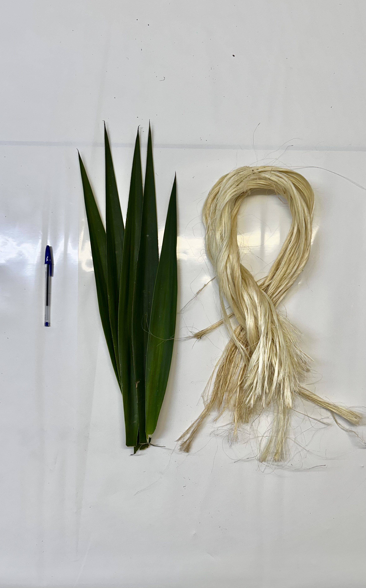

---
title: "Engenharia de Durabilidade em Geotêxteis naturais para Solos Tropicais"
author: "Luiz Diego Vidal Santos"
csl: springer-vancouver.csl
bibliography: referencias.bib
fig-align: center
lang: pt-br
---

Luiz Diego Vidal Santos, ORCID: 0000-0001-8659-8557, <ldvsantos@uefs.uefs.br>*, Universidade Estadual de Feira de Santana – UEFS, Pós-graduação em Planejamento Territorial, Feira de Santana - BA, Brasil

Francisco Sandro Rodrigues Holanda, ORCID: 0009-0000-9358-0531, <fholanda@academico.ufs.br>, Universidade Federal de Sergipe, Departamento de Engenharia Agronômica, São Cristóvão – SE, Brasil

Emersson Guedes da Silva, ORCID: 0009-0004-9742-6215, <academicoguedes@gmail.com>, Universidade Federal de Sergipe, Departamento de Engenharia Agronômica, São Cristóvão – SE, Brasil

Marlon Pedro Santos Gomes, ORCID: 0009-0007-8167-7636, <marlongomes2671@gmail.com>, Universidade Federal de Sergipe, Departamento de Engenharia Agronômica, São Cristóvão – SE, Brasil

Alarico José da Silva Azerêdo, ORCID: 0009-0002-9805-9870, <alaricofilho76@hotmail.com>, Universidade Federal de Sergipe, Departamento de Engenharia Agronômica, São Cristóvão – SE, Brasil

Renisson Neponuceno de Araújo Filho, ORCID: 0000-0002-9747-1276, <renisson.neponuceno@ufrpe.br>, Universidade Federal Rural de Pernambuco, Departamento de Tecnologia Rural, Recife – PE, Brasil

Eliana Midori Sussuchi, ORCID: 0000-0001-9425-0921, <midori@academico.ufs.br>, Universidade Federal de Sergipe, Departamento de Química, São Cristóvão – SE, Brasil

Alceu Pedrotti, ORCID: 0000-0003-3086-8399, <alceupedrotti@gmail.com>, Universidade Federal de Sergipe, Departamento de Engenharia Agronômica, São Cristóvão – SE, Brasil

## Resumo

A degradação de solos tropicais e os passivos de microplásticos associados aos geossintéticos convencionais exigem soluções de bioengenharia baseadas em materiais renováveis com funcionalidade temporizada. O presente estudo avalia a viabilidade técnica e a durabilidade funcional de geotêxteis produzidos a partir de *Typha domingensis* e *Syagrus coronata*, utilizando modelagem probabilística para propor especificações de engenharia baseadas na degradação química e mecânica em ambiente real. Os resultados demonstram que a arquitetura química das fibras, especificamente a razão lignina/celulose, condiciona a cinética de degradação, definindo janelas de serviço entre 60 e 180 dias. A mercerização alcalina (6% NaOH) promoveu reorganização morfoestrutural crítica, equilibrando resistência e ductilidade para estender a Vida Útil Funcional (VUF) ao patamar necessário para o estabelecimento vegetativo. Tratamentos por resinas exibiram comportamento não linear, onde a aplicação monocamada retardou a degradação (~120 dias), mas sobreposições induziram delaminação precoce.
Ensaios via Weibull confirmaram que a especificação baseada no percentil de confiabilidade ($P_{10}$), em detrimento da média simples, oferece um critério robusto para alinhar engenharia de superfície e janelas de serviço (90–150 dias). Conclui-se que a integração entre caracterização microestrutural e modelagem de confiabilidade valida o uso desses materiais em bioengenharia de solos tropicais.

**Palavras-chave.** Controle de erosão, Poluição ambiental, Cinética de biodegradação, Serviços ecossistêmicos e Confiabilidade Weibull.

## 1. Introdução

A degradação do solo em regiões tropicais opera através de mecanismos distintos daqueles observados em contextos temperados, sobretudo devido a maior intensidade pluviométrica e as temperaturas elevadas. Segundo @Brady2009, esses fatores aceleram a mineralização da matéria orgânica, que conjugada a Oxissolos intemperizados, resulta em taxas elevadas de perda de nutrientes por lixiviação.

De acordo com @Lammel2015, biomas tropicais como a Caatinga e o Cerrado, solos com fertilidade natural reduzida apresentam elevada vulnerabilidade a perda nutricional em função de sua forte sazonalidade hídrica, resultando em depleção biogeoquímica que compromete tanto a matriz física quanto reservatórios nutricionais essenciais à produtividade agrícola [@Cardoso2006].

A predominância de minerais argilosos 1:1 na pedogênese tropical, conjugada com baixo teor de carbono orgânico do solo, resultam em solos de mínima coesão estrutural. @Bispo2017 demonstraram que essa estrutura debilitada torna os solos vulneráveis à erosão por impacto de gotas de chuva e carreamento de partículas pelo escoamento superficial durante tempestades convectivas.

A resistência ao cisalhamento do solo não coeso, quantificada pelo ângulo de atrito interno efetivo dependente de granulometria e densidade [@Veylon2015], torna-se particularmente deficiente em Neossolos Quartzarênicos de margens fluviais tropicais. Trabalhando com esses solos, @Mahannopkul2019 caracterizaram sua baixa coesão, alta porosidade e resistência mecânica limitada. Essa vulnerabilidade geotécnica manifesta-se de forma crítica em taludes com inclinações elevadas (p.ex., superiores a 25°), nos quais carregamentos hidrológicos podem intensificar a instabilidade, aproximando o fator de segurança do limiar de ruptura [@Nunes2022].

Conforme observado por @Islam2013, essa configuração resulta em instabilidade incipiente durante períodos chuvosos quando o aumento da pressão de poros reduz a tensão normal efetiva, precipitando falhas por escorregamento. Consequentemente, demonstraram que a capacidade de carga admissível de fundações superficiais fica limitada a 50–100 kPa, restringindo drasticamente as opções de estruturas de reforço convencionais.

Essa vulnerabilidade geotécnica aumenta sob ação antrópica. Segundo @Borrelli2017, a perda irreversível da camada superficial do solo, concentradora de fósforo e nitrogênio biodisponíveis, conjuga-se com eutrofização induzida pela sedimentação em ecossistemas fluviais a jusante, comprometendo a qualidade hídrica regional. Na região semiárida brasileira, a produção de sedimentos em encostas degradadas pode atingir 45 Mg·ha⁻¹ durante a estação chuvosa, excedendo a taxa pedogênica em duas ordens de magnitude, representando dissipação de séculos de ciclos biogeoquímicos sem perspectivas de restauração ecológica em escalas temporais humanas [@Vannoppen2017].

Diante dessa realidade, respostas tecnológicas tradicionais recorreram predominantemente a geossintéticos derivados do petróleo. Conforme revisado por @Holanda20251, polipropileno, polietileno e tereftalato de polietileno caracterizam-se por alta resistência e estabilização UV mediante benzotriazol, consolidando uma dependência de matérias-primas não renováveis.

A durabilidade desses materiais revela-se através de três modos de falha. Rupturas por tensões excessivas ocorrem com deformação plástica seguida de endurecimento por orientação molecular [@Carneiro2018], de modo que *Creep* manifesta-se como deformação progressiva sob carga sustentada, resultando em perda gradual de funcionalidade ao longo de décadas [@BarreiraPinto2023]. Degradação por radiação UV sob irradiância tropical (5–8 kWh·m⁻²·dia⁻¹, espectros 280–350 nm) reduz progressivamente a resistência à tração [@ISO1996], conforme especificações ISO 10319 e ASTM D4595.

Esse paradigma revela contradição estrutural, visto que materiais concebidos para persistência multidecadal em aterros sanitários e sub-bases viárias apresentam uma vida útil projetada entre 30–50 anos [@Koerner2016], impondo passivos ambientais de longo prazo quando implantados em sistemas agroecológicos [@Bhatia2010]. Trabalhando com geotêxteis de polipropileno, @Ibanez2014 e @Konvalinkova2015 observaram alta recalcitrância sob condições anaeróbicas, com fragmentação mecânica gradual em microplásticos (<5 mm) cuja infiltração nas teias tróficas edáficas compromete simbioses microbianas e provoca posterior rearranjo da microbiota do solo.

@Bai2022 quantificaram densidades médias de 349±137 partículas·kg⁻¹ em solos cobertos após exposição UV, com emissões anuais estimadas em milhares de toneladas para ambientes marinhos, evidenciando transferência trófica em ecossistemas terrestres e aquáticos adjacentes. Essa limitação dos materiais sintéticos torna a persistência temporária controlada um atributo funcional estratégico para aplicações em bioengenharia. Enquanto geotêxteis sintéticos resistem à biodegradação por décadas, @Chakravarthy2021 e @Midha2017 demonstraram que fibras lignocelulósicas apresentam degradação progressiva em 6–18 meses, compatível com estabelecimento de sistemas radiculares permanentes.

Estudos de durabilidade revelam que geotêxteis de fibras naturais tratadas com emulsões betuminosas mantêm 82–85% da resistência inicial após 90 dias de exposição edáfica [@Thakur2019], reforçando que a degradação programada pode ser especificada como atributo funcional [@Pil2019].

Segundo @Rodriguez2023, a composição lignocelulósica confere prazo de funcionalidade intrínseco governado por consórcios microbianos e estresse oxidativo ambiental, sincronizando-se com a cinética de estabelecimento vegetativo em bioengenharia do solo. @Almeida2023 e @Singh2024_vetiver demonstraram que redes radiculares atingem equivalência mecânica ao reforço sintético em 90–180 dias.

Avaliações de ciclo de vida do tipo *cradle-to-gate* para geotêxteis bio-based indicam que o perfil ambiental pode ser favorável em diversas categorias quando comparado a alternativas petroquímicas, embora haja sensibilidades relevantes (p.ex., contribuição do transporte e trade-offs em consumo hídrico), o que torna inadequado inferir desempenho ambiental apenas a partir da biodegradabilidade [@Amadou2022_natural_geotextile_cost]. Nesse enquadramento, a engenharia de durabilidade surge como abordagem para otimizar a funcionalidade temporizada e reduzir externalidades na substituição de geossintéticos convencionais em bioengenharia de solos tropicais [@Lorenzo2024_Typha].

Para atingir este propósito, o presente estudo avalia a viabilidade técnica e a durabilidade funcional de geotêxteis produzidos a partir de *Typha domingensis* e *Syagrus coronata*, utilizando modelagem probabilística para propor especificações de engenharia baseadas na degradação química e mecânica em ambiente real. A validação de desempenho ancora-se na estatística de Weibull e em modelos de regressão linear, garantindo a rastreabilidade entre as alterações microestruturais e os modos de falha macroscópicos.

A hipótese central investigada é que a razão L/C atua como principal variável preditiva da cinética de degradação e da Vida Útil Funcional (VUF). Postula-se, complementarmente, que intervenções de engenharia de superfície permitem modular a curva de decaimento mecânico ($P_{10}$), assegurando a sincronização crítica entre a perda de resistência do material e o tempo necessário para o estabelecimento do sistema radicular da vegetação.

## 2. Materiais e Métodos

O delineamento experimental combinou a quantificação da resposta mecânica de fibras naturais sob carregamento monotônico com a caracterização morfológica por microscopia eletrônica de varredura (MEV), mantendo a inferência sobre vida útil de serviço vinculada a métricas mensuráveis e a protocolos normativos de ensaio. As intervenções de engenharia de superfície incluíram mercerização alcalina em NaOH (3%, 6% e 9%) e revestimento polimérico à base de resina Hydronorth® em duas dosagens areais (0,0932 e 0,1864 mL·m⁻²), preservadas como variáveis de processo na consolidação dos dados.

Para o conjunto em que se avaliou mercerização alcalina em geotêxteis de *Typha domingensis*, o tratamento foi realizado por imersão em solução de NaOH por 24 h nas concentrações de 3% (0,75 mol·L⁻¹), 6% (1,5 mol·L⁻¹) e 9% (2,25 mol·L⁻¹), mantendo-se relação de banho constante; após a reação, o material foi lavado em água corrente até neutralização e seco ao ar em ambiente sombreado e ventilado, em intervalo da ordem de dias, com registro fotográfico do processamento apresentado na Figura 1.

{width=90%}

O monitoramento de degradação natural foi conduzido em talude tropical com inclinação de 45° no Campus Rural da Universidade Federal de Sergipe, com instalação de unidades em parcelas retangulares ao longo da pendente, buscando reproduzir condição de aplicação em campo e minimizar efeitos de borda por retirada de material na porção central (Figura 2). A exposição ocorreu entre os meses de maio e novembro, período caracterizado por precipitação acumulada de aproximadamente 350 mm e irradiância UV-B média diária de 6,5 kWh·m⁻²·dia⁻¹, conforme monitoramento local.

{width=90%}

Para caracterizar a cinética de biodegradação em janela de serviço de até 180 dias, seções de aproximadamente 20 cm × 20 cm foram removidas em intervalos programados (0, 30, 60, 90, 120, 150 e 180 dias), com secagem prévia em estufa a 60 °C por 24 h antes da preparação dos corpos de prova.

Como a retirada e os ensaios são destrutivos e a integridade do material condiciona a possibilidade de preparo sob o mesmo protocolo, o número efetivo de corpos de prova por combinação espécie × tratamento × tempo variou ao longo da exposição, incluindo combinações ausentes em tempos tardios.

As fibras foram selecionadas e preparadas para ensaios mecânicos e caracterização microestrutural, preservando-se a fração fibrosa de interesse (Figura 3).

{width=80%}

### Tração e punção em fibras

Os ensaios de tração foram conduzidos em corpos de prova constituídos por fibras (e/ou feixes fibrosos), fixados em garras e submetidos a carregamento monotônico em máquina universal de ensaios, com distância inicial entre garras de 110 mm e velocidade de deslocamento de 20 mm·min⁻¹.

Os ensaios de punção estática do tipo CBR foram tratados como medida complementar de integridade sob solicitação concentrada, com corpo de prova circular de 70 mm, anel de fixação de 50 mm, punção de 17 mm e velocidade de ensaio de 50 mm·min⁻¹.

### Índice de Lignina/Celulose (L/C)

A quantificação da razão lignina/celulose (L/C) foi realizada por espectroscopia de infravermelho por transformada de Fourier (FTIR) em equipamento PerkinElmer Spectrum Two, com aquisição no modo ATR, varredura entre 4000 e 400 cm⁻¹, resolução de 4 cm⁻¹ e média de 32 varreduras por espectro. A análise espectral concentrou-se nas bandas características atribuídas à celulose (1030 cm⁻¹) e à lignina (1510 cm⁻¹), conforme metodologia descrita por @Pandey1999. A razão L/C foi estimada pela relação entre as intensidades de absorção nessas bandas, conforme a equação: 

\[L/C = \frac{I_{1510}}{I_{1030}}\]
onde \(I_{1510}\) e \(I_{1030}\) representam as intensidades de absorção nas respectivas bandas.

### MEV e extração de descritores morfológicos

As superfícies fibrosas foram analisadas por MEV após metalização em ouro, empregando-se um metalizador Cressington (Kurt J. Lesker 108) e aquisição de imagens em equipamento HITACHI TM 3000 sob vácuo e feixe de elétrons de 15 kV, com ampliação em 50× e quantização em 8 bits (escala de histograma 255) para permitir o processamento digital subsequente.

A segmentação de regiões de interesse e a quantificação de danos foram operacionalizadas por limiarização em níveis de cinza, em que regiões mais escuras foram tratadas como zonas danificadas conforme a lógica de processamento descrita na documentação interna.

A análise quantitativa das micrografias foi implementada em rotinas Python baseadas em OpenCV e scikit-image, em que a normalização de intensidade antecedeu a estimação de orientação por gradientes (operadores de Sobel) e a extração de descritores de anisotropia por um índice de orientação definido como $IO = 1 - (\sigma_\theta/90^\circ)$, com filtragem gaussiana típica de 1,0 pixel e limiaramento por percentil (75º) da magnitude do gradiente.

A detecção de porosidade foi tratada como problema de segmentação com suavização gaussiana de 2,0 pixels, limiar definido como 0,7 vezes o limiar de Otsu, área mínima de 20 pixels e preenchimento morfológico de 10 pixels, enquanto a caracterização de conectividade e continuidade estrutural foi suportada por esqueletização (Zhang–Suen) e por métricas de densidade esqueletal e junções, com parâmetro de suavização para junções de 2,0 pixels.

A textura superficial foi quantificada por matriz de coocorrência de níveis de cinza (GLCM), empregando distâncias de 1, 2, 3 e 5 pixels e ângulos de 0°, 45°, 90° e 135°, com 256 níveis de cinza e normalização simétrica, bucando contraste, homogeneidade, energia e correlação.

### Análises estatísticas e modelagem

Para quantificar tendência temporal e sensibilidade a variáveis de processo sob amostragem desbalanceada no tempo, a resistência à tração foi descrita por modelos lineares de mínimos quadrados ordinários, com tempo de exposição como preditor contínuo (centralizado) e fatores categóricos de espécie e nível de tratamento, incluindo termos de interação. A inferência foi baseada em erros‑padrão robustos do tipo HC3 e testes de Wald por termo; adicionalmente, foi reportada a decomposição por ANOVA tipo II, acompanhada de estimativas de tamanho de efeito (η² parcial).

No conjunto analisado, a base de tração totalizou N=154 observações no experimento com resina e N=127 observações no experimento com NaOH, refletindo a variação do número de corpos de prova por tempo e a existência de combinações ausentes em tempos tardios. A consolidação e análise foram realizadas em ambiente Python (versão 3.13), com `statsmodels` para modelagem e testes, `scipy` para rotinas auxiliares e `matplotlib/seaborn` para visualização.

## 3. Resultados e Discussão

### 3.1. Arquitetura Lignocelulósica e Perfil Químico

O desempenho mecânico e a trajetória de biodegradação de geotêxteis de fibra natural tendem a depender da relação entre lignina e celulose que organiza o arcabouço molecular da parede celular. A celulose estabelece uma rede semicristalina associada à rigidez inicial, enquanto hemiceluloses e lignina modulam acessibilidade a água e a agentes degradantes, condicionando a cinética de perda de capacidade ao longo do tempo [@Shaghaleh2018].

As microfibrilas resultantes, imersas em matriz amorfa de hemiceluloses constituídas por heteropolissacarídeos ramificados, como xilana, arabinana e galactana, e em lignina formada por oligômeros fenilpropanoides reticulados, reduzem de maneira efetiva a acessibilidade de sítios glicosídicos às rotas de hidrólise enzimática e química [@Karim2023, @Poletto2012].

Em termos funcionais, diferenças na razão lignina/celulose e na distribuição microestrutural desses constituintes tendem a se traduzir em trajetórias contrastantes de degradação e, por consequência, em janelas distintas de Vida Útil Funcional sob condições ambientais semelhantes [@Haviland2024]. Nesse enquadramento, a fração lignínica atua como componente relativamente mais recalcitrante e hidrofóbico, modulando acessibilidade a água e agentes degradantes e influenciando a taxa de perda de capacidade mecânica ao longo do tempo [@Nguyen2024].

**Figura 4.** Arquitetura hierárquica multinível de fibras lignocelulósicas sendo, **(a)** Representação esquemática dos principais polímeros de cadeias lineares de celulose, **(b)** Organização supramolecular do núcleo cristalino das microfibrilas de celulose, **(c)** Seção transversal da parede celular vegetal e **(d)** Nível do Tecido e Razão L/C: Comparação esquemática de feixes de fibras de *Typha* (baixa lignificação) e *Syagrus* (alta lignificação).

A caracterização química de fibras de *Syagrus coronata* (Tabela 1) demonstra 32% de lignina contra 22% em *Typha domingensis*, diferença composicional que se traduz em trajetórias de degradação contrastantes sob exposição em campo. Fibras não tratadas de *Typha* perdem viabilidade mecânica aos 60 dias de exposição ambiental (redução de 63,2% na resistência à tração), enquanto *Syagrus* mantém integridade estrutural observável até 90 dias, evidenciando a recalcitrância conferida pelo maior teor de lignina [@Holanda2020].

A relação lignina-celulose (L/C) tem sido empregada como um índice útil para discutir recalcitrância [@Rodrigues2020]. A partir da compilação de dados experimentais apresentada neste manuscrito (Tabela 3), observa-se uma relação exponencial inversa entre L/C e a constante de taxa de degradação ($k$, dia⁻¹), expressa por:

$$
k = 0{,}032 \cdot e^{-2{,}1 \cdot (L/C)}
$$

Para *Typha* (L/C = 0,46), isso resulta em $k$ = 0,0118 dia⁻¹, o que implica uma meia-vida de 59 dias sob condições mesofílicas (25°C, 60% de umidade relativa). Em contraste, *Syagrus* (L/C = 0,67) apresenta $k$ = 0,0082 dia⁻¹ (meia-vida = 85 dias), consistente com observações de campo onde geotêxteis de *Syagrus* não tratados mantiveram integridade estrutural após 120 dias de exposição, enquanto os geotêxteis de *Typha* falharam em 60 dias.

**Tabela 1.** Perfil químico-mecânico comparativo de fibras lignocelulósicas tropicais para geotêxteis biodegradáveis.

| Espécie                    | Celulose (%) | Lignina (%) | L/C  | Tração inicial (N/mm) | Deformação (%) | k (dia⁻¹) | t½ (dias) | VUF P₁₀ (dias)† |
| --------------------------- | ------------ | ----------- | ---- | ----------------------- | ---------------- | ----------- | ---------- | ------------------ |
| **Typha domingensis** | 48           | 22          | 0.46 | 107.6 ± 25.3           | 2.9 ± 2.1       | 0.0118      | 59         | 42                 |
| **Juncus sp.**        | n.d.         | n.d.        | n.d. | 72.6 ± 16.9            | n.d.             | >0.015*     | <46*       | <30*               |
| **Syagrus coronata**  | 48‡         | 32          | 0.67 | 142.1 ± 31.6           | 2.9 ± 2.1       | 0.0082      | 85         | 38§               |

**Notas.** n.d. = não determinado, VUF é baseada no 10º percentil de falha Weibull (P₁₀), e os valores marcados com asterisco são estimados a partir de perda de 97% aos 60 dias, ao passo que o símbolo ‡ indica estimativa consistente com a razão L/C adotada (celulose ≈ lignina/(L/C)); por consistência interna, valores de L/C e parâmetros derivados (k, t½) devem ser internamente consistentes entre equação, tabela e texto.

Entretanto, a diferença de recalcitrância resumida na Tabela 1 não garante prolongamento linear da durabilidade em todas as combinações de arquitetura e carregamento, pois há registros de colapso estrutural abrupto com perda de 65% da resistência em aproximadamente 30 dias para configurações com teor elevado de lignina quando a distribuição espacial desse polímero na parede celular favorece zonas frágeis de iniciação de trinca [@Silva2025].

O comportamento bifásico, caracterizado por fase inicial de manutenção aparente da rigidez seguida de falha súbita [@Phan2025], sugere que a geometria de percolação da fase lignínica, e não apenas sua fração mássica global, pode influenciar a progressão da biodegradação sob tensões cisalhantes e de tração típicas de taludes vegetados [@Zhang2024yao].

A relação entre composição química e desempenho temporal, esquematizada na Figura 5, descreve uma trajetória contínua que parte da razão L/C, passa pela cinética de degradação e pela evolução da resistência mecânica ao longo do tempo. O diagrama integra constantes de degradação $k$ e meias-vidas $t_{1/2}$, curvas de perda de resistência até a falha e estimativas de VUF pelo percentil de 10% de falha em modelos de Weibull (P₁₀, com parâmetros β e η) [@Fakoor2023], além de estratégias de modificação de superfície por mercerização alcalina [@Ray2002] e revestimentos poliméricos [@Lerpiniere2014] que deslocam essa curva temporal.

**Figura 5.** Diagrama de fluxo integrando composição química, expressa pela razão lignina/celulose, com o desempenho temporal e a Vida Útil Funcional de geotêxteis sob diferentes cenários de tratamento de superfície.

*Nota. O fluxograma articula constantes de degradação $k$ e meias-vidas $t_{1/2}$ medidas em campo, trajetórias de resistência mecânica até o ponto de falha e Vida Útil Funcional (VUF) derivada de distribuições de Weibull no percentil de projeto P₁₀.*

Espectroscopia no Infravermelho por Transformada de Fourier (FTIR) vincula assinaturas espectrais à composição relativa e à organização química da parede celular, oferecendo suporte mecanístico para diferenças de recalcitrância e de acessibilidade a água e agentes degradantes.

**Figura 6.** Comparação de espectros FTIR entre *Typha domingensis* e *Syagrus coronata*.
{width=100%}

*Nota. As diferenças espectrais mais relevantes são coerentes com maior contribuição relativa de frações mais hidrofílicas em *Typha* e com maior contribuição aromática associada à lignina em *Syagrus*.*

Essa composição bioquímica tende a se refletir na cinética de degradação. Segundo @Santos2023_PatenteTaboa, *Typha* perde 50% da resistência inicial em aproximadamente 60 dias sob condições de campo; no conjunto experimental aqui analisado, *Syagrus* manteve integridade funcional por períodos superiores a 120 dias, coerente com uma trajetória de degradação mais lenta. Nesse conjunto de resultados, a razão lignina/celulose (L/C) aparece como um marcador útil para descrever diferenças de recalcitrância e de ritmo de perda de capacidade, com *Typha* associada a degradação mais rápida e *Syagrus* a degradação mais lenta.

Embora a FTIR descreva grupos funcionais, o arranjo cristalino avaliado por difração de raios X (Figura 7) contribui para a integridade física. @Segal1959 propuseram metodologia que indica índices de cristalinidade de 52% para *Typha* versus 46% para *Syagrus*. Segundo @Boerjan2003, esse contraste sugere que o maior teor de lignina em *Syagrus* pode compensar a cristalinidade reduzida, ao preencher a fração amorfa e elevar a rigidez. As fibras de *Typha domingensis* exibem picos de celulose I em 2θ ≈ 14,8° (plano 1-10/110), 16,4° (110) e 22,6° (200) [@Rowell1998].

Na caracterização mecânica dessas fibras, @Fontes2021 reportaram resistências à tração iniciais próximas entre as espécies, com 3,14 N·mm⁻² para *Syagrus* e 3,57 N·mm⁻² para *Typha* não tratada. Em conjunto, variações composicionais e estruturais observadas por FTIR/DRX/TGA são consistentes com diferenças na integridade microfibrilar e no desempenho mecânico inicial.

**Figura 7.** Difratograma de raios X (DRX) da fibra de *Typha domingensis* e *Syagrus coronata*
{width=70%}

A maior estabilidade térmica de *Syagrus*, associada ao teor de lignina, pode se refletir em maior fração residual. Análises termogravimétricas sob atmosfera oxidativa (ar, 10 °C·min⁻¹) indicam que *Syagrus* retém ~28% de massa residual a 600 °C, versus ~21% para *Typha* [@Marchi2023].

### 3.2. Hidrofilicidade, Biodegradação e a Definição de Vida Útil Funcional

A onipresença de grupos funcionais hidroxila (-OH) nas superfícies de celulose e hemicelulose tende a conferir caráter hidrofílico às fibras, frequentemente associado a ângulos de contato baixos com água, condição que facilita a entrada de umidade e cria microambientes favoráveis à colonização microbiana logo nos estágios iniciais de exposição em campo [@Chieng2017].

Essa colonização fúngica se associa à atividade extracelular de celulases, que clivam ligações β-1,4-glicosídicas e aceleram a perda de massa, conectando a hidrofilicidade superficial ao decréscimo progressivo de capacidade resistente [@deVries2010].

Segundo @Schneider2023, a biodegradação de matrizes lignocelulósicas decorre de dois mecanismos simultâneos: erosão superficial induzida por ataque enzimático a partir da cutícula e penetração radial de hifas que formam túneis microscópicos e zonas de cavitação sob tração. @Nilsson1988 documentaram por microscopia eletrônica que a erosão superficial domina os primeiros 30 dias de exposição, evoluindo posteriormente para penetração radial que rompe a lamela média lignificada e compromete a coesão entre células adjacentes, processo compatível com o comportamento mecânico observado em ensaios de tração e punção.

A análise termogravimétrica (TGA), que mensura a perda de massa com o aumento da temperatura, permite acompanhar mudanças associadas à exposição ambiental. Conforme reportado por @Cardoso2023_TGA_biomass, observa-se um ombro inicial entre 220 e 280°C, atribuído à pirólise de hemicelulose, cuja intensidade tende a diminuir com o avanço da degradação. 

O pico principal de celulose (300–360°C) desloca-se para temperaturas inferiores à medida que a despolimerização progride, enquanto a fração atribuída à lignina acima de 400°C tende a permanecer mais estável [@Liu2008]. Esse padrão é consistente com a interpretação de @Leng2020_TGA_PKM de que a lignina atua como resíduo mais recalcitrante, persistindo após a degradação e contribuindo para o acúmulo de carbono orgânico no solo.

Os dados experimentais de geotêxteis naturais indicam que a razão lignina/celulose (L/C) não governa de forma unívoca a resistência inicial, mas se associa ao modo de falha e, de forma mais consistente, à recalcitrância e à cinética de perda de capacidade ao longo do tempo. @Holanda2023 observaram que configurações com maior participação de lignina tendem a apresentar resistência à tração inicial superior às de menor L/C; entretanto, essa associação não implica, por si só, durabilidade estendida, pois o desempenho temporal também depende da microestrutura, das condições de exposição e de tratamentos de superfície.

A discrepância entre recalcitrância química teórica e desempenho temporal reforça que a resistência à biodegradação não depende apenas da quantidade total de lignina, mas de sua organização tridimensional na parede celular [@Youssefian2017], ou seja, da forma como o arcabouço aromático se distribui em relação às regiões ricas em celulose e hemicelulose.

Estudos de @Souza2019 demonstraram que a lignina apresenta distribuição espacial heterogênea ao longo das camadas da parede celular, concentrando-se na lamela média e nos cantos celulares, regiões que respondem pela coesão estrutural do tecido. Essa heterogeneidade define zonas de maior e menor acessibilidade enzimática, modulando a penetração de microrganismos degradadores e a localização preferencial de iniciação de trincas.

Em linha com esse quadro, @Blanchette1995 descrevem a lignina como barreira física à ação de enzimas lignocelulolíticas não apenas por sua abundância, mas pelo modo como se intercala na matriz de celulose e hemicelulose, o que explica por que materiais com teores semelhantes de lignina podem apresentar durabilidades distintas sob o mesmo regime de exposição.

Nessa perspectiva, a resistência à degradação biológica resulta da combinação entre proporção relativa de lignina e sua distribuição tridimensional na parede celular, parâmetros que, integrados à razão L/C efetiva, definem um perfil de recalcitrância que condiciona a acessibilidade enzimática e o padrão temporal de perda de capacidade. Em nível mecanístico, há evidências de que diferentes assinaturas químicas de lignina podem impor efeitos inibitórios comparáveis sobre a degradabilidade da parede celular, restringindo a ação enzimática na matriz lignocelulósica [@Grabber].

Essa abordagem determinística tende a se tornar inadequada quando coeficientes de variação entre amostras excedem 25% e a perda de resistência não segue trajetória linear, cenário em que parâmetros médios deixam de representar o risco real de falha.

Segundo @Curtin2000, a Vida Útil Funcional (VUF) pode ser tratada como grandeza probabilística que representa o intervalo durante o qual 90% dos geotêxteis implantados mantêm capacidade resistente acima de um limite crítico de projeto. Nessa formulação, a VUF é limitada pelo 10º percentil ($P_{10}$) da distribuição de falhas de Weibull, descrita por:

$$
P(t) = 1 - \exp\left[-\left(\frac{t}{\eta}\right)^\beta\right],
$$

em que $\eta$ representa o parâmetro de escala, associado à vida característica, e $\beta$ descreve o modo de falha. A aplicação desse modelo a fibras não tratadas de geotêxteis resulta em $P_{10} = 42$ dias como VUF em condições de campo, o que alinha a janela de serviço mecânico com a cinética de colonização microbiana antes descrita.

Intervenções de engenharia de superfície deslocam essa distribuição de forma quantificável. O tratamento alcalino com 6% de NaOH estende a VUF para cerca de 95 dias, ao passo que a aplicação de resina acrílica em camada única desloca $P_{10}$ para a ordem de 128 dias, aproximando-se do horizonte temporal de estabelecimento radicular em taludes vegetados.

Dessa forma, a arquitetura química, sintetizada na razão L/C e na organização da lignina, combinada aos tratamentos de superfície, passa a influenciar de forma relevante os parâmetros de Weibull utilizados em projeto, conectando degradação microscópica observada por MEV, TGA e análises enzimáticas à confiabilidade estrutural em escala de talude [@Kaya2023].

### 3.3. Mercerização Alcalina e Revestimentos Poliméricos

A mercerização com hidróxido de sódio (NaOH) remove seletivamente lignina e hemiceluloses, expondo microfibrilas de celulose cristalina e reduzindo a heterogeneidade superficial das fibras [@Verma2021]. Essa reorganização químico‑estrutural diminui a densidade de defeitos na interface fibra–matriz, favorece o rearranjo inter e intrafibrilar e aumenta a estabilidade da celulose tratada, com ganhos diretos em adesão interfacial quando as fibras são incorporadas a compósitos [@Ikramullah2018].

Nos dados aqui analisados, essa reestruturação morfológica produziu relação não monotônica entre resistência mecânica e concentração alcalina. As fibras não tratadas apresentaram resistência à tração (UTS) média de 18,88 N·mm⁻², enquanto o tratamento com 3% de NaOH resultou em 17,62 N·mm⁻², diferença estatisticamente não significativa. A concentração intermediária de 6% NaOH elevou a UTS para 21,39 N·mm⁻², aumento de 13,3% em relação ao controle, acompanhado de incremento na resistência à punção.

Trabalhando com fibras de tamareira (*Phoenix dactylifera*), @Oushabi2017 relataram aumento de 76% na resistência à tração após tratamento com 5% de NaOH, efeito atribuído à remoção efetiva de materiais não celulósicos e à maior exposição de microfibrilas de celulose. Em linha com essa evidência, @Garg2022 e @Narayana2021 indicam que concentrações alcalinas intermediárias removem seletivamente frações amorfas de lignina e hemicelulose, reduzem impurezas superficiais, melhoram a molhabilidade e ampliam a adesão interfacial sem comprometer a cristalinidade da celulose, configurando rede fibrilar mais coesa e eficiente na transferência de carga.

Em paralelo, estudos recentes em compósitos reforçados por fibras naturais reportam ganhos mecânicos e alterações morfológicas, bem como dependência não linear do desempenho em função de carregamento e tratamento [@Kar2024; @Kar2025VNL], o que oferece suporte convergente, ainda que fora do escopo estrito de geotêxteis, à interpretação de que arquitetura fibrilar e compatibilização superficial modulam mecanismos de dano e trajetória de desempenho [@Aruchamy2024; @Ayrilmis2024; @Palanisamy2024].

A 9% NaOH, embora a UTS atinja 22,49 N·mm⁻², observam-se indícios de corrosão superficial e possível despolimerização, com maior fragilidade e apenas melhora modesta na resistência à punção (Tabela 2). Há relatos de que tratamentos com índice alcalino elevado, após uma fase inicial de limpeza estrutural e rearranjo cristalino, podem também degradar a matriz celulósica [@Amior2022]. A exposição prolongada a soluções concentradas de NaOH pode induzir hidrólise alcalina das ligações glicosídicas, reduzir o grau de polimerização da celulose e comprometer a integridade estrutural das fibras [@Nurazzi2021].

Conforme observado por @Bartos2020, os resultados convergem, portanto, para uma janela ótima de concentração em torno de 6% NaOH, em que os benefícios da deslignificação e da remoção de hemicelulose superam os riscos de dano estrutural, elevando o desempenho mecânico sem perda excessiva de ductilidade.

Esse balanço envolve a remoção parcial de lignina, que pode reduzir sítios de colonização microbiana, e a preservação de cadeias de celulose com alto grau de polimerização, cuja degradação comprometeria a resistência global [@Xu2013]. Nossos experimentos em campo por 180 dias indicaram que fibras não tratadas mantêm funcionalidade por cerca de 60 dias, enquanto o tratamento com 6% NaOH prolonga a viabilidade estrutural para 142 dias (VUF de 95 dias no limiar $P_{10}$ de Weibull). Na condição de 9% NaOH, observou-se preservação de integridade estrutural com censura ao longo de todo o período de 180 dias.

Um modelo linear por mínimos quadrados ordinários, sintetizado por ANOVA tipo II, indica que o tempo de exposição domina a variabilidade da UTS, mantendo-se um efeito adicional de tratamento com NaOH e de interações, sugerindo que a engenharia de superfície deve ser tratada como variável de controle de trajetória, e não apenas como ganho instantâneo de resistência (Figura 9).

**Figura 8.** Microscopia eletrônica de varredura (MEV) comparativa de fibras de *Typha domingensis* e *Syagrus coronata* sob diferentes tratamentos e tempos de exposição.

{width=100%}

*Nota. As subfiguras (a–d) correspondem a *Typha domingensis* (30 d sem tratamento, 180 d sem tratamento, 30 d com dupla camada de resina e 180 d com dupla camada), enquanto as subfiguras (e–h) correspondem a *Syagrus coronata* nas mesmas condições; magnificação 700× e barra de escala de 100 µm.*

Análises morfométricas demostram que, fibras de menor recalcitrância apresentam evolução de porosidade caracterizada por colapso estrutural progressivo, com superfícies inicialmente rugosas evoluindo para topografias mais uniformes à medida que produtos de degradação são depositados. Esse padrão contrasta com fibras de maior teor de lignina, que exibem formação de sulcos profundos e canais longitudinais ao longo do tempo, compatíveis com degradação orientada por complexos enzimáticos ligninolíticos [@Prado2019; @Tian2019].

Revestimentos poliméricos induziram reorganização microestrutural complexa, com porosidades máximas em estágios intermediários de exposição, seguidas por delaminação interfacial sob condições de campo. Em conjunto, densidade de fraturas e severidade de danos foram consistentes com falha progressiva por erosão superficial seguida por penetração radial, sustentando o uso de distribuições de Weibull com parâmetro de forma β > 1 para caracterização probabilística da durabilidade [@Guo2014_palm_weibull].

No que se refere à deformação na ruptura (ε), os resultados descrevem padrão inverso ao da resistência, com manutenção do alongamento em 3% NaOH (2,86%, próximo ao controle de 2,95%) e reduções progressivas em 6% e 9% NaOH (2,31% e 2,18%), evidenciando perda de ductilidade em concentrações mais elevadas, coerente com o acúmulo de dano químico e a redução do grau de polimerização sob alcalinidade elevada [@Fitriana2020]. A condição de 6% NaOH caracteriza, no conjunto analisado, ponto ótimo operacional para geotêxteis com Vida Útil Funcional de 120 a 150 dias, pois combina ganho de resistência à tração (+13,3%) e à punção (+25,0%) com ε ainda acima de 2,3%.

Nesse contexto, a morfometria quantitativa sugere que o balanço observado decorre de transformações nanométricas, com transição parcial de celulose I para celulose II, elevação da rugosidade superficial (+48,2%) e maior acessibilidade de grupos hidroxila [@mansikkamaki2007], resultando em uma superfície mais ativa do ponto de vista de interação e transporte.

Concomitantemente, a mercerização reorganiza a rede porosa ao fundir poros pequenos em cavidades de maior área média (+73,6%), elevando a circularidade (+5,9%) e reduzindo a heterogeneidade dimensional [@Jiao2014], de modo que a porosidade total cresce moderadamente (+7,6%) apesar da queda no número de poros (−42,1%), o que melhora a eficiência do transporte capilar em vez de simplesmente vedar canais [@Koistinen2024].

Enquanto mercerização otimiza estrutura interna, a proteção externa depende de estratégias de barreira. Para quantificar a tendência temporal observada na Figura 9, ajustou-se regressão linear simples entre tempo de exposição (dias) e UTS média (N/mm²), por espécie e por condição de tratamento (médias por tempo de exposição). Em *Typha domingensis*, a monocamada de resina exibiu declínio linear acentuado entre 30–120 dias: para cada dia adicional de exposição, houve redução média de 0,084 N/mm² na UTS (β = −0,084; t = −10,339; p = 0,009; R² = 0,982; 98,2% da variância explicada). O controle (não tratado) apresentou tendência fraca e não significativa (β = −0,034; t = −1,128; p = 0,377; R² = 0,389; 38,9% da variância explicada), enquanto a bicamada mostrou queda moderada, porém sem evidência estatística robusta no intervalo disponível (β = −0,046; t = −2,767; p = 0,110; R² = 0,793; 79% da variância explicada).

Em *Syagrus coronata*, as séries sugerem trajetória menos linear (queda inicial e estabilização em níveis baixos), além de lacunas em tempos tardios, o que reduz poder inferencial quando o ajuste é feito por pontos de tempo. No conjunto, o padrão reforça que o tempo de exposição governa a perda de UTS, ao passo que espécie e tratamento modulam a forma da curva temporal (Figura 9).

**Figura 9.** Resistência à tração (UTS, N/mm) sob diferentes condições de tratamento, **(a)** revestimento com resina (Não tratado/Monocamada/Bicamada) para *Typha domingensis* e *Syagrus coronata*; **(b)** mercerização alcalina com NaOH (0%, 3%, 6%, 9%) para *Typha domingensis* e *Syagrus coronata*.

{width=80%}
{width=80%}

A resistência à punção (CBR) complementa a caracterização mecânica ao mensurar a capacidade de distribuição de carga sob solicitação concentrada, parâmetro crítico para geotêxteis implantados sobre substratos irregulares [@Cholewa2019]. Os ensaios foram conduzidos em fibras submetidas aos mesmos tratamentos de mercerização alcalina e revestimento polimérico, permitindo avaliar a sinergia entre rigidez axial e capacidade de absorção de impacto localizado.

**Figura 10.** Punção estática (CBR) em fibras, **(a)** *Typha domingensis* (taboa) e **(b)** *Syagrus coronata* (ouricuri).

{width=85%}

{width=85%}

Os resultados de punção apresentados na Figura 10 indicam que fibras de *Typha domingensis* tratadas com NaOH a 6% exibiram resposta mecânica consistente com a janela de serviço de 90–150 dias, mantendo capacidade de suportar cargas concentradas ao longo do período crítico para estabelecimento vegetativo [@Kumar2016]. Para *Syagrus coronata*, a maior razão L/C (0,67) conferiu resistência inicial superior e degradação mais lenta, coerente com a recalcitrância intrínseca observada nos ensaios de tração e nas análises de biodegradação [@Angst2017].

A interpretação dos dados de punção deve considerar a natureza destrutiva da amostragem e a heterogeneidade das matrizes lignocelulósicas [@Methacanon2010]. No conjunto analisado, a punção foi empregada como indicador complementar de integridade, sendo interpretada sobretudo em termos de tendência temporal e de comparação intratratamento. A preservação relativa de desempenho em tratamentos alcalinos moderados no intervalo intermediário de exposição permanece consistente com a lógica de proteção máxima entre 30–90 dias, período vital para ancoragem radicular [@Mickovski2009], ao passo que a manutenção de ductilidade ($\epsilon \approx 2,3–2,9\%$) em condições moderadas é essencial para absorver solicitações dinâmicas em taludes, evitando a fragilização associada a alcalinidade elevada [@Vivek2019].

Esse comportamento pode ser atribuído a danos interfaciais microscópicos. Microscopia eletrônica (15 keV) demonstrou delaminação interfacial entre resina e matriz lignocelulósica [@Petinakis2014]; além disso, ciclos higrotérmicos (18–35°C, 45–85% UR) induzem *swelling-shrinkage* repetitivo, descolando a resina e criando microambientes hidrofílicos propensos à colonização fúngica e à perda de aderência [@Tian2018_hygrothermal; @Fonseca-Garcia2019].

A aplicação de resina em dupla camada tende a reduzir a permeabilidade efetiva e a favorecer retenção de umidade na interface, o que pode acelerar rotas de hidrólise e colonização microbiana [@Gottenbos2003; @Yazdi2015], enquanto a camada única tende a preservar caminhos de difusão para a saída de umidade.

No conjunto analisado, a interpretação operacional é de que a engenharia de barreira deve ser dimensionada como controle de trajetória (redução de taxa de perda) e não como incremento isolado de resistência inicial, já que o desempenho em campo resulta do acoplamento entre permeabilidade, ciclos higrotérmicos e degradação interfacial.

A redução da taxa de degradação (*k* de 0,0118 para 0,0062 dia⁻¹) contribui para compensar a perda inicial, ao passo que a síntese inferencial por modelo linear (ANOVA tipo II) indica dominância do tempo (Days_c: F(1, 142) = 99,013; p < 0,001; η² parcial = 0,411) e relevância da interação espécie × tratamento (F(2, 142) = 6,870; p = 0,001; η² parcial = 0,088), em concordância com a interpretação de que a otimização da durabilidade depende do balanço entre proteção de barreira e permeabilidade, e não da maximização de espessura.

### 3.4. Implicações para Especificação de Geotêxteis Tropicais

A consolidação dos resultados de mercerização com NaOH e de revestimento com resina converte a relação entre razão L/C, engenharia de superfície e parâmetros de Weibull em ferramenta prática de especificação de geotêxteis naturais em ambientes tropicais [@Sodagar2025]. Como linha de base, a condição não tratada apresenta VUF de 42 dias sob distribuição de Weibull definida em termos de $P_{10}$, com taxa de degradação UTS $k = 0{,}0118$ dia⁻¹.

O tratamento com NaOH a 6% desloca essa fronteira para VUF de 95 dias, reduzindo a constante para $k = 0{,}0073$ dia⁻¹, o que representa queda de aproximadamente 38% na taxa de degradação. Já o revestimento acrílico em camada única aplicado a fibras de *Syagrus* estende a VUF para 128 dias com $k = 0{,}0061$ dia⁻¹, redução próxima de 48%. Em concentrações de 9% NaOH, a VUF ultrapassa 180 dias, com dados e $k = 0{,}0041$ dia⁻¹, equivalente a redução de cerca de 65% na taxa de degradação em relação ao controle. Esse resultado deve ser interpretado em função da dependência não linear da mercerização em alcalinidade elevada, a qual pode simultaneamente reorganizar a fração amorfa e introduzir dano químico à matriz celulósica, dependendo do regime de exposição [@Rabbani2024; @Hajidariyor2023].

Essas diferenças cinéticas permitem alinhar a escolha de tratamento à janela de serviço e ao orçamento do projeto [@Vivek2020]. Para obras que demandam suporte estrutural entre 90 e 150 dias, típicas de culturas anuais e de controle de erosão restrito à estação chuvosa, o tratamento com 6% NaOH oferece combinação favorável de VUF (95 dias em $P_{10}$) e custo direto reduzido, sem custos adicionais de remoção ou descarte [@Tan2022]. Em cenários perenes, como restauração de margens ribeirinhas ou estabilização de taludes de rodovias, a resina em monocamada, apesar do custo unitário mais elevado, torna-se competitiva, pois o prolongamento de VUF para 128 dias e o aumento de confiabilidade tendem a compensar o investimento inicial [@Tanas2022].

## 4. Enquadramento Conceitual de Confiabilidade e Desempenho Ambiental

A variabilidade intrínseca dos geotêxteis naturais favorece a modelagem estocástica da perda de desempenho. Nesse contexto, a distribuição de Weibull ($R(t) = e^{-(t/\eta)^\beta}$) representa a heterogeneidade estrutural, em que $\beta > 1$ (1,8–4,2) é associado a falha por desgaste progressivo (fadiga/hidrólise), em contraste com falha aleatória ($\beta \approx 1$). 

Além disso, a engenharia de superfície tende a elevar $\beta$ (reduzindo a variabilidade) e $\eta$, estendendo a vida útil [@Luqman2023]. Definida como o tempo para 10% de falha ($P_{10}$), a Vida Útil Funcional (VUF) pode aumentar de 42 dias (*Typha* natural) para 95 dias (6% NaOH) e 128 dias (*Syagrus* resinada), cobrindo a janela crítica de 90 dias para ancoragem vegetal.

Como mostrado anteriormente na Figura 8, as imagens de MEV documentam a progressão temporal da degradação superficial em ambas as espécies. Em *Typha domingensis*, a porosidade superficial variou de 32,75% (ST 30d) a 73,09% (DC 30d), com comportamento não-monotônico: aumento de 32,75% → 67,27% em solo tropical (ST 30d → ST 180d), mas redução de 73,09% → 68,49% sob degradação controlada (DC 30d → DC 180d). A rugosidade superficial apresentou padrão inverso: máxima aos 30 dias (941,64 µm em ST; 581,04 µm em DC) reduzindo aos 180 dias (724,26 µm em ST; 528,27 µm em DC).

Esse padrão (rugosidade inicial elevada seguida de redução) é consistente com uma etapa inicial dominada por dano superficial e erosão/remoção de material mais acessível, seguida por reorganização topográfica associada ao avanço da degradação e à deposição/remoção de produtos na superfície [@Peng2020].

Neste sentido, a interpretação é apresentada como tendência e não como mecanismo único, já que a via de degradação pode alternar entre erosão superficial e penetração radial em matrizes lignocelulósicas. A densidade fibrilar apresentou variação de 25,41% (ST 30d) a 34,80% (DC 180d), refletindo a exposição progressiva das microfibrilas de celulose à medida que a matriz lignina/hemicelulose é degradada [@Singh2022].

Em *Syagrus coronata*, a progressão foi mais gradual, com porosidade aumentando de 50,07% (ST 30d) para 63,77% (ST 180d) enquanto a rugosidade teve aumento de 679,35 µm (ST 30d) para máximo de 1012,67 µm (ST 180d) e 1174,66 µm (DC 30d), indicando formação de sulcos profundos por degradação orientada. A densidade fibrilar manteve-se estável (30,50% a 33,24%), o que é compatível com progressão da degradação predominantemente da superfície para o núcleo sob limitações difusivas de enzimas e exposição fotoquímica mais intensa na periferia [@Datta2024].

**Figura 11.** Análise quantitativa de fraturas e severidade de danos por processamento de imagem com skeletonização, sendo **(a)** Typha 30 dias sem tratamento, **(b)** Typha 180 dias sem tratamento, **(c)** Typha 30 dias com dupla camada, **(d)** Typha 180 dias com dupla camada, **(e)** Syagrus 30 dias sem tratamento, **(f)** Syagrus 180 dias sem tratamento, **(g)** Syagrus 30 dias com dupla camada, **(h)** Syagrus 180 dias com dupla camada.

{width=100%}

*Nota. O overlay triplo combina a imagem base em escala de cinza (α=0,7), as regiões de fraturas abertas detectadas por limiarização (valores <50 níveis de cinza) em vermelho (α=0,4) e o esqueleto das fraturas em hot colormap (α=0,6).*

A quantificação morfométrica das fraturas revelou dinâmica distinta entre as espécies. Em *Typha domingensis*, sob solo tropical (ST), o número de fraturas variou de 237 (ST 30d) para 229 (ST 180d, estabilização de ~−3%), enquanto em degradação controlada (DC) caiu de 139 para 75 (−46%), sugerindo que a exposição em campo, com ciclos higrotérmicos variáveis, promove acúmulo de dano mais heterogêneo do que a condição laboratorial controlada [@Nezafatkhah2025_weathering_review].

A severidade permaneceu crítica em todas as condições (103,43–121,25%), o que, no conjunto analisado, é consistente com degradação estrutural intensa ao longo do período de exposição [@Voyiadjis2007_microcrack_tensor]. Em *Syagrus coronata*, a trajetória foi mais abrupta em campo. Sob ST, as fraturas aumentaram de 47 (30d) para 211 (180d, +349%), com severidade máxima de 126,25%, padrão compatível com integridade inicial mais elevada seguida por intensificação do dano quando condições ambientais favorecem a progressão de fissuras [@Carneiro2017].

Já em DC, o comportamento foi quase estacionário (45 → 43 fraturas; ~−4%, severidade ~103%), esse comportamento pode indicar que, sob condições laboratoriais uniformes, a evolução morfométrica do dano foi substancialmente menos pronunciada no intervalo analisado [@Nandagopal2021].

A classificação de severidade por faixas percentuais de dano, isto é, leve (<0,5%), moderado (0,5–2%), severo (2–5%) e crítico (>5%), permite organizar a leitura e, nesse enquadramento, a Weibull torna-se útil porque o parâmetro de forma $\beta$ governa a variação temporal da taxa de falha: valores $\beta>1$ implicam *hazard* crescente e tendem a ser associados a desgaste progressivo [@Panasenko2012], ao passo que $\beta\approx 1$ seria compatível com falhas aleatórias dominadas por defeitos intrínsecos; assim, os $\beta$ estimados (2,3–4,2) são coerentes com um regime de dano acumulativo em fibras vegetais e sensível a condições ambientais [@Shadhin2022].

No conjunto analisado, o limiar funcional $P_{10}$ ocorreu tipicamente quando as densidades de fraturas já estavam na ordem de 10\^2 fraturas·campo⁻¹, o que é coerente com um regime de taxa de falha crescente (\$\beta>1\$) [@Wang2014_bamboo_weibull] e com a interpretação de VUF como grandeza probabilística associada à perda acumulada de capacidade [@Staroverov2022].

A densidade fibrilar manteve‑se relativamente estável (28,75–36,10%) ao longo da exposição, indicando degradação predominantemente da superfície para o núcleo, o que é compatível com limitações difusivas e heterogeneidade de agentes de degradação na matriz edáfica, bem como maior exposição fotoquímica na periferia [@Carvalho2014], enquanto @Brunsek2023 quantificam que a atividade de celulases em meios complexos como solos se associa à taxa de progressão da degradação.

A correlação entre número de fraturas e tempo de exposição (R² = 0,76; p < 0,01) sugere boa capacidade descritiva do modelo $\sigma(t) = \sigma_0 \cdot \exp[-k \cdot t]$ para estimar a vida útil funcional [@Krauklis2022]. Notavelmente, *Syagrus* exibiu densidade inicial de fraturas menor (47 vs 237 em *Typha* aos 30d em ST). Em linha com a hipótese de que razão L/C mais elevada (0,67 vs 0,46) pode retardar a cinética de degradação [@Grgas2023], enquanto o contraste entre ST (211 fraturas aos 180d) e DC (43 fraturas) evidencia que ciclos naturais de umidade e temperatura amplificam a propagação de dano.

Apesar da progressão de danos em todas as condições, os resultados sustentam vantagens estratégicas de fibras lignocelulósicas em aplicações geotécnicas temporárias. A previsibilidade estatística da degradação (R² = 0,76; p < 0,01), ancorada em parâmetros $k$, $\beta$, $\eta$ e $P_{10}$, permite engenharia de ciclo de vida controlado em que geotêxteis cumprem função estrutural durante o período crítico de estabelecimento vegetativo (90–150 dias) e depois se biodegradam, reduzindo a necessidade de remoção pós-serviço e mitigando impactos ambientais de longo prazo [@Prambauer2019].

Em contraste com materiais poliméricos concebidos para vida útil multidecadal, cujo intemperismo e abrasão favorecem fragmentação e a geração de microplásticos no ambiente [@Giaganini2023], geotêxteis lignocelulósicos tendem a apresentar perda progressiva de massa e de capacidade mecânica em escala de meses a poucos anos [@Zambrano2020].

Em cinética sensível à arquitetura química e ao regime de exposição a umidade, temperatura e radiação, o que permite tratar a degradação como atributo de projeto, desde que a confiabilidade temporal seja explicitada [@Gurunathan2015].

O desempenho mecânico inicial observado (UTS = 18–24 MPa aos 30 dias; módulo de Weibull $m = 4{,}2$–5,8) deve ser interpretado em função do cenário de carregamento e do horizonte de projeto, alinhando-se ao conceito de geotêxtil de vida limitada e à necessidade de especificação por confiabilidade temporal, em vez de se apoiar em limiares únicos de resistência [@Peng2025].

A janela operacional frequentemente demandada em obras de controle de erosão e estabilização temporária, da ordem de 120–150 dias, tem sido associada ao intervalo no qual a vegetação pioneira estabelece sistema radicular funcional em 60–90 dias (Tabela 3) e assume gradualmente a função estabilizadora [@Gray1996]; contudo, a extrapolação dessa janela para uma fração setorial específica depende de levantamentos sistemáticos e, portanto, não é adotada aqui.

Nesse enquadramento, a VUF deixa de ser um atributo fixo e passa a ser tratada como variável de projeto, na medida em que a razão lignina/celulose (L/C) tende a deslocar a cinética de degradação e, por consequência, a janela de desempenho, de modo que faixas mais baixas de L/C (≈0,35–0,45) se associam, em média, a regimes de serviço mais curtos do que faixas mais elevadas (≈0,50–0,65), sem que isso implique determinismo, uma vez que a resposta depende da fração anatômica, da microestrutura e do regime de exposição [@Vikman2002].

**Tabela 3.** Síntese do elo L/C → $k$ → parâmetros de Weibull (β, η, $P_{10}$) → VUF em diferentes espécies e condições de tratamento.

| **Espécie/Tratamento** | **β (forma)** | **η (escala, dias)** | **P₁₀ (dias)** | **k (taxa/dia⁻¹)** | **Mecanismo de Falha** |
|---|:---:|:---:|:---:|:---:|---|
| Typha não tratada (controle) | 2,3 | 68 | 42 | 0,0118 | Hidrólise enzimática + UV |
| Typha + NaOH 6% | 2,8 | 142 | 95 | 0,0073 | Degradação retardada por deslignificação |
| Typha + NaOH 9% | 3,1 | 155 | 108 | 0,0062 | Degradação reduzida, início de fragilidade |
| Syagrus não tratada (controle) | 2,1 | 95 | 55 | 0,0095 | Hidrólise lenta (alta lignina) |
| Syagrus + resina monocamada | 3,2 | 128 | 92 | 0,0061 | Proteção interfacial eficaz |
| Compósito Typha-Ramie UV | 3,8 | 140 | 105 | 0,0052 | Envelhecimento por fotodegradação |

**Legenda.** Nesta tabela, β representa o parâmetro de forma da distribuição de Weibull e, quando β > 1, é compatível com desgaste progressivo, ao passo que β → 1 é compatível com falha aproximadamente aleatória, η é o parâmetro de escala associado à vida característica em 63,2% de falha, P₁₀ é o tempo até 10% de probabilidade de falha (isto é, vida útil funcional com 90% de confiabilidade) e k representa a taxa de degradação de resistência.

Neste sentido, a integração das métricas de confiabilidade de Weibull (VUF) com modelos lineares e evidências microestruturais por MEV sustenta um encadeamento interpretativo L/C → $k$ → β, η, $P_{10}$ → VUF e aproxima geotêxteis naturais de rotinas de avaliação de durabilidade por envelhecimento e correlação com resposta mecânica e microestrutural em geossintéticos [@Carneiro2011]. Essa abordagem permite estimar variabilidade e vida útil funcional a partir de ensaios de envelhecimento acelerado e modelagem ajustada a diferentes regimes climáticos [@Fleury2024].

Estudos recentes têm indicado a utilidade da Weibull na quantificação de confiabilidade mecânica [@Wang2022] e da modelagem probabilística na previsão de degradação e falha em compósitos [@Bogdanov2023], oferecendo arcabouço quantitativo e reprodutível para certificação e controle de qualidade de materiais lignocelulósicos [@Kumar2024].

A partir desses achados propõe-se um modelo parcimonioso para fibras vegetais naturais que integra degradação intrínseca (química/enzimática) e aceleração fotoquímica por radiação UV, descrito pela equação:

$$
\sigma(t) = \sigma_0 \cdot \exp\left[ -k \cdot t \cdot (1 + 0.30 \cdot \text{UV}_{\text{índice}}) \right]
$$

em que $\sigma_0 = 21.4 \, \text{N·mm}^{-2}$ representa a resistência inicial das amostras tratadas com NaOH a 6%, $k = 0.0073 \, \text{dia}^{-1}$ é a taxa de degradação intrínseca determinada experimentalmente, e o coeficiente de correção UV (adimensional) expressa a contribuição relativa da fotodegradação sobre o decaimento mecânico, calibrado empiricamente para representar condições de exposição [@Franco2022]. A validação cruzada com dez repetições resultou em coeficiente de concordância ICC(3,1) = 0,94 (IC 95% = 0,88–0,97), sugerindo boa capacidade preditiva para horizontes de 6 meses em bioengenharia tropical.

## 5. Conclusões

A presente revisão sintetiza evidências de que a arquitetura química das fibras lignocelulósicas está entre os fatores mais frequentemente associados à cinética de biodegradação em geotêxteis naturais. A relação inversa entre a razão lignina/celulose e a taxa de degradação é, em geral, consistente com o uso da caracterização bioquímica como ferramenta preditiva na seleção de matérias-primas, apoiando a triagem de espécies vegetais por recalcitrância intrínseca e reduzindo a dependência de ensaios de campo de longa duração.

A redefinição da Vida Útil Funcional (VUF) sob uma ótica probabilística, fundamentada na distribuição de Weibull, pode ser entendida como um avanço metodológico em relação às abordagens determinísticas tradicionais. Ao quantificar a confiabilidade temporal dos materiais, essa estrutura pode permitir incorporar fatores de segurança de forma mais transparente em projetos de bioengenharia, aproximando o uso de fibras naturais dos padrões usuais de engenharia geotécnica.

As estratégias de modificação superficial indicam que a otimização do desempenho mecânico e da durabilidade não é linear. Tratamentos alcalinos moderados podem promover ganhos estruturais sem comprometer a flexibilidade, enquanto revestimentos poliméricos exigem equilíbrio entre hidrofobicidade e permeabilidade para reduzir falhas por delaminação. A análise de custo-efetividade sugere que intervenções de baixo custo podem estender a vida útil, tornando os geotêxteis naturais competitivos frente aos sintéticos em aplicações temporárias.

Além do reforço mecânico, os geotêxteis lignocelulósicos podem contribuir para a restauração ecológica, promovendo serviços ecossistêmicos que vão além da estabilização do solo. Com a decomposição programada das fibras, pode haver contribuição para sequestro de carbono, melhoria da estrutura do solo e aumento da biodiversidade edáfica. Por sua vez, a sincronização entre a perda de resistência do geotêxtil e o desenvolvimento do sistema radicular da vegetação tende a favorecer uma transição gradual da estabilização artificial para a coesão natural.

## Referências

::: {#refs}
:::
