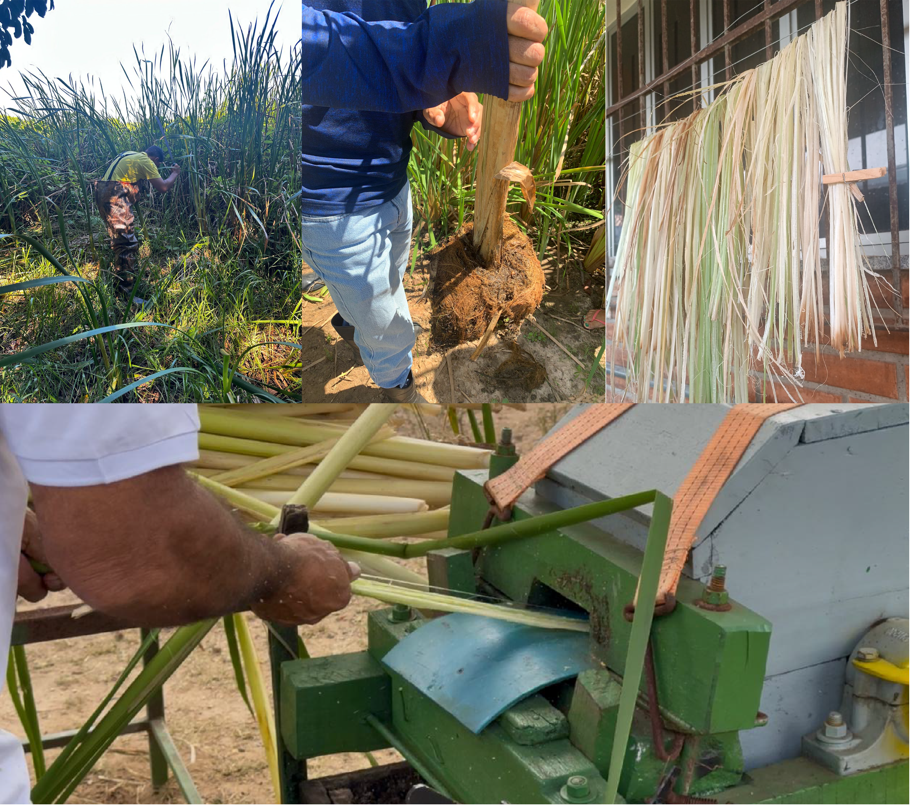
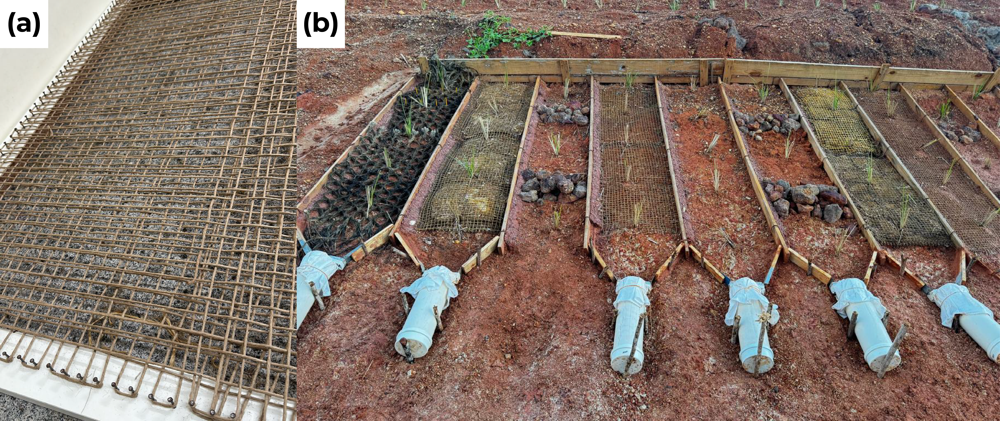
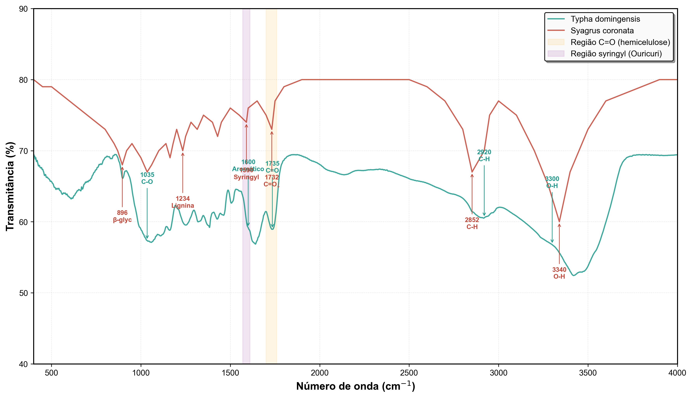
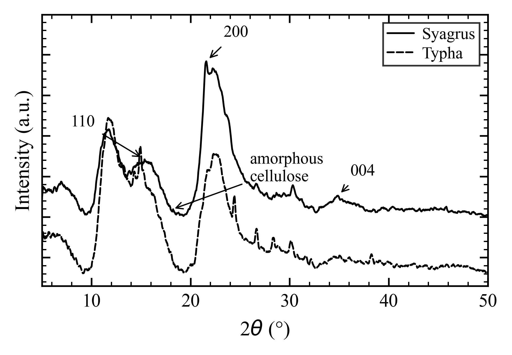
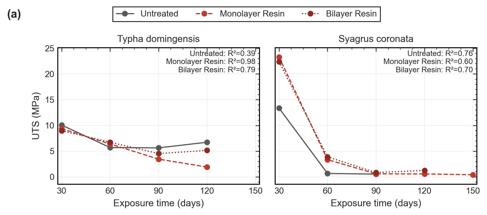
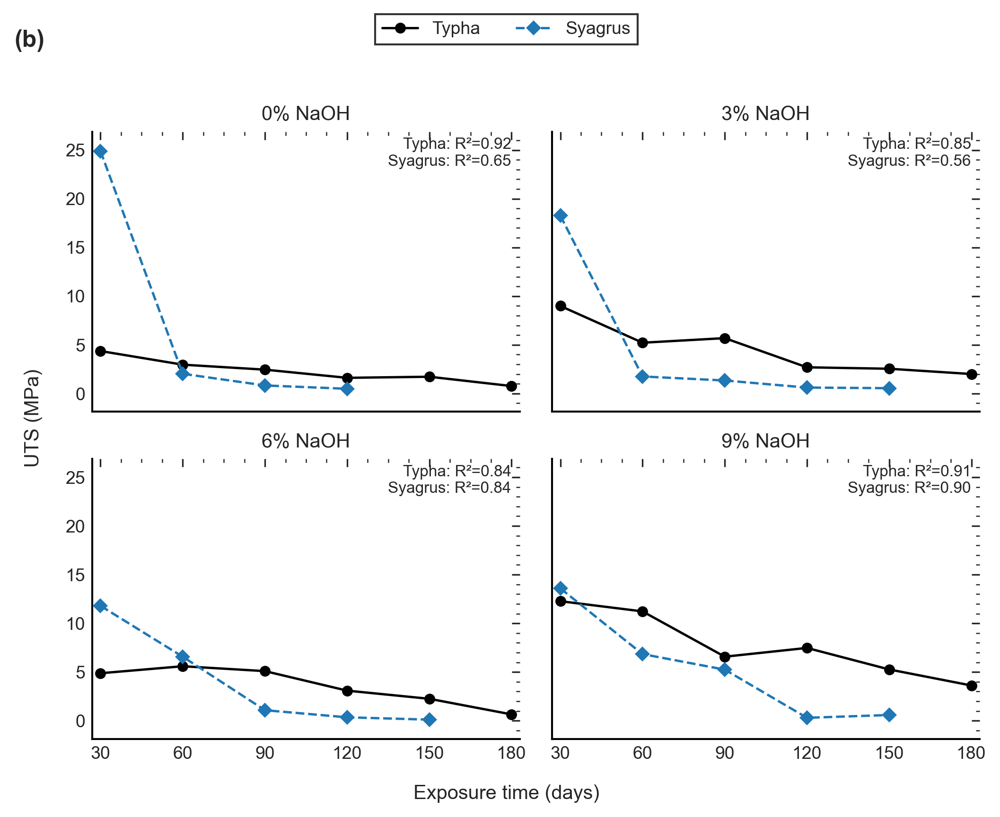
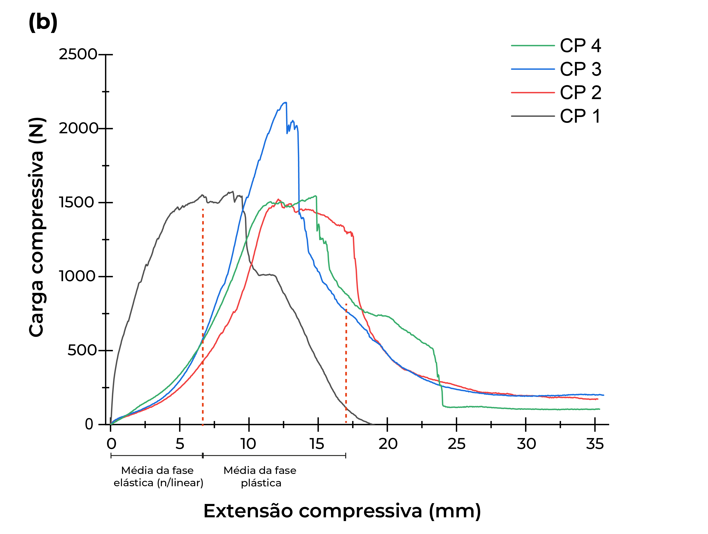
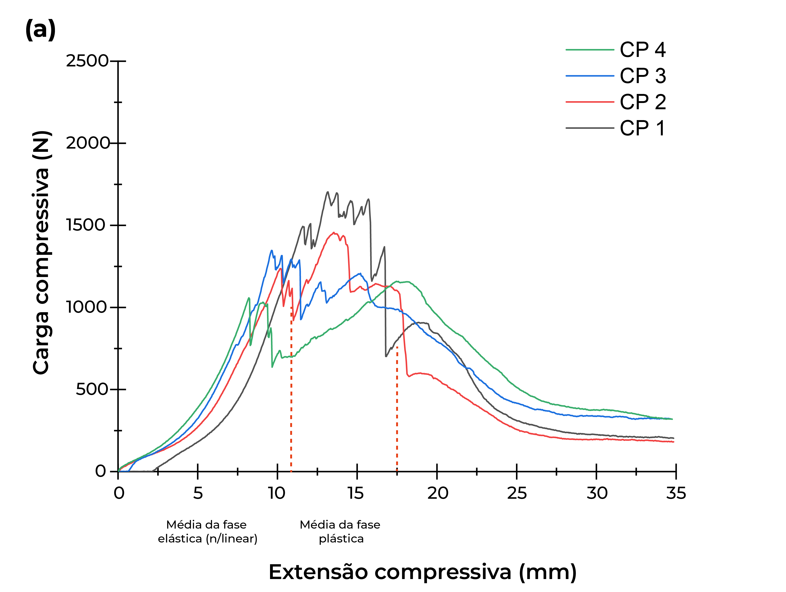
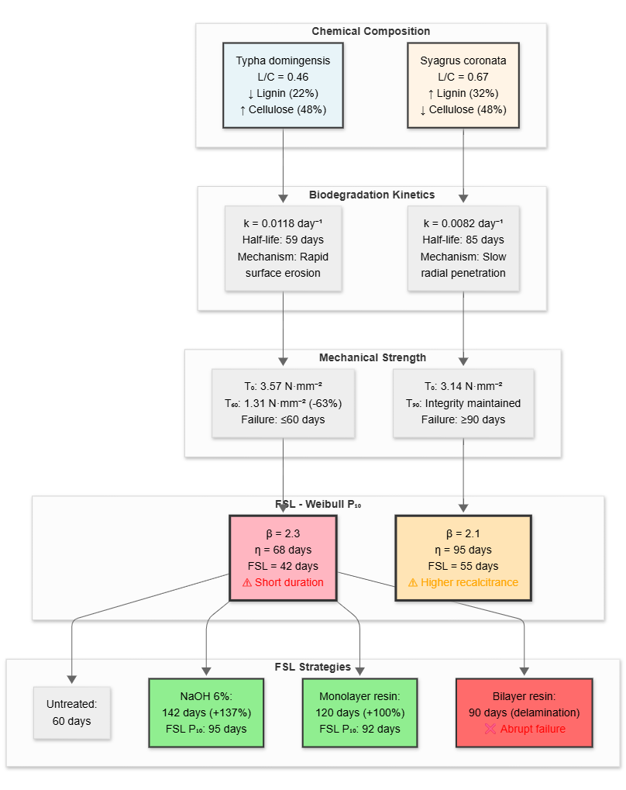

Luiz Diego Vidal Santos, ORCID: 0000-0001-8659-8557, <ldvsantos@uefs.uefs.br>*, Universidade Estadual de Feira de Santana – UEFS, Pós-graduação em Planejamento Territorial, Feira de Santana - BA, Brasil

Francisco Sandro Rodrigues Holanda, ORCID: 0009-0000-9358-0531, <fholanda@academico.ufs.br>, Universidade Federal de Sergipe, Departamento de Engenharia Agronômica, São Cristóvão – SE, Brasil

Emersson Guedes da Silva, ORCID: 0009-0004-9742-6215, <academicoguedes@gmail.com>, Universidade Federal de Sergipe, Departamento de Engenharia Agronômica, São Cristóvão – SE, Brasil

Marlon Pedro Santos Gomes, ORCID: 0009-0007-8167-7636, <marlongomes2671@gmail.com>, Universidade Federal de Sergipe, Departamento de Engenharia Agronômica, São Cristóvão – SE, Brasil

Alarico José da Silva Azerêdo, ORCID: 0009-0002-9805-9870, <alaricofilho76@hotmail.com>, Universidade Federal de Sergipe, Departamento de Engenharia Agronômica, São Cristóvão – SE, Brasil

Renisson Neponuceno de Araújo Filho, ORCID: 0000-0002-9747-1276, <renisson.neponuceno@ufrpe.br>, Universidade Federal Rural de Pernambuco, Departamento de Tecnologia Rural, Recife – PE, Brasil

Eliana Midori Sussuchi, ORCID: 0000-0001-9425-0921, <midori@academico.ufs.br>, Universidade Federal de Sergipe, Departamento de Química, São Cristóvão – SE, Brasil

Alceu Pedrotti, ORCID: 0000-0003-3086-8399, <alceupedrotti@gmail.com>, Universidade Federal de Sergipe, Departamento de Engenharia Agronômica, São Cristóvão – SE, Brasil

## Abstract

Tropical soil degradation and the microplastic liabilities associated with conventional geosynthetics demand bioengineering solutions based on renewable materials with timed functionality. This study evaluates the technical feasibility and functional durability of geotextiles produced from *Typha domingensis* and *Syagrus coronata*, using probabilistic modeling to propose engineering specifications based on chemical and mechanical degradation under real field exposure. Results indicate that fiber chemical architecture, specifically the lignin/cellulose ratio, constrains degradation kinetics and defines service windows between 60 and 180 days. Alkaline mercerization (6% NaOH) promoted critical morphostructural reorganization, balancing strength and ductility to extend Functional Service Life (FSL) to the level required for vegetative establishment. Resin treatments exhibited non-linear behavior: monolayer application delayed degradation (~120 days), whereas overlap induced early delamination.
Weibull analyses confirmed that specification based on the reliability percentile ($P_{10}$), rather than simple mean values, provides a robust criterion to align surface engineering with service windows (90–150 days). It is concluded that integrating microstructural characterization with reliability modeling validates these materials for tropical soil bioengineering.

**Keywords.** Erosion control, Environmental pollution, Biodegradation kinetics, Ecosystem services and Weibull reliability.

## 1. Introduction

Soil degradation in tropical regions operates through mechanisms distinct from those observed in temperate contexts, mainly due to higher rainfall intensity and elevated temperatures. According to @Brady2009, these factors accelerate organic matter mineralization which, combined with weathered Oxisols, results in high rates of nutrient losses by leaching.

According to @Lammel2015, in tropical biomes such as the Caatinga and the Cerrado, soils with low natural fertility present high vulnerability to nutrient losses due to strong hydrological seasonality, resulting in biogeochemical depletion that compromises both the physical matrix and nutrient reservoirs essential for agricultural productivity [@Cardoso2006].

The predominance of 1:1 clay minerals in tropical pedogenesis, together with low soil organic carbon, results in soils with minimal structural cohesion. @Bispo2017 demonstrated that this weakened structure makes soils vulnerable to erosion by raindrop impact and particle transport by surface runoff during convective storms.

Shear strength in non-cohesive soils, quantified by the effective internal friction angle and dependent on particle-size distribution and density [@Veylon2015], becomes particularly deficient in Quartzarenic Neosols along tropical riverbanks. Working with these soils, @Mahannopkul2019 characterized low cohesion, high porosity, and limited mechanical resistance. This geotechnical vulnerability manifests critically on slopes with high inclinations (e.g., above 25°), where hydrological loading can intensify instability and reduce the factor of safety toward failure threshold [@Nunes2022].

As observed by @Islam2013, this configuration results in incipient instability during rainy periods when increased pore pressure reduces effective normal stress, precipitating sliding failures. Consequently, they showed that allowable bearing capacity of shallow foundations is constrained to 50–100 kPa, drastically restricting conventional reinforcement options.

This geotechnical vulnerability increases under anthropogenic action. According to @Borrelli2017, irreversible loss of the topsoil layer, which concentrates bioavailable phosphorus and nitrogen, combines with sedimentation-driven eutrophication in downstream fluvial ecosystems, compromising regional water quality. In the Brazilian semi-arid region, sediment production on degraded slopes can reach 45 Mg·ha⁻¹ during the rainy season, exceeding pedogenic rates by two orders of magnitude, representing dissipation of centuries of biogeochemical cycles without restoration prospects at human timescales [@Vannoppen2017].

Faced with this reality, traditional technological responses have predominantly relied on petroleum-derived geosynthetics. As reviewed by @Holanda20251, polypropylene, polyethylene, and polyethylene terephthalate are characterized by high strength and UV stabilization via benzotriazole, consolidating dependence on non-renewable feedstocks.

The durability of these materials can be described through three failure modes. Rupture under excessive stress occurs with plastic deformation followed by hardening through molecular orientation [@Carneiro2018], whereas creep manifests as progressive deformation under sustained load, resulting in gradual loss of functionality over decades [@BarreiraPinto2023]. UV radiation under tropical irradiance (5–8 kWh·m⁻²·day⁻¹, spectra 280–350 nm) progressively reduces tensile strength [@ISO1996], as addressed in ISO 10319 and ASTM D4595.

This paradigm reveals a structural contradiction because materials designed for multi-decadal persistence in landfills and road sub-bases have a projected service life between 30 and 50 years [@Koerner2016], imposing long-term environmental liabilities when deployed in agroecological systems [@Bhatia2010]. Working with polypropylene geotextiles, @Ibanez2014 and @Konvalinkova2015 observed high recalcitrance under anaerobic conditions, with gradual mechanical fragmentation into microplastics (<5 mm), whose infiltration into soil trophic webs compromises microbial symbioses and triggers subsequent rearrangement of soil microbiota.

@Bai2022 quantified mean densities of 349±137 particles·kg⁻¹ in covered soils after UV exposure, with annual emissions estimated in the thousands of tons for marine environments, evidencing trophic transfer in adjacent terrestrial and aquatic ecosystems. This limitation of synthetic materials makes controlled temporary persistence a strategic functional attribute for bioengineering applications. While synthetic geotextiles resist biodegradation for decades, @Chakravarthy2021 and @Midha2017 demonstrated that lignocellulosic fibers degrade progressively within 6–18 months, compatible with establishment of permanent root systems.

Durability studies show that treated natural-fiber geotextiles coated with bituminous emulsions maintain 82–85% of initial strength after 90 days of soil exposure [@Thakur2019], reinforcing that programmed degradation can be specified as a functional attribute [@Pil2019].

According to @Rodriguez2023, lignocellulosic composition confers an intrinsic functionality timeframe governed by microbial consortia and environmental oxidative stress, synchronizing with vegetative establishment kinetics in soil bioengineering. @Almeida2023 and @Singh2024_vetiver demonstrated that root networks reach mechanical equivalence to synthetic reinforcement within 90–180 days.

Cradle-to-gate life-cycle assessments for bio-based geotextiles indicate that environmental profiles may be favorable in several categories relative to petrochemical alternatives, although relevant sensitivities remain (e.g., transport contributions and trade-offs in water consumption), making it inadequate to infer environmental performance solely from biodegradability [@Amadou2022_natural_geotextile_cost]. In this framing, durability engineering emerges as an approach to optimize timed functionality and reduce externalities when replacing conventional geosynthetics in tropical soil bioengineering [@Lorenzo2024_Typha].

To achieve this purpose, this study evaluates the technical feasibility and functional durability of geotextiles produced from *Typha domingensis* and *Syagrus coronata*, using probabilistic modeling to propose engineering specifications based on chemical and mechanical degradation under real field exposure. Performance validation is anchored in Weibull statistics and in linear regression models, ensuring traceability between microstructural changes and macroscopic failure modes.

The central hypothesis is that the L/C ratio acts as the main predictive variable for degradation kinetics and Functional Service Life (FSL). It is also postulated that surface engineering interventions can modulate the mechanical decay curve ($P_{10}$), ensuring critical synchronization between material strength loss and the time needed for vegetation root-system establishment.

## 2. Materials and Methods

The experimental design combined quantification of mechanical response of natural fibers under monotonic loading with morphological characterization by scanning electron microscopy (SEM), keeping inference about service life linked to measurable metrics and to normative testing protocols. Surface engineering interventions included alkaline mercerization in NaOH (3%, 6%, and 9%) and polymeric coating based on Hydronorth® resin at two areal dosages (0.0932 and 0.1864 mL·m⁻²), preserved as process variables during data consolidation.

For the set evaluating alkaline mercerization in *Typha domingensis* geotextiles, treatment was performed by immersion in NaOH solution for 24 h at concentrations of 3% (0.75 mol·L⁻¹), 6% (1.5 mol·L⁻¹), and 9% (2.25 mol·L⁻¹), maintaining a constant bath ratio; after reaction, material was washed with running water until neutralization and air-dried in a shaded and ventilated environment over a timescale of days, with photographic records of processing presented in Figure 1.

{width=90%}

Natural degradation monitoring was conducted on a tropical slope with 45° inclination at the Rural Campus of the Federal University of Sergipe, with installation of units in rectangular plots along the slope, seeking to reproduce field application conditions and to minimize edge effects by sampling central portions (Figure 2). Exposure occurred between May and November, a period characterized by cumulative precipitation of approximately 350 mm and mean daily UV-B irradiance of 6.5 kWh·m⁻²·day⁻¹, according to local monitoring.

{width=90%}

To characterize biodegradation kinetics within a service window of up to 180 days, sections of approximately 20 cm × 20 cm were removed at programmed intervals (0, 30, 60, 90, 120, 150, and 180 days), with prior drying in an oven at 60 °C for 24 h before specimen preparation.

Because sampling and testing are destructive and material integrity conditions the possibility of preparing specimens under the same protocol, the effective number of specimens per species × treatment × time varied throughout exposure, including combinations absent at late times.

Fibers were selected and prepared for mechanical tests and microstructural characterization, preserving the fibrous fraction of interest (Figure 1).

### Tensile and puncture tests in fibers

Tensile tests were conducted on specimens composed of fibers (and/or fiber bundles) fixed in grips and subjected to monotonic loading in a universal testing machine, with initial grip separation of 110 mm and crosshead speed of 20 mm·min⁻¹.

Static puncture tests of the CBR type were treated as a complementary measure of integrity under concentrated solicitation, using a 70 mm circular specimen, a 50 mm clamping ring, a 17 mm punch, and test speed of 50 mm·min⁻¹.

### Lignin/Cellulose ratio (L/C)

The lignin/cellulose ratio (L/C) was quantified by Fourier transform infrared spectroscopy (FTIR) using a PerkinElmer Spectrum Two instrument, with ATR acquisition, scan range between 4000 and 400 cm⁻¹, resolution of 4 cm⁻¹, and 32 scans per spectrum. Spectral analysis focused on characteristic bands attributed to cellulose (1030 cm⁻¹) and lignin (1510 cm⁻¹), following the methodology described by @Pandey1999. The L/C ratio was estimated as the ratio between absorption intensities at these bands, according to:

\[L/C = \frac{I_{1510}}{I_{1030}}\]
where $I_{1510}$ and $I_{1030}$ represent the absorption intensities at the respective bands.

### SEM and extraction of morphological descriptors

Fibrous surfaces were analyzed by SEM after gold sputtering using a Cressington coater (Kurt J. Lesker 108), with image acquisition on a HITACHI TM 3000 under vacuum and 15 kV electron beam, 50× magnification, and 8-bit quantization (histogram scale 255) to enable subsequent digital processing.

Region-of-interest segmentation and damage quantification were operationalized by gray-level thresholding, where darker regions were treated as damaged zones according to the internal processing logic.

Quantitative micrograph analysis was implemented in Python routines based on OpenCV and scikit-image, in which intensity normalization preceded gradient-based orientation estimation (Sobel operators) and extraction of anisotropy descriptors through an orientation index defined as $IO = 1 - (\sigma_\theta/90^\circ)$, with typical Gaussian filtering of 1.0 pixel and percentile thresholding (75th) of gradient magnitude.

Porosity detection was treated as a segmentation problem with Gaussian smoothing of 2.0 pixels, a threshold defined as 0.7 times Otsu’s threshold, minimum area of 20 pixels and morphological filling of 10 pixels, whereas connectivity and structural continuity were supported by skeletonization (Zhang–Suen) and by skeletal density and junction metrics, with junction smoothing parameter of 2.0 pixels.

Surface texture was quantified by gray-level co-occurrence matrix (GLCM), using distances of 1, 2, 3, and 5 pixels and angles of 0°, 45°, 90° and 135°, with 256 gray levels and symmetric normalization, targeting contrast, homogeneity, energy, and correlation.

### Statistical analyses and modeling

To quantify temporal trends and sensitivity to process variables under time-unbalanced sampling, tensile strength was described by ordinary least squares linear models, with exposure time as a continuous predictor (centered) and categorical factors for species and treatment level, including interaction terms. Inference was based on HC3 robust standard errors and term-wise Wald tests; additionally, Type-II ANOVA decomposition was reported, accompanied by effect-size estimates (partial η²).

In the analyzed set, the tensile dataset totaled N=154 observations in the resin experiment and N=127 observations in the NaOH experiment, reflecting the variation in specimen counts by time and the existence of absent combinations at late times. Consolidation and analysis were conducted in Python (version 3.13), using `statsmodels` for modeling and tests, `scipy` for auxiliary routines, and `matplotlib/seaborn` for visualization.

## 3. Results and Discussion

### 3.1. Lignocellulosic architecture and chemical profile

Mechanical performance and the biodegradation trajectory of natural-fiber geotextiles tend to depend on the relationship between lignin and cellulose that organizes the molecular scaffold of the cell wall. Cellulose establishes a semi-crystalline network associated with initial stiffness, whereas hemicelluloses and lignin modulate access to water and degrading agents, conditioning the kinetics of capacity loss over time [@Shaghaleh2018].

The resulting microfibrils, immersed in an amorphous hemicellulose matrix constituted by branched heteropolysaccharides such as xylan, arabinan, and galactan, and in lignin formed by cross-linked phenylpropanoid oligomers, effectively reduce the accessibility of glycosidic sites to enzymatic and chemical hydrolysis pathways [@Karim2023, @Poletto2012].

In functional terms, differences in lignin/cellulose ratio and in microstructural distribution of these constituents tend to translate into contrasting degradation trajectories and, consequently, into distinct Functional Service Life windows under similar environmental conditions [@Haviland2024]. In this framing, the lignin fraction acts as a relatively more recalcitrant and hydrophobic component, modulating accessibility to water and degrading agents and influencing the rate of mechanical capacity loss over time [@Nguyen2024].

**Figure 3.** Multilevel hierarchical architecture of lignocellulosic fibers, **(a)** schematic representation of the main linear cellulose polymer chains, **(b)** supramolecular organization of the crystalline core of cellulose microfibrils, **(c)** transverse section of the plant cell wall and **(d)** tissue level and L/C ratio: schematic comparison of fiber bundles of *Typha* (low lignification) and *Syagrus* (high lignification).

Chemical characterization of *Syagrus coronata* fibers (Table 1) indicates 32% lignin versus 22% in *Typha domingensis*, a compositional difference that translates into contrasting degradation trajectories under field exposure. Untreated *Typha* fibers lose mechanical viability at 60 days of environmental exposure (63.2% reduction in tensile strength), whereas *Syagrus* maintains observable structural integrity up to 90 days, evidencing the recalcitrance conferred by higher lignin content [@Holanda2020].

The lignin/cellulose ratio (L/C) has been employed as a useful index to discuss recalcitrance [@Rodrigues2020]. From the compilation of experimental data presented in this manuscript (Table 3), an inverse exponential relationship between L/C and the degradation rate constant ($k$, day⁻¹) is observed, expressed as:

$$
k = 0.032 \cdot e^{-2.1 \cdot (L/C)}
$$

For *Typha* (L/C = 0.46), this results in $k$ = 0.0118 day⁻¹, implying a half-life of 59 days under mesophilic conditions (25°C, 60% relative humidity). In contrast, *Syagrus* (L/C = 0.67) presents $k$ = 0.0082 day⁻¹ (half-life = 85 days), consistent with field observations where untreated *Syagrus* geotextiles maintained structural integrity after 120 days of exposure, whereas *Typha* geotextiles failed at 60 days.

**Table 1.** Comparative chemical–mechanical profile of tropical lignocellulosic fibers for biodegradable geotextiles.

| Species | Cellulose (%) | Lignin (%) | L/C | Initial tensile (N/mm) | Strain (%) | k (day⁻¹) | t½ (days) | FSL P₁₀ (days)† |
| --- | --- | --- | --- | --- | --- | --- | --- | --- |
| **Typha domingensis** | 48 | 22 | 0.46 | 107.6 ± 25.3 | 2.9 ± 2.1 | 0.0118 | 59 | 42 |
| **Juncus sp.** | n.d. | n.d. | n.d. | 72.6 ± 16.9 | n.d. | >0.015* | <46* | <30* |
| **Syagrus coronata** | 48‡ | 32 | 0.67 | 142.1 ± 31.6 | 2.9 ± 2.1 | 0.0082 | 85 | 38§ |

**Notes.** n.d. = not determined; FSL is based on the 10th percentile of Weibull failure (P₁₀); values marked with an asterisk are estimated from a 97% loss at 60 days, whereas the symbol ‡ indicates an estimate consistent with the adopted L/C ratio (cellulose ≈ lignin/(L/C)); for internal consistency, L/C values and derived parameters ($k$, t½) should be internally consistent among equation, table, and text.

However, the recalcitrance contrast summarized in Table 1 does not guarantee linear extension of durability in all combinations of architecture and loading, as there are records of abrupt structural collapse with 65% strength loss in approximately 30 days for high-lignin configurations when the spatial distribution of this polymer within the cell wall favors fragile crack-initiation zones [@Silva2025].

This biphasic behavior, characterized by an initial phase of apparent stiffness maintenance followed by sudden failure [@Phan2025], suggests that the percolation geometry of the lignin phase, and not only its global mass fraction, can influence biodegradation progression under shear and tensile stresses typical of vegetated slopes [@Zhang2024yao].

Fourier Transform Infrared Spectroscopy (FTIR) links spectral signatures to the relative composition and chemical organization of the cell wall, offering mechanistic support for differences in recalcitrance and accessibility to water and degrading agents.

**Figure 4.** FTIR spectra comparison between *Typha domingensis* and *Syagrus coronata*.
{width=100%}

*Note. The most relevant spectral differences are coherent with higher relative contribution of more hydrophilic fractions in *Typha* and with higher aromatic contribution associated with lignin in *Syagrus*.*

This composition tends to be reflected in degradation kinetics. According to @Santos2023_PatenteTaboa, *Typha* loses 50% of initial strength in approximately 60 days under field conditions; in the experimental set analyzed here, *Syagrus* maintained functional integrity for periods exceeding 120 days, coherent with a slower degradation trajectory. In this set of results, the L/C ratio appears as a useful marker to describe recalcitrance contrasts and the pace of capacity loss, with *Typha* associated with faster degradation and *Syagrus* with slower degradation.

Although FTIR describes functional groups, crystalline arrangement assessed by X-ray diffraction (Figure 5) contributes to physical integrity. @Segal1959 proposed a method indicating crystallinity indices of 52% for *Typha* versus 46% for *Syagrus*. According to @Boerjan2003, this contrast suggests that higher lignin content in *Syagrus* can compensate reduced crystallinity by filling the amorphous fraction and increasing stiffness. *Typha domingensis* fibers exhibit cellulose I peaks at 2θ ≈ 14.8° (plane 1-10/110), 16.4° (110), and 22.6° (200) [@Rowell1998].

In mechanical characterization, @Fontes2021 reported similar initial tensile strength between species, with 3.14 N·mm⁻² for *Syagrus* and 3.57 N·mm⁻² for untreated *Typha*. Taken together, compositional and structural variations observed by FTIR/XRD/TGA are consistent with differences in microfibrillar integrity and initial mechanical performance.

**Figure 5.** X-ray diffractogram (XRD) of *Typha domingensis* and *Syagrus coronata* fibers
{width=70%}

The higher thermal stability of *Syagrus*, associated with lignin content, may be reflected in larger residual fraction. Thermogravimetric analyses under oxidative atmosphere (air, 10 °C·min⁻¹) indicate that *Syagrus* retains ~28% residual mass at 600 °C, versus ~21% for *Typha* [@Marchi2023].

### 3.2. Hydrophilicity, biodegradation, and the definition of Functional Service Life

The ubiquity of hydroxyl functional groups (-OH) on cellulose and hemicellulose surfaces tends to confer hydrophilic character to fibers, often associated with low water contact angles, a condition that facilitates moisture ingress and creates microenvironments favorable to microbial colonization in the early stages of field exposure [@Chieng2017].

This fungal colonization is associated with extracellular cellulase activity, which cleaves β-1,4-glycosidic bonds and accelerates mass loss, connecting surface hydrophilicity to progressive decreases in load-bearing capacity [@deVries2010].

According to @Schneider2023, biodegradation of lignocellulosic matrices results from two simultaneous mechanisms: surface erosion induced by enzymatic attack from the cuticle and radial penetration of hyphae that form microscopic tunnels and cavitation zones under tension. @Nilsson1988 documented by electron microscopy that surface erosion dominates the first 30 days of exposure, later evolving into radial penetration that ruptures the lignified middle lamella and compromises cohesion between adjacent cells, a process compatible with the mechanical behavior observed in tensile and puncture tests.

Thermogravimetric analysis (TGA), which measures mass loss with increasing temperature, allows tracking exposure-related changes. As reported by @Cardoso2023_TGA_biomass, an initial shoulder between 220 and 280°C, attributed to hemicellulose pyrolysis, tends to decrease as degradation advances.

The main cellulose peak (300–360°C) shifts to lower temperatures as depolymerization progresses, while the lignin-associated fraction above 400°C tends to remain more stable [@Liu2008]. This pattern is consistent with the interpretation of @Leng2020_TGA_PKM that lignin acts as a more recalcitrant residue, persisting after degradation and contributing to soil organic carbon accumulation.

Experimental data on natural geotextiles indicate that the L/C ratio does not uniquely govern initial strength, but is associated with failure mode and, more consistently, with recalcitrance and kinetics of capacity loss over time. @Holanda2023 observed that configurations with higher lignin participation tend to present higher initial tensile strength than those with lower L/C; however, this association does not necessarily imply extended durability, because temporal performance also depends on microstructure, exposure conditions, and surface treatments.

The discrepancy between theoretical chemical recalcitrance and temporal performance reinforces that resistance to biodegradation depends not only on total lignin amount but on its three-dimensional organization in the cell wall [@Youssefian2017], that is, on how the aromatic scaffold is distributed relative to cellulose- and hemicellulose-rich regions.

Studies by @Souza2019 demonstrated that lignin presents heterogeneous spatial distribution across cell wall layers, concentrating in the middle lamella and cell corners, regions responsible for tissue cohesion. This heterogeneity defines zones of greater and lesser enzymatic accessibility, modulating microorganism penetration and preferential locations for crack initiation.

In line with this, @Blanchette1995 describe lignin as a physical barrier to lignocellulolytic enzymes not only due to abundance but due to how it intercalates within the cellulose and hemicellulose matrix, which explains why materials with similar lignin contents can exhibit distinct durabilities under the same exposure regime.

From this perspective, resistance to biological degradation results from the combination of lignin proportion and its three-dimensional distribution in the cell wall, parameters which, integrated with effective L/C ratio, define a recalcitrance profile conditioning enzymatic accessibility and temporal pattern of capacity loss. At a mechanistic level, there is evidence that different lignin chemical signatures can impose comparable inhibitory effects on cell wall degradability, restricting enzymatic action in the lignocellulosic matrix [@Grabber].

This deterministic approach tends to become inadequate when coefficients of variation exceed 25% and strength loss does not follow a linear trajectory, a scenario in which mean parameters no longer represent real failure risk.

According to @Curtin2000, Functional Service Life (FSL) can be treated as a probabilistic quantity representing the interval during which 90% of deployed geotextiles maintain load-bearing capacity above a critical design threshold. In this formulation, FSL is bounded by the 10th percentile ($P_{10}$) of the Weibull failure distribution, described by:

$$
P(t) = 1 - \exp\left[-\left(\frac{t}{\eta}\right)^\beta\right],
$$

where $\eta$ is the scale parameter associated with characteristic life and $\beta$ describes failure mode. Applying this model to untreated fiber geotextiles yields $P_{10} = 42$ days as FSL under field conditions, aligning the mechanical service window with the previously described microbial colonization kinetics.

Surface engineering interventions can shift the failure distribution in terms of reliability ($P_{10}$, adopted here as FSL) and in terms of characteristic life (scale parameter $\eta$). In the analyzed set, alkaline treatment with 6% NaOH shifts $P_{10}$ to on the order of 95 days (Table 3). For monolayer coating, $\eta$ increases to on the order of 128 days, with $P_{10}$ on the order of 92 days (Table 3), values compatible with the critical window for root establishment in vegetated slopes.

Thus, chemical architecture, synthesized by L/C ratio and lignin organization, combined with surface treatments, influences Weibull parameters used in design, connecting microscopic degradation observed by SEM, TGA, and enzymatic analyses to structural reliability at slope scale [@Kaya2023].

### 3.3. Alkaline mercerization and polymeric coatings

Mercerization with sodium hydroxide (NaOH) selectively removes lignin and hemicelluloses, exposing crystalline cellulose microfibrils and reducing surface heterogeneity of fibers [@Verma2021]. This chemical–structural reorganization decreases defect density at the fiber–matrix interface, favors inter- and intrafibrillar rearrangement, and increases stability of treated cellulose, with direct gains in interfacial adhesion when fibers are incorporated into composites [@Ikramullah2018].

In this study, this morphological restructuring produced a non-monotonic relationship between mechanical strength and alkaline concentration. Untreated fibers presented mean ultimate tensile strength (UTS) of 18.88 N·mm⁻², whereas 3% NaOH resulted in 17.62 N·mm⁻², a statistically non-significant difference. The intermediate concentration of 6% NaOH increased UTS to 21.39 N·mm⁻², a 13.3% increase relative to control, accompanied by increased puncture resistance.

Working with date palm fibers (*Phoenix dactylifera*), @Oushabi2017 reported a 76% increase in tensile strength after 5% NaOH and attributed this gain to effective removal of non-cellulosic constituents and increased exposure of cellulose microfibrils. In line with this evidence, @Garg2022 and @Narayana2021 indicate that intermediate alkaline concentrations selectively remove amorphous lignin and hemicellulose fractions, reduce surface impurities, improve wettability, and enhance interfacial adhesion without compromising cellulose crystallinity, configuring a more cohesive fibrous network and more efficient load transfer.

In parallel, recent studies on natural fiber reinforced composites report mechanical gains and morphological changes, as well as non-linear dependence of performance as a function of loading and treatment [@Kar2024; @Kar2025VNL], which provides convergent support, albeit outside the strict scope of geotextiles, for the interpretation that fibrous architecture and surface compatibilization modulate damage mechanisms and performance trajectory [@Aruchamy2024; @Ayrilmis2024; @Palanisamy2024].

At 9% NaOH, although UTS reaches 22.49 N·mm⁻², there are indications of surface corrosion and possible depolymerization, with higher brittleness and only modest improvement in puncture resistance (Table 2). There are reports that high-alkalinity treatments, after an initial phase of structural cleaning and crystalline rearrangement, can also degrade the cellulosic matrix [@Amior2022]. Prolonged exposure to concentrated NaOH solutions can induce alkaline hydrolysis of glycosidic bonds, reduce cellulose degree of polymerization, and compromise fiber structural integrity [@Nurazzi2021].

As observed by @Bartos2020, results converge to an optimal concentration window around 6% NaOH, where benefits of delignification and hemicellulose removal outweigh risks of structural damage, improving mechanical performance without excessive loss of ductility.

This balance involves partial lignin removal, which can reduce microbial colonization sites, and preservation of cellulose chains with high degree of polymerization, whose degradation would compromise global strength [@Xu2013]. In the field dataset analyzed over 180 days, untreated fibers maintained functionality for about 60 days, while 6% NaOH extended structural viability to 142 days (FSL of 95 days at the Weibull $P_{10}$ threshold). Under 9% NaOH, structural integrity was preserved with censoring throughout the 180-day period.

An ordinary least squares model, summarized by Type-II ANOVA, indicates that exposure time dominates UTS variability, with additional treatment effects and interactions, suggesting that surface engineering should be treated as a trajectory-control variable rather than only as an instantaneous strength gain (Figure 7).

**Figure 6.** Comparative SEM micrographs of *Typha domingensis* and *Syagrus coronata* fibers under different treatments and exposure times.

{width=100%}

*Note. Subfigures (a–d) correspond to *Typha domingensis* (30 d untreated, 180 d untreated, 30 d double resin layer, and 180 d double layer), whereas subfigures (e–h) correspond to *Syagrus coronata* under the same conditions; 700× magnification and 100 µm scale bar.*

Morphometric analyses show that less recalcitrant fibers present porosity evolution characterized by progressive structural collapse, with initially rough surfaces evolving toward more uniform topographies as degradation products are deposited. This pattern contrasts with more lignified fibers, which exhibit deep grooves and longitudinal channels over time, compatible with degradation oriented by ligninolytic enzymatic complexes [@Prado2019; @Tian2019].

Polymeric coatings induced complex microstructural reorganization, with maximum porosities at intermediate exposure stages, followed by interfacial delamination under field conditions. Overall, fracture density and damage severity were consistent with progressive failure by surface erosion followed by radial penetration, supporting the use of Weibull distributions with shape parameter β > 1 for probabilistic characterization of durability [@Guo2014_palm_weibull].

Regarding strain at break (ε), results describe an inverse pattern relative to strength, with maintained elongation at 3% NaOH (2.86%, close to control at 2.95%) and progressive reductions at 6% and 9% NaOH (2.31% and 2.18%), evidencing ductility loss at higher concentrations, coherent with the accumulation of chemical damage and reduced degree of polymerization under high alkalinity [@Fitriana2020]. The 6% NaOH condition characterizes, in the analyzed set, an operational optimum by balancing tensile strength, puncture resistance, and ductility, with $P_{10}$ on the order of 95 days and characteristic life ($\eta$) around 142 days (Table 3), keeping ε above 2.3%.

In this context, quantitative morphometry suggests that the observed balance results from nanometric transformations, with partial transition from cellulose I to cellulose II, increased surface roughness (+48.2%), and higher accessibility of hydroxyl groups [@mansikkamaki2007], yielding a more active surface in terms of interaction and transport.

Concomitantly, mercerization reorganizes the pore network by fusing small pores into cavities with larger mean area (+73.6%), increasing circularity (+5.9%), and reducing dimensional heterogeneity [@Jiao2014], such that total porosity increases moderately (+7.6%) despite a decrease in pore number (−42.1%), which improves capillary transport efficiency rather than simply sealing channels [@Koistinen2024].

While mercerization optimizes internal structure, external protection depends on barrier strategies. To quantify the temporal trend observed in Figure 7, simple linear regression was fitted between exposure time (days) and mean UTS (N/mm²), by species and treatment condition (means by exposure time). In *Typha domingensis*, monolayer resin exhibited a steep linear decline between 30–120 days: for each additional day of exposure, mean UTS decreased by 0.084 N/mm² (β = −0.084 N/mm²·day⁻¹, 95% CI [−0.120, −0.049], p = 0.009, f² = 53.45, R² = 0.982). The untreated control showed a weak trend (β = −0.034 N/mm²·day⁻¹, 95% CI [−0.161, 0.094], p = 0.377, f² = 0.64, R² = 0.389), whereas the double-layer showed a moderate decline in the available interval (β = −0.046 N/mm²·day⁻¹, 95% CI [−0.116, 0.025], p = 0.110, f² = 3.83, R² = 0.793).

In *Syagrus coronata*, regressions also presented negative coefficients under resin conditions, but without statistically significant evidence when fitting by time points: control (β = −0.214 N/mm²·day⁻¹, 95% CI [−1.750, 1.323], p = 0.328, f² = 3.12, R² = 0.757), monolayer (β = −0.162 N/mm²·day⁻¹, 95% CI [−0.406, 0.083], p = 0.126, f² = 1.48, R² = 0.596) and double-layer (β = −0.221 N/mm²·day⁻¹, 95% CI [−0.667, 0.224], p = 0.166, f² = 2.28, R² = 0.695). This pattern is compatible with a less linear trajectory (initial drop and stabilization at low levels), in addition to gaps at late times, which reduces inferential power when fitting by time points; overall, it reinforces that exposure time governs UTS loss, whereas species and treatment modulate curve shape (Figure 7).

**Figure 7.** Tensile strength (UTS, N/mm) under different treatment conditions, **(a)** resin coating (Untreated/Monolayer/Double-layer) for *Typha domingensis* and *Syagrus coronata*; **(b)** alkaline mercerization with NaOH (0%, 3%, 6%, 9%) for *Typha domingensis* and *Syagrus coronata*.

{width=80%}
{width=80%}

Puncture resistance (CBR) complements mechanical characterization by measuring the load distribution capacity under concentrated solicitation, a critical parameter for geotextiles deployed on irregular substrates [@Cholewa2019]. Tests were conducted on fibers under the same alkaline mercerization and polymeric coating treatments, allowing evaluation of the synergy between axial stiffness and local impact absorption.

**Figure 8.** Static puncture (CBR) in fibers, **(a)** *Typha domingensis* (taboa) and **(b)** *Syagrus coronata* (ouricuri).

{width=85%}

{width=85%}

Results presented in Figure 8 indicate that *Typha domingensis* fibers treated with 6% NaOH exhibited a mechanical response consistent with the service window of 90–150 days, maintaining the ability to support concentrated loads throughout the critical period for vegetative establishment [@Kumar2016]. For *Syagrus coronata*, the higher L/C ratio (0.67) conferred higher initial strength and slower degradation, consistent with intrinsic recalcitrance observed in tensile tests and biodegradation analyses [@Angst2017].

Interpretation of puncture data should consider the destructive nature of sampling and the heterogeneity of lignocellulosic matrices [@Methacanon2010]. In the analyzed set, puncture was employed as a complementary indicator of integrity and interpreted mainly in terms of temporal trend and intra-treatment comparison. Relative preservation of performance under moderate alkaline treatments in the intermediate exposure interval remains consistent with the logic of maximum protection between 30 and 90 days, a vital period for root anchorage [@Mickovski2009], while maintaining ductility ($\epsilon \approx 2.3–2.9\%$) under moderate conditions is essential to absorb dynamic solicitations in slopes, avoiding embrittlement associated with elevated alkalinity [@Vivek2019].

This behavior can be attributed to microscopic interfacial damage. Electron microscopy (15 keV) demonstrated interfacial delamination between resin and lignocellulosic matrix [@Petinakis2014]; in addition, hygrothermal cycles (18–35°C, 45–85% RH) induce repeated swelling–shrinkage, detaching the resin and creating hydrophilic microenvironments prone to fungal colonization and adhesion loss [@Tian2018_hygrothermal; @Fonseca-Garcia2019].

Double-layer resin application tends to reduce effective permeability and favor moisture retention at the interface, which can accelerate hydrolysis pathways and microbial colonization [@Gottenbos2003; @Yazdi2015], whereas single-layer coating tends to preserve diffusion pathways for moisture release.

In the analyzed set, the operational interpretation is that barrier engineering should be dimensioned as trajectory control (reduction in loss rate) rather than as an isolated increase in initial strength, since field performance results from coupling among permeability, hygrothermal cycles, and interfacial degradation.

The reduction in degradation rate ($k$ from 0.0118 to 0.0062 day⁻¹) contributes to compensating initial loss, while inferential synthesis by linear model (Type-II ANOVA) indicates dominance of time (Days_c: F(1, 142) = 99.013; p < 0.001; partial η² = 0.411) and relevance of the species × treatment interaction (F(2, 142) = 6.870; p = 0.001; partial η² = 0.088), consistent with the interpretation that optimizing durability depends on the balance between barrier protection and permeability rather than on maximizing thickness.

### 3.4. Implications for tropical geotextile specification

Consolidating results from NaOH mercerization and resin coating converts the relationship among L/C ratio, surface engineering, and Weibull parameters into a practical tool for specifying natural geotextiles in tropical environments [@Sodagar2025]. As a baseline, the untreated condition presents FSL of 42 days under a Weibull distribution defined in terms of $P_{10}$, with tensile degradation rate $k = 0.0118$ day⁻¹.

Treatment with 6% NaOH shifts this boundary to FSL ($P_{10}$) of 95 days, with $k = 0.0073$ day⁻¹ (Table 3), which represents an approximately 38% reduction in degradation rate. For monolayer coating applied to *Syagrus* fibers, $k = 0.0061$ day⁻¹ is observed, with an increase in characteristic life to $\eta$ \~128 days and FSL ($P_{10}$) on the order of 92 days (Table 3). At higher NaOH concentrations, the set suggests reduced degradation, but interpretation should consider the non-linear dependence of mercerization under elevated alkalinity, which can simultaneously reorganize the amorphous fraction and introduce chemical damage to the cellulosic matrix, depending on exposure regime [@Rabbani2024; @Hajidariyor2023].

These kinetic differences allow aligning treatment choice to service window and project budget [@Vivek2020]. For works requiring structural support between 90 and 150 days, typical of annual crops and erosion control restricted to the rainy season, the 6% NaOH treatment offers favorable combination of FSL (95 days at $P_{10}$) and reduced direct cost, without additional removal or disposal costs [@Tan2022]. In perennial scenarios such as riverbank restoration or highway slope stabilization, monolayer resin, despite higher unit cost, becomes competitive because increasing characteristic life to ~128 days (with FSL, $P_{10}$, on the order of 92 days; Table 3) and increasing reliability tend to offset the initial investment [@Tanas2022].

## 4. Conceptual framework of reliability and environmental performance

The intrinsic variability of natural geotextiles favors stochastic modeling of performance loss. In this context, the Weibull distribution ($R(t) = e^{-(t/\eta)^\beta}$) represents structural heterogeneity, where $\beta > 1$ (1.8–4.2) is associated with progressive wear-out failure (fatigue/hydrolysis), in contrast with approximately random failure ($\beta \approx 1$).

In addition, surface engineering tends to increase $\beta$ (reducing variability) and $\eta$, extending service life [@Luqman2023]. Defined here as time to 10% failure ($P_{10}$), Functional Service Life can increase from 42 days (untreated *Typha*) to about 95 days (6% NaOH) and to on the order of 92 days for monolayer resin condition, while $\eta$ can reach ~128 days (Table 3), covering the critical ~90-day window for vegetative anchorage.

As shown previously in Figure 6, SEM images document the temporal progression of surface degradation in both species. In *Typha domingensis*, surface porosity ranged from 32.75% (ST 30d) to 73.09% (DC 30d), with non-monotonic behavior: an increase from 32.75% to 67.27% under tropical soil exposure (ST 30d → ST 180d), but a reduction from 73.09% to 68.49% under controlled degradation (DC 30d → DC 180d). Surface roughness showed an inverse pattern, peaking at 30 days (941.64 µm in ST; 581.04 µm in DC) and decreasing at 180 days (724.26 µm in ST; 528.27 µm in DC).

This pattern (high initial roughness followed by reduction) is consistent with an initial stage dominated by surface damage and erosion/removal of more accessible material, followed by topographic reorganization associated with degradation advance and deposition/removal of products on the surface [@Peng2020].

In this sense, interpretation is presented as a trend rather than a unique mechanism, since degradation pathways may alternate between surface erosion and radial penetration in lignocellulosic matrices. Fiber density varied from 25.41% (ST 30d) to 34.80% (DC 180d), reflecting progressive exposure of cellulose microfibrils as lignin/hemicellulose matrix degrades [@Singh2022].

In *Syagrus coronata*, progression was more gradual, with porosity increasing from 50.07% (ST 30d) to 63.77% (ST 180d), while roughness increased from 679.35 µm (ST 30d) to a maximum of 1012.67 µm (ST 180d) and 1174.66 µm (DC 30d), indicating formation of deep grooves by oriented degradation. Fiber density remained stable (30.50% to 33.24%), which is compatible with degradation progressing mainly from surface to core under diffusional limitations on enzymes and more intense photochemical exposure at the periphery [@Datta2024].

**Figure 10.** Quantitative analysis of fractures and damage severity by image processing with skeletonization, **(a)** *Typha* 30 days untreated, **(b)** *Typha* 180 days untreated, **(c)** *Typha* 30 days double layer, **(d)** *Typha* 180 days double layer, **(e)** *Syagrus* 30 days untreated, **(f)** *Syagrus* 180 days untreated, **(g)** *Syagrus* 30 days double layer, **(h)** *Syagrus* 180 days double layer.

{width=100%}

*Note. The triple overlay combines the base grayscale image (α=0.7), open-fracture regions detected by thresholding (values <50 gray levels) in red (α=0.4), and the fracture skeleton in hot colormap (α=0.6).*

Morphometric quantification of fractures revealed distinct dynamics between species. In *Typha domingensis*, under tropical soil exposure (ST), fracture count varied from 237 (ST 30d) to 229 (ST 180d, stabilization of ~−3%), whereas in controlled degradation (DC) it decreased from 139 to 75 (−46%), suggesting that field exposure, with variable hygrothermal cycles, promotes more heterogeneous damage accumulation than controlled laboratory condition [@Nezafatkhah2025_weathering_review].

Severity remained critical under all conditions (103.43–121.25%), which, in the analyzed set, is consistent with intense structural degradation throughout the exposure period [@Voyiadjis2007_microcrack_tensor]. In *Syagrus coronata*, the field trajectory was more abrupt. Under ST, fractures increased from 47 (30d) to 211 (180d, +349%), with maximum severity of 126.25%, a pattern compatible with higher initial integrity followed by damage intensification when environmental conditions favor crack progression [@Carneiro2017].

In DC, behavior was almost stationary (45 → 43 fractures; ~−4%, severity ~103%), which may indicate that, under uniform laboratory conditions, morphometric evolution of damage was substantially less pronounced within the analyzed interval [@Nandagopal2021].

Severity classification by percentage damage bands, that is, mild (<0.5%), moderate (0.5–2%), severe (2–5%), and critical (>5%), allows organizing the reading and, in this framing, Weibull becomes useful because the shape parameter $\beta$ governs the temporal variation of failure rate: values $\beta>1$ imply increasing hazard and tend to be associated with progressive wear [@Panasenko2012], whereas $\beta\approx 1$ would be compatible with random failures dominated by intrinsic defects; thus, estimated $\beta$ (2.3–4.2) are coherent with an accumulative damage regime in plant fibers and sensitive to environmental conditions [@Shadhin2022].

In the analyzed set, the functional threshold $P_{10}$ typically occurred when fracture densities were already on the order of 10^2 fractures·field⁻¹, which is coherent with an increasing failure rate regime ($\beta>1$) [@Wang2014_bamboo_weibull] and with interpreting FSL as a probabilistic quantity associated with accumulated capacity loss [@Staroverov2022].

Fiber density remained relatively stable (28.75–36.10%) throughout exposure, indicating degradation predominantly from surface to core, compatible with diffusional limitations and heterogeneity of degrading agents in the soil matrix, as well as greater photochemical exposure at the periphery [@Carvalho2014], while @Brunsek2023 quantify that cellulase activity in complex media such as soils is associated with degradation progression rate.

The correlation between fracture count and exposure time (R² = 0.76; p < 0.01) suggests good descriptive capacity of the model $\sigma(t) = \sigma_0 \cdot \exp[-k \cdot t]$ to estimate service life [@Krauklis2022]. Notably, *Syagrus* exhibited lower initial fracture density (47 vs 237 in *Typha* at 30d in ST). In line with the hypothesis that higher L/C ratio (0.67 vs 0.46) can retard degradation kinetics [@Grgas2023], while the contrast between ST (211 fractures at 180d) and DC (43 fractures) indicates that natural cycles of moisture and temperature amplify damage propagation.

Despite damage progression under all conditions, results sustain strategic advantages of lignocellulosic fibers in temporary geotechnical applications. Statistical predictability of degradation (R² = 0.76; p < 0.01), anchored in parameters $k$, $\beta$, $\eta$, and $P_{10}$, enables controlled life-cycle engineering in which geotextiles fulfill structural function during the critical vegetative establishment period (90–150 days) and then biodegrade, reducing post-service removal need and mitigating long-term environmental impacts [@Prambauer2019].

In contrast with polymeric materials conceived for multi-decadal service, whose weathering and abrasion promote fragmentation and microplastic generation in the environment [@Giaganini2023], lignocellulosic geotextiles tend to present progressive mass loss and mechanical capacity decline on the scale of months to a few years [@Zambrano2020].

In kinetics sensitive to chemical architecture and exposure regime (moisture, temperature, and radiation), which allows treating degradation as a design attribute provided temporal reliability is explicit [@Gurunathan2015].

The observed initial mechanical performance (UTS = 18–24 MPa at 30 days; Weibull modulus $m = 4.2$–5.8) should be interpreted as a function of loading scenario and design horizon, aligned with the concept of limited-life geotextile and with the need to specify by temporal reliability rather than rely on single resistance thresholds [@Peng2025].

The operational window often demanded in erosion control and temporary stabilization works, on the order of 120–150 days, has been associated with the interval in which pioneer vegetation establishes a functional root system in 60–90 days (Table 3) and gradually assumes the stabilizing function [@Gray1996]; however, extrapolating this window to a specific sectoral fraction depends on systematic surveys and therefore is not adopted here.

In this framing, FSL ceases to be a fixed attribute and becomes a design variable, insofar as the L/C ratio tends to shift degradation kinetics and, consequently, the performance window, such that lower L/C ranges (≈0.35–0.45) are, on average, associated with shorter service regimes than higher ranges (≈0.50–0.65), without implying determinism, since response depends on anatomical fraction, microstructure, and exposure regime [@Vikman2002].

**Table 3.** Synthesis of the L/C → $k$ → Weibull parameters (β, η, $P_{10}$) → FSL linkage across species and treatment conditions.

| **Species/Treatment** | **β (shape)** | **η (scale, days)** | **P₁₀ (days)** | **k (rate/day⁻¹)** | **Failure mechanism** |
| --- | :---: | :---: | :---: | :---: | --- |
| *Typha* untreated (control) | 2.3 | 68 | 42 | 0.0118 | Enzymatic hydrolysis + UV |
| *Typha* + NaOH 6% | 2.8 | 142 | 95 | 0.0073 | Degradation delayed by delignification |
| *Typha* + NaOH 9% | 3.1 | 155 | 108 | 0.0062 | Reduced degradation, onset of embrittlement |
| *Syagrus* untreated (control) | 2.1 | 95 | 55 | 0.0095 | Slow hydrolysis (high lignin) |
| *Syagrus* + monolayer resin | 3.2 | 128 | 92 | 0.0061 | Effective interfacial protection |
| *Typha*–Ramie composite UV | 3.8 | 140 | 105 | 0.0052 | Photodegradation aging |

**Legend.** In this table, β represents the Weibull shape parameter and, when β > 1, is compatible with progressive wear-out; β → 1 is compatible with approximately random failure; η is the scale parameter associated with characteristic life at 63.2% failure; P₁₀ is the time to 10% probability of failure (i.e., functional service life with 90% reliability); and k is the strength degradation rate.

In this sense, integrating Weibull reliability metrics (FSL) with linear models and microstructural evidence from SEM supports an interpretive chain L/C → $k$ → β, η, $P_{10}$ → FSL and brings natural geotextiles closer to durability assessment routines by weathering and correlation with mechanical and microstructural response in geosynthetics [@Carneiro2011]. This approach allows estimating variability and functional service life from accelerated aging assays and modeling adjusted to different climatic regimes [@Fleury2024].

Recent studies have indicated the utility of Weibull in quantifying mechanical reliability [@Wang2022] and probabilistic modeling in predicting degradation and failure in composites [@Bogdanov2023], offering a quantitative and reproducible framework for certification and quality control of lignocellulosic materials [@Kumar2024].

As an operational synthesis, strength loss can be treated as a time-dependent decay governed by an effective rate $k$, while exposure regime effects (e.g., moisture and radiation) can be incorporated as site-specific correction factors when sufficient data are available. This formulation maintains traceability between estimated parameters ($k$, β, η, $P_{10}$) and exposure regime, avoiding fixed universal coefficients for environmental components without explicit calibration in the analyzed dataset.

The synthesis of this integrated approach is presented in Figure 9, which connects the initial chemical composition (L/C ratio) to degradation kinetics and, finally, to the Functional Service Life (FSL) parameterized by Weibull. The flowchart illustrates how surface engineering interventions shift performance curves, allowing durability to be adjusted to the specific needs of each project.

**Figure 9.** Flow diagram integrating chemical composition, expressed by lignin/cellulose ratio, with temporal performance and Functional Service Life of geotextiles under different surface-treatment scenarios.

*Note. The flowchart articulates degradation constants $k$ and half-lives $t_{1/2}$ measured in the field, mechanical resistance trajectories up to failure, and Functional Service Life (FSL) derived from Weibull distributions at the design percentile P₁₀.*

## 5. Conclusions

This review synthesizes evidence that the chemical architecture of lignocellulosic fibers is among the factors most frequently associated with biodegradation kinetics in natural geotextiles. The inverse relationship between lignin/cellulose ratio and degradation rate is generally consistent with using biochemical characterization as a predictive tool in raw material selection, supporting screening of plant species by intrinsic recalcitrance and reducing dependence on long-duration field trials.

Redefining Functional Service Life (FSL) under a probabilistic perspective grounded in the Weibull distribution can be understood as a methodological advance relative to traditional deterministic approaches. By quantifying temporal reliability of materials, this structure can allow incorporating safety factors more transparently in bioengineering design, bringing the use of natural fibers closer to usual geotechnical engineering standards.

Surface modification strategies indicate that optimizing mechanical performance and durability is not linear. Moderate alkaline treatments can promote structural gains without compromising flexibility, while polymeric coatings require a balance between hydrophobicity and permeability to reduce delamination failures. Cost-effectiveness analysis suggests that low-cost interventions can extend service life, making natural geotextiles competitive relative to synthetic ones in temporary applications.

Beyond mechanical reinforcement, lignocellulosic geotextiles can contribute to ecological restoration by promoting ecosystem services that go beyond soil stabilization. With programmed decomposition of fibers, there may be contributions to carbon sequestration, improved soil structure, and increased edaphic biodiversity. In turn, synchronization between geotextile strength loss and vegetation root-system development tends to favor a gradual transition from artificial stabilization to natural cohesion.

## References

::: {#refs}
:::
