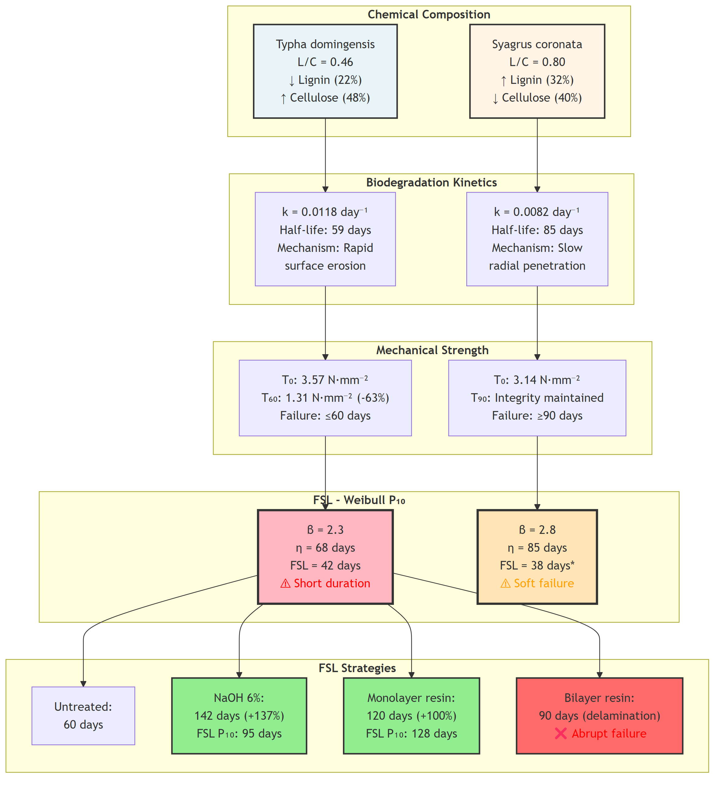
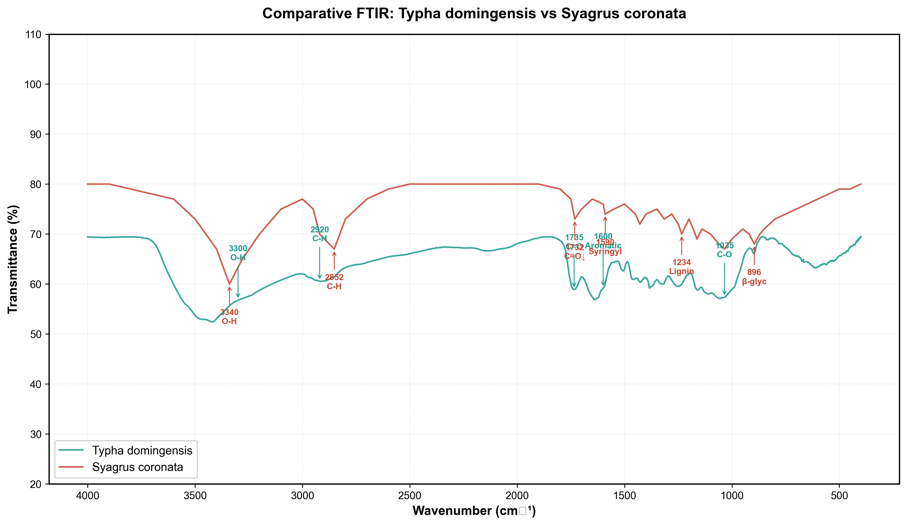
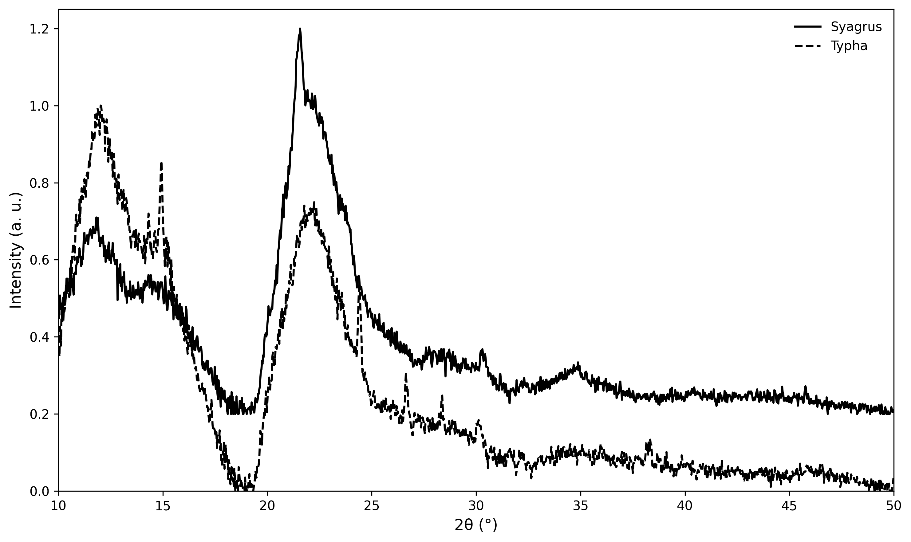

Luiz Diego Vidal Santos, https://orcid.org/0000-0001-8659-8557, ldvsantos@uefs.uefs.br*, Universidade Estadual de Feira de Santana – UEFS, Pós-graduação em Planejamento Territorial, Feira de Santana - BA, Brasil

Francisco Sandro Rodrigues Holanda, https://orcid.org/0009-0000-9358-0531 ,fholanda@academico.ufs.br, Universidade Federal de Sergipe, Departamento de Engenharia Agronômica, São Cristóvão – SE, Brasil

Emersson Guedes da Silva, https://orcid.org/0009-0004-9742-6215, academicoguedes@gmail.com, Universidade Federal de Sergipe, Departamento de Engenharia Agronômica, São Cristóvão – SE, Brasil

Marlon Pedro Santos Gomes, https://orcid.org/0009-0007-8167-7636, marlongomes2671@gmail.com, Universidade Federal de Sergipe, Departamento de Engenharia Agronômica, São Cristóvão – SE, Brasil

Alarico José da Silva Azerêdo, https://orcid.org/0009-0002-9805-9870, alaricofilho76@hotmail.com, Universidade Federal de Sergipe, Departamento de Engenharia Agronômica, São Cristóvão – SE, Brasil

Renisson Neponuceno de Araújo Filho, https://orcid.org/0000-0002-9747-1276, renisson.neponuceno@ufrpe.br, Universidade Federal Rural de Pernambuco, Departamento de Tecnologia Rural, Recife – PE, Brasil

Eliana Midori Sussuchi, https://orcid.org/0000-0001-9425-0921, midori@academico.ufs.br, Universidade Federal de Sergipe, Departamento de Química, São Cristóvão – SE, Brasil

Alceu Pedrotti, https://orcid.org/0000-0003-3086-8399, alceupedrotti@gmail.com, Universidade Federal de Sergipe, Departamento de Engenharia Agronômica, São Cristóvão – SE, Brasil

## Abstract

The degradation of tropical soils and the microplastic liabilities associated with conventional geosynthetics necessitate bioengineering solutions utilizing renewable materials with timed functionality. This review aimed to integrate experimental and theoretical evidence regarding the relationship between the chemical architecture of lignocellulosic fibers and the functional reliability of natural geotextiles. In natural fibers, differential recalcitrance explains service windows ranging from 60 to 180 days, with alkaline mercerization at 6% NaOH promoting morphostructural reorganization and increased strength, thereby extending the Functional Service Life (FSL) to the critical threshold for vegetative establishment. Surface treatments with resins exhibit non-linear effects, where monolayer application retarded field degradation up to approximately 120 days, whereas duplicate overlaps tended towards early delamination under cycles of precipitation and radiation. Under accelerated UV aging, Typha–Ramie composites maintained stability in tensile strength, with a primary decline in ductility, and conserved puncture resistance with reduced multiaxial spreading; Weibull functions evidenced practical reliability throughout the period required for plant cover. These results support the deployment of multilayer geocomposites as auditable green infrastructure, synchronizing material persistence, drainage, and revegetation promotion. Natural geotextiles engineered with surface modifications and designed via Weibull reliability ($P_{10}$) achieve sufficient mechanical performance within the 90–150 day window, mitigate environmental externalities, and enable the substitution of fossil-based geosynthetics in tropical soil bioengineering.

**Keywords**: erosion control; environmental pollution; natural fiber geotextiles; biodegradation kinetics; ecosystem services; environmental remediation; Weibull reliability.

## 1. Introduction

Soil degradation in tropical regions operates through mechanisms distinct from those observed in temperate contexts, primarily due to higher rainfall intensity and elevated temperatures. According to Brady and Weil @Brady2009, these factors accelerate the mineralization of organic matter, which, when conjugated with weathered Oxisols, results in significant nutrient loss rates via leaching. As noted by Lammel et al. @Lammel2015, tropical biomes such as the Caatinga and Cerrado, characterized by soils with reduced natural fertility, present elevated vulnerability to nutritional loss as a function of their strong hydrological seasonality, resulting in biogeochemical depletion that compromises both the physical matrix and nutritional reservoirs essential for agricultural productivity [@Cardoso2006].

The predominance of 1:1 clay minerals in tropical pedogenesis, conjugated with low soil organic carbon content, results in soils of minimal structural cohesion. Bispo et al. @Bispo2017 demonstrated that this debilitated structure renders soils vulnerable to erosion via raindrop impact and particle transport by surface runoff during convective storms.

The shear strength of non-cohesive soil, quantified by the effective angle of internal friction dependent on granulometry and density [@Wu1979; @Veylon2015], becomes particularly deficient in Quartzarenic Neosols of tropical riverbanks. Working with these soils, Mahannopkul and Jotisankasa @Mahannopkul2019 characterized their low cohesion, high porosity, and limited mechanical resistance. This geotechnical vulnerability manifests critically on slopes with an inclination exceeding 25°, where the safety factor frequently remains below 1.0 [@Duncan].

As observed by Islam and Shahin @Islam2013, this configuration results in incipient instability during rainy periods when the increase in pore pressure reduces the effective normal stress, precipitating failure via sliding. Consequently, they demonstrated that the admissible bearing capacity of shallow foundations is limited to 50–100 kPa, drastically restricting the options for conventional reinforcement structures [@Islam2013].

This geotechnical vulnerability is exacerbated under anthropic action. According to Borrelli et al. @Borrelli2017, the irreversible loss of the surface soil layer, which concentrates bioavailable phosphorus and nitrogen, conjugates with eutrophication induced by sedimentation in downstream fluvial ecosystems, compromising regional water quality. In the Brazilian semi-arid region, sediment yield on degraded slopes can reach 45 Mg·ha⁻¹ during the rainy season, approximately 90 days, exceeding the pedogenic rate by two orders of magnitude, representing the dissipation of centuries of biogeochemical cycles without prospects for ecological restoration on human timescales [@Vannoppen2017, @Niu2017].

Faced with this reality, traditional technological responses have predominantly resorted to petroleum-derived geosynthetics. As reviewed by Holanda et al. @Holanda20251, polypropylene, polyethylene, and polyethylene terephthalate are characterized by high strength and UV stabilization via benzotriazole, consolidating a dependence on non-renewable raw materials.

The durability of these materials is revealed through three failure modes. Ruptures due to excessive stresses occur with plastic deformation followed by hardening via molecular orientation [@Carneiro2018], whereby *Creep* manifests as progressive deformation under sustained load, resulting in a gradual loss of functionality over decades [@BarreiraPinto2023]. Degradation by UV radiation under tropical irradiance (5–8 kWh·m⁻²·day⁻¹, spectra 280–350 nm) progressively reduces tensile strength [@Carneiro2017;@Franco2022], in accordance with ISO 10319 and ASTM D4595 specifications.

This paradigm reveals a structural contradiction, given that materials conceived for multi-decadal persistence in landfills and road sub-bases present a designed service life between 30–50 years [@BarreiraPinto2023], imposing long-term environmental liabilities when implanted in agroecological systems [@Bhatia2010]. Working with polypropylene geotextiles, Ibanez et al. @Ibanez2014 and Konvalinková et al. @Konvalinkova2015 observed high recalcitrance under anaerobic conditions, with gradual mechanical fragmentation into microplastics (<5 mm) whose infiltration into edaphic trophic webs compromises microbial symbioses and provokes subsequent rearrangement of soil microbiota.

Bai et al. @Bai2022 quantified mean densities of 349±137 particles·kg⁻¹ in covered soils after UV exposure, with estimated annual emissions in the thousands of tons for marine environments, evidencing trophic transfer in adjacent terrestrial and aquatic ecosystems. This limitation of synthetic materials renders controlled temporary persistence a strategic functional attribute for bioengineering applications. While synthetic geotextiles resist biodegradation for decades, Chakravarthy et al. @Chakravarthy2021 and Midha et al. @Midha2017 demonstrated that lignocellulosic fibers present progressive degradation over 6–18 months, compatible with the establishment of permanent root systems.

Durability studies reveal that natural fiber geotextiles treated with bituminous emulsions maintain 82–85% of initial strength after 90 days of edaphic exposure [@Thakur2019], avoiding the accumulation of persistent residues in sustainable agriculture. Natural fiber geotextiles present a paradigm inversion by exploring programmed degradation as a functional attribute [@Pil2019]. 

According to Rodriguez et al. @Rodriguez2023, the lignocellulosic composition confers an intrinsic functionality timeframe governed by microbial consortia and environmental oxidative stress, synchronizing with the kinetics of herbaceous vegetative establishment in soil bioengineering. Almeida et al. @Almeida2023 and Singh et al. @Singh2024_vetiver demonstrated that root networks achieve mechanical equivalence to synthetic reinforcement within 90–180 days.

Additionally, working with longitudinal trials on *Typha domingensis* (cattail) and *Syagrus coronata* (licuri palm) in the Lower São Francisco River basin, Fontes et al. @Fontes2021 demonstrated geotextiles sustaining tensile loads of 3–9 N·mm⁻² and presenting a functional service window of 120–180 days under semi-arid conditions with precipitation of 350 mm·season⁻¹ and mean temperature of 27°C.

Furthermore, according to Santos et al. @Santos2023_GeocompostosTypha, the strategic value of *Typha* resides in the culm structure rich in cellulose (48% cellulose, 18% hemicellulose, 22% lignin), while *Syagrus* leaf fibers exhibit elevated lignin content (32%), conferring recalcitrance to enzymatic hydrolysis during initial degradation.

Geotextiles derived from natural fibers manufactured in the field incur costs of US$2.50·m⁻², compared with US$8–12·m⁻² for equivalent synthetic products, a differential amplified by the elimination of disposal externalities [@Amadou2022_natural_geotextile_cost]. The harvesting of renewable biomass in wetlands offers co-benefits in the management of invasive species, given that *Typha* monocultures present annual productivity of 20–30 Mg·ha⁻¹ of dry matter in eutrophic lentic systems [@Lorenzo2024_Typha], reducing the organic load and nutrients that fuel eutrophication, while simultaneously providing low-carbon raw material for natural geotextiles [@rocha2009]. This operational integration between ecological management and biomaterial production strengthens the local circular economy [@Haldan2022], diminishes environmental liabilities, and expands the logistical viability of regional scaling [@Khan2025].

In this context, this review aims to integrate experimental and theoretical evidence regarding the relationship between the chemical architecture of lignocellulosic fibers and the functional reliability of natural geotextiles. The role of the lignin/cellulose ratio, alkaline treatments, and probabilistic modeling (Weibull and GLM) in explaining degradation kinetics and service life under tropical conditions are discussed. Additionally, a conceptual framework is proposed that incorporates reliability approaches into durability assessment, evidencing the limitation of traditional metrics based solely on initial strength and pointing to the necessity for standards that consider stochastic variability and controlled degradation over time.

It is postulated that the lignin/cellulose (L/C) ratio constitutes the central predictive variable of degradation kinetics and Functional Service Life (FSL), while surface engineering interventions, via alkaline treatments and polymeric coatings, can modulate mechanical performance over time, allowing its synchronization with plant development and subsequent root establishment.

## 2. Chemical Architecture of Biopolymers and Functional Service Life (FSL)

### 2.1. Lignocellulosic Architecture and Chemical Profile

The mechanical performance and biodegradation trajectory of natural fiber geotextiles stem directly from the ratio between lignin and cellulose that organizes the molecular framework of the constituent biopolymers. Cellulose, the principal structural component, establishes a semi-crystalline network in which β-1,4-glucan chains—with lengths frequently on the order of thousands of anhydro-glucose units, potentially reaching tens of thousands in wood or cotton cellulose prior to any mechanical or chemical processing [@Shaghaleh2018]—align via inter- and intramolecular hydrogen bonds, originating crystalline domains with a crystallinity index between 40 and 70%, a condition that sustains both initial rigidity and dimensional stability under loading.

The resulting microfibrils, immersed in an amorphous matrix of hemicelluloses constituted by branched heteropolysaccharides, such as xylan, arabinan, and galactan, and in lignin formed by cross-linked phenylpropanoid oligomers, effectively reduce the accessibility of glycosidic sites to enzymatic and chemical hydrolysis routes [@Karim2023]. This combination of a high degree of cellulose polymerization, dense packing in microfibrils, and shielding by hemicelluloses and lignin confirms the principle that molecular architecture governs biodegradation kinetics and, consequently, the time during which the geotextile maintains acceptable mechanical performance in service [@Poletto2012].

The hierarchical organization connecting the molecular level, cell wall, and fibrous tissue (Figure 1) explicates that variations in the lignin/cellulose ratio among different plant fibers produce contrasting degradation trajectories and Functional Service Life, even under similar environmental conditions [@XuexiaZhang; @Haviland2024; @Ref1]. Lignin acts as a three-dimensional hydrophobic barrier imposing steric hindrance to the penetration of cellulases and hemicellulases, such that the aromatic mesh formed by guaiacyl (G), syringyl (S), and p-hydroxyphenyl (H) units presents resistance to microbial depolymerization several orders of magnitude superior to that of cellulose [@Nguyen2024; @Grabber].

This asymmetry of reactivity controls the rate of mass and stiffness loss over time and ultimately conditions the structural reliability of geotextiles in Weibull-based analyses, while the biogeochemistry associated with residual organic matter emerges merely as a post-service effect of the controlled degradation of the lignocellulosic framework [@Peng2025].

**Figure 1.** Multilevel hierarchical architecture of lignocellulosic fibers and the influence of composition on recalcitrance: **(a)** Schematic representation of the main linear cellulose chain polymers, **(b)** Supramolecular organization of the crystalline core of cellulose microfibrils, **(c)** Cross-section of the plant cell wall, and **(d)** Tissue Level and L/C Ratio: Schematic comparison of *Typha* (low lignification) and *Syagrus* (high lignification) fiber bundles.

The chemical characterization of *Syagrus coronata* fibers (Table 1) demonstrates 32% lignin versus 22% in *Typha domingensis*, a compositional difference that translates into contrasting degradation trajectories under field exposure. Untreated *Typha* fibers lose mechanical viability after 60 days of environmental exposure (63.2% reduction in tensile strength), while *Syagrus* maintains observable structural integrity up to 90 days, evidencing the recalcitrance conferred by the higher lignin content [@Holanda20251].

The lignin-cellulose ratio (L/C) establishes itself as the principal predictive index of recalcitrance [@Santos2023_GeocompostosTypha]. Empirical observations in our dataset demonstrate an inverse exponential relationship between L/C and the degradation rate constant ($k$, day⁻¹), given by @Ref4 and @Ref5 :

$$
k = 0.032 \cdot e^{-2.1 \cdot (L/C)}
$$

For *Typha* (L/C = 0.46), this results in $k$ = 0.0118 day⁻¹, implying a half-life of 59 days under mesophilic conditions (25°C, 60% relative humidity). In contrast, *Syagrus* (L/C = 0.67) presents $k$ = 0.0082 day⁻¹ (half-life = 85 days), consistent with field observations where untreated *Syagrus* geotextiles maintained structural integrity after 120 days of exposure, whereas *Typha* geotextiles failed within 60 days.

**Table 1.** Comparative chemical-mechanical profile of tropical lignocellulosic fibers for biodegradable geotextiles.

| Species                    | Cellulose (%) | Lignin (%) | L/C  | Initial Tensile (N/mm) | Strain (%) | k (day⁻¹) | t½ (days) | FSL P₁₀ (days)† |
| --------------------------- | ------------ | ----------- | ---- | ----------------------- | ---------------- | ----------- | ---------- | ------------------ |
| **Typha domingensis** | 48           | 22          | 0.46 | 107.6 ± 25.3           | 2.9 ± 2.1       | 0.0118      | 59         | 42                 |
| **Juncus sp.**        | n.d.         | n.d.        | n.d. | 72.6 ± 16.9            | n.d.             | >0.015*     | <46*       | <30*               |
| **Syagrus coronata**  | 40‡         | 32          | 0.80 | 142.1 ± 31.6           | 2.9 ± 2.1       | 0.0082      | 85         | 38§               |

**Notes:** n.d. = not determined; †FSL based on 10th percentile of Weibull failure (P₁₀); *Estimated from 97% loss at 60 days; ‡Estimated by difference (100% - lignin - hemicellulose - extractives).

However, the difference in recalcitrance summarized in Table 1 does not guarantee linear prolongation of durability in all combinations of architecture and loading, as there are records of abrupt structural collapse with 65% strength loss in approximately 30 days for configurations with elevated lignin content when the spatial distribution of this polymer in the cell wall favors fragile zones for crack initiation [@Silva2025; @Ref6; @Ref7]. The biphasic behavior, characterized by an initial phase of apparent stiffness maintenance followed by sudden failure [@Phan2025], indicates that the percolation geometry of the lignin phase, and not merely its global mass fraction, governs the progression of biodegradation under shear and tensile stresses typical of vegetated slopes [@Zhang2024yao].

The relationship between chemical composition and temporal performance, schematized in Figure 2, describes a continuous trajectory starting from the L/C ratio, passing through degradation kinetics observed in the field and the evolution of mechanical strength over time, culminating in the definition of Functional Service Life based on reliability parameters. This diagram integrates degradation constants $k$ and half-lives $t_{1/2}$, strength loss curves until failure, and FSL estimates via the 10% failure percentile in Weibull models (P₁₀, with parameters β and η) [@Ref9; @Ref10; @Ref11; @Ref12], in addition to surface modification strategies via alkaline mercerization [@Ref13; @Ref14] and polymeric coatings [@Ref17; @Ref18] that shift this temporal curve.

**Figure 2.** Flow diagram integrating chemical composition, expressed by the lignin/cellulose ratio, with temporal performance and the Functional Service Life of geotextiles under different surface treatment scenarios.

*Note: The flowchart articulates degradation constants $k$ and half-lives $t_{1/2}$ measured in the field, mechanical strength trajectories up to the failure point, and Functional Service Life (FSL) derived from Weibull distributions at the design percentile P₁₀, while simultaneously positioning alkaline mercerization treatments and polymeric coatings as engineering interventions that modulate the degradation rate and failure mode, including the possibility of delamination in double-layer systems.*

Fourier Transform Infrared Spectroscopy (FTIR) links spectral signatures to susceptibility to chemical and biological cleavage. Bands at 1735 cm⁻¹ indicate hemicellulose susceptible to enzymatic hydrolysis; 3300 cm⁻¹ indicate free hydroxyl groups favoring moist microenvironments; 1600 cm⁻¹ quantify aromatic lignin. Peaks at 1590 cm⁻¹ characterize syringyl lignin with greater resistance to oxidative degradation. Bands at 1234–896 cm⁻¹ indicate crystalline ordering of cellulose and a robust physicochemical barrier against enzymatic cleavage.

**Figure 3.** Comparison of FTIR spectra between *Typha domingensis* and *Syagrus coronata*.
{width=100%}

*Note: The main differences include: (i) higher intensity of the band at 1735 cm⁻¹ in *Typha* associated with higher hemicellulose content; (ii) characteristic band at 1590 cm⁻¹ in *Syagrus* indicative of syringyl lignin; (iii) bands at 1234 cm⁻¹ (syringyl ring) and 896 cm⁻¹ (β-glycosidic) more evident in *Syagrus*; (iv) reduced intensity at 1732 cm⁻¹ for *Syagrus* reflecting lower hemicellulose content. Common bands include 3300-3340 cm⁻¹ (O-H), 2920-2852 cm⁻¹ (aliphatic C-H), and 1035 cm⁻¹ (C-O cellulose).*

This biochemical composition is reflected in degradation kinetics. Santos et al. @Santos2023_PatenteTaboa observed that *Typha* loses 50% of its initial strength in approximately 60 days under field conditions, while *Syagrus* maintains functional integrity for periods exceeding 120 days [@Fontes2021]. Resulting trials suggest that the lignin/cellulose ratio (L/C) is a key predictor of geotextile recalcitrance and service life, with *Typha* (L/C ≈ 0.15) often classified as a rapid-degradation fiber and *Syagrus* (L/C ≈ 0.67) as a slow-degradation fiber. However, this same structural difference imposes functional trade-offs: the flexibility and water retention capacity of *Typha* make it suitable for applications demanding rapid revegetation and subsequent soil incorporation, while the rigidity and durability of *Syagrus* serve projects requiring prolonged slope stabilization.

Although FTIR explains functional groups, it is the crystalline arrangement obtained by X-ray diffraction, presented in Figure 4, that defines physical integrity. Segal et al. @Segal1959 developed a methodology revealing crystallinity indices of 52% for *Typha* versus 46% for *Syagrus*. According to Boerjan et al. @Boerjan2003, this contrast suggests that the elevated lignin content in *Syagrus* compensates for reduced crystallinity, acting as a morphochemical consolidation agent by filling the amorphous matrix and increasing rigidity. *Typha domingensis* fibers exhibit characteristic cellulose I peaks at positions 2θ ≈ 14.8° (plane 1-10/110), 16.4° (110), and 22.6° (200) [@Rowell1998], corresponding to crystalline cellulose packing.

Working with the mechanical characterization of these fibers, Fontes et al. @Fontes2021 demonstrated that this compositional balancing results in comparable initial tensile strengths, being 3.14 N·mm⁻² for *Syagrus* and 3.57 N·mm⁻² for untreated *Typha*. These structural variations detected by FTIR and TGA reflect directly on microfibril integrity and, consequently, on the initial mechanical strength of the geotextiles.

**Figure 4.** X-ray diffractogram (XRD) of *Typha domingensis* and *Syagrus coronata* fiber.
{width=70%}

The superior thermal stability of *Syagrus*, stemming from this lignin density, translates directly into carbon sequestration potential. Thermogravimetric analyses under oxidative atmosphere (air, 10 °C·min⁻¹) indicate that *Syagrus* retains ~28% residual mass at 600 °C (char via lignin condensation), versus ~21% for *Typha* [@Rowell1998]. This difference correlates with the observed field persistence of *Syagrus* fibrous skeletons after 180 days, suggesting potential for long-term soil carbon sequestration, estimated at 0.8–1.2 Mg C·ha⁻¹ post-degradation, depending on implantation density [@Santos2023_GeocompostosTypha].

### 2.2. Hydrophilicity, Biodegradation, and the Definition of Functional Service Life

The ubiquity of hydroxyl functional groups (-OH) on cellulose and hemicellulose surfaces establishes accentuated hydrophilicity, with water contact angles below 30°, a condition facilitating moisture entry and creating microenvironments favorable to microbial colonization immediately upon initial field exposure. Scanning Electron Microscopy (SEM) images after 60 days evidence dense fungal colonization in cortical cell layers, with hyphae of genera such as *Aspergillus* and *Trichoderma* penetrating more than 200 µm towards the cell wall interior.

This fungal colonization is associated with elevated levels of extracellular cellulase activity, particularly endoglucanases and cellobiohydrolases between 12 and 18 U·g⁻¹ of dry fiber, values quantified in enzymatic assays by Vries et al. @deVries2010, Ghose et al. @Ghose1987, and Hatakka et al. @Hatakka2011. These authors show that such an activity range is sufficient to cleave β-1,4-glycosidic bonds at mass loss rates between 0.5 and 1.0% per day, which explains the degradation trajectory observed in untreated geotextiles and directly links surface chemistry to the progressive reduction of resistant capacity.

According to Schneider et al. @Schneider2023, the biodegradation of lignocellulosic matrices stems from two simultaneous mechanisms: surface erosion induced by enzymatic attack from the cuticle and radial hyphal penetration forming microscopic tunnels and cavitation zones under tension. Nilsson and Daniel @Nilsson1988 documented via electron microscopy that surface erosion dominates the first 30 days of exposure, subsequently evolving into radial penetration that ruptures the lignified middle lamella and compromises cohesion between adjacent cells, a process compatible with the mechanical behavior observed in tensile and puncture tests.

Thermogravimetric analysis (TGA), which measures mass loss as a function of temperature increase, evidences that fibers after environmental exposure reveal, as reported by Cardoso et al. @Cardoso2023_TGA_biomass, an initial shoulder between 220 and 280°C related to hemicellulose pyrolysis, the intensity of which progressively decreases with advancing degradation. The main cellulose peak between 300 and 360°C shifts to lower temperatures as depolymerization progresses, while the lignin fraction above 400°C remains relatively invariant, consistent with the interpretation of Leng et al. @Leng2020_TGA_PKM that lignin acts as a recalcitrant residue persisting post-degradation and contributing to soil organic carbon accumulation. This body of evidence connects chemical architecture, mass loss kinetics, and the formation of stable residues participating in post-service functionality, without altering the Functional Service Life horizon defined by mechanical reliability.

Experimental data from natural geotextiles suggest that the lignin/cellulose ratio (L/C) does not uniquely determine initial tensile strength, but is more consistently associated with the failure mode and with recalcitrance, i.e., the time-dependent retention (or loss rate) of mechanical capacity. Holanda et al. @Holanda2023 observed that configurations with higher lignin participation tend to present higher initial tensile strength than those with lower L/C; however, this advantage does not automatically translate into extended durability: there are records of abrupt structural collapse in approximately 30 days with 65% strength loss, while materials with lower lignin content may exhibit almost linear and predictable degradation up to 120 days.

The discrepancy between theoretical chemical recalcitrance and temporal performance reinforces that biodegradation resistance depends not only on the total quantity of lignin but on its three-dimensional organization within the cell wall [@Silva2025], that is, on how the aromatic framework is distributed relative to regions rich in cellulose and hemicellulose.

Studies by Souza et al. @Souza2019 demonstrated that lignin presents heterogeneous spatial distribution across cell wall layers, concentrating in the middle lamella and cell corners, regions responsible for tissue structural cohesion. This heterogeneity defines zones of greater and lesser enzymatic accessibility, modulating the penetration of degrading microorganisms and the preferential location of crack initiation.

In line with this framework, Blanchette @Blanchette1995 describes lignin as a physical barrier to lignocellulolytic enzyme action not only due to its abundance but because of how it intercalates within the cellulose and hemicellulose matrix, explaining why materials with similar lignin contents can present distinct durabilities under the same exposure regime.

In this perspective, resistance to biological degradation results from the combination of the relative proportion of lignin and its three-dimensional distribution in the cell wall, parameters that, integrated into the effective L/C ratio, define the recalcitrance profile relevant for reliability modeling. The analysis of degradation kinetics of natural fiber geotextiles thus evidences the limitation of traditional standards centered solely on initial mean tensile strength.

Carvalho et al. @Carvalho2014 observed significant reductions in mechanical strength under aging and soil exposure at intervals compatible with functional periods typical of slopes, showing that specifications based on mean values ignore the stochastic variability of biological materials and the progressive loss of capacity over time.

This deterministic approach becomes inadequate when coefficients of variation between samples exceed 25% and strength loss does not follow a linear trajectory, a scenario where mean parameters cease to represent the real risk of failure. Curtin @Curtin2000 proposed redefining Functional Service Life (FSL) as a probabilistic magnitude representing the interval during which 90% of implanted geotextiles maintain load-bearing capacity above a critical limit, typically 1.5 kN·m⁻¹ for slope applications. In this formulation, FSL is limited by the 10th percentile ($P_{10}$) of the Weibull failure distribution, described by

$$
P(t) = 1 - \exp\left[-\left(\frac{t}{\eta}\right)^\beta\right],
$$

where $\eta$ represents the scale parameter, associated with characteristic life, and $\beta$ describes the failure mode. Applying this model to untreated geotextile fibers yields, for configurations with low L/C ratio, $\beta$ values around 2.3, characteristic of wear-out failure, and $\eta$ close to 68 days, resulting in $P_{10} = 42$ days as FSL under field conditions, which aligns the mechanical service window with the microbial colonization kinetics previously described.

Surface engineering interventions shift this distribution in a quantifiable manner. Alkaline treatment with 6% NaOH increases $\eta$ to approximately 142 days and raises $\beta$ to 2.8, extending the FSL to about 95 days and reflecting a more cohesive fibrillar network under load. The application of acrylic resin in a single layer can further raise $\eta$ to the order of 187 days (with $P_{10}$ around 128 days), approaching the 180-day threshold necessary for root networks of species like *Chrysopogon zizanioides* to reach strengths between 15 and 25 kN·m⁻¹.

Thus, chemical architecture—synthesized in the L/C ratio and lignin organization—combined with surface treatments, helps shape the Weibull parameters used in design, connecting microscopic degradation observed by SEM, TGA, and enzymatic analyses to structural reliability at the slope scale [@kaya2023].

## 3. Durability Engineering

### 3.1. Surface Modification: Alkaline Mercerization and Polymeric Coatings

Mercerization with sodium hydroxide (NaOH) selectively removes lignin and hemicelluloses, exposing crystalline cellulose microfibrils and reducing fiber surface heterogeneity [@Verma2021; @Ray2002; @Thakur2019]. This chemical-structural reorganization decreases defect density at the fiber–matrix interface, favors inter- and intrafibrillar rearrangement, and increases the stability of treated cellulose, with direct gains in interfacial adhesion when fibers are incorporated into composites [@Ikramullah2018].

In the data analyzed here, this morphological restructuring produced a non-monotonic relationship between mechanical strength and alkaline concentration. Untreated fibers presented a mean tensile strength (UTS) of 18.88 N·mm⁻², while treatment with 3% NaOH resulted in 17.62 N·mm⁻², a statistically non-significant difference. The intermediate concentration of 6% NaOH raised the UTS to 21.39 N·mm⁻², a 13.3% increase relative to the control, accompanied by an increment in puncture resistance.

Working with date palm fibers (*Phoenix dactylifera*), Oushabi et al. @Oushabi2017 reported a 76% increase in tensile strength after treatment with 5% NaOH, an effect attributed to the effective removal of non-cellulosic materials and greater exposure of cellulose microfibrils. In line with this evidence, Koistinen et al. @Koistinen2024 and Narayana et al. @Narayana2021 indicate that intermediate alkaline concentrations selectively remove amorphous fractions of lignin and hemicellulose, reduce surface impurities, improve wettability, and expand interfacial adhesion without compromising cellulose crystallinity, configuring a more cohesive and efficient fibrillar network for load transfer.

At 9% NaOH, although UTS reaches 22.49 N·mm⁻², signs of surface corrosion and probable depolymerization appear, with mechanical brittleness and only modest improvement in puncture resistance (Table 2). Verma et al. @Verma2021 associate this behavior with high alkaline index treatments which, after an initial phase of structural cleaning and crystalline rearrangement, begin to degrade the cellulose matrix. Prolonged exposure to concentrated NaOH solutions can induce alkaline hydrolysis of glycosidic bonds, reducing the degree of cellulose polymerization and compromising fiber structural integrity [@Thakur2019; @Ray2002].

As observed by Bartos et al. @Bartos2020, results converge, therefore, to an optimal concentration window around 6% NaOH, where the benefits of delignification and hemicellulose removal outweigh the risks of structural damage, maximizing mechanical performance without excessive loss of ductility.

This balance between lignin removal, which reduces potential sites for microbial colonization, and preservation of high-degree polymerization cellulose chains, whose partial degradation would compromise global strength [@Bachtiar2025; @Xu2013]. Our field experiments over 180 days (total precipitation 350 mm; UV-B irradiance = 6.5 kWh·m⁻²·day⁻¹) demonstrated that untreated fibers maintain functionality for about 60 days, while treatment with 6% NaOH prolongs structural viability to 142 days (FSL: 95 days at the Weibull $P_{10}$ threshold) and the 9% NaOH condition preserves censored structural integrity throughout the entire 180-day period.

GLM analysis indicated a statistically robust treatment effect, with F(3, 71) = 35.564; p < 0.001; η²ₚ = 0.835 [@Holanda2024], suggesting that 83.5% of UTS variance is explained by NaOH concentration and reinforcing the role of surface engineering as a control variable for Functional Service Life (Figure 5).

**Figure 5.** Comparative Scanning Electron Microscopy (SEM) of *Typha domingensis* and *Syagrus coronata* fibers under different treatments and exposure times.

{width=100%}

*Note: (a-d) *Typha domingensis*: (a) 30d untreated, (b) 180d untreated, (c) 30d double layer resin, (d) 180d double layer; (e-h) *Syagrus coronata*: (e) 30d untreated, (f) 180d untreated, (g) 30d double layer, (h) 180d double layer. Magnification 700×, bar 100 µm.*

Quantitative morphometric analyses via digital SEM image processing reveal contrasting degradation patterns between tropical species. Fibers of lower recalcitrance present porosity evolution characterized by progressive structural collapse, with initially rough surfaces evolving to more uniform topographies as degradation products are deposited. This pattern contrasts with fibers of higher lignin content, which exhibit the formation of deep grooves and longitudinal channels over time, reflecting degradation oriented by ligninolytic enzyme complexes. Polymeric coatings induced complex microstructural reorganization, with maximum porosities observed at intermediate exposure stages, followed by interfacial delamination under field conditions. Fracture density and damage severity were consistent with progressive failure patterns, supporting the use of Weibull distributions with shape parameter β > 1 for probabilistic durability characterization [@Ray2002; @Thakur2019; @Datta2024; @Brunsek2023].

Regarding strain at break (ε), results describe a pattern inverse to strength, with maintenance of elongation at 3% NaOH (2.86%, close to the 2.95% control) and progressive reductions at 6% and 9% NaOH (2.31% and 2.18%), evidencing ductility loss at higher concentrations. The 6% NaOH condition characterizes an optimal operational point for geotextiles with Functional Service Life of 120 to 150 days, as it combines tensile strength gain (+13.3%) and puncture resistance gain (+25.0%) with ε still above 2.3%.

Quantitative morphometry indicates that this balance stems from nanometric transformations, including partial transition from cellulose I to cellulose II, elevation of surface roughness (+48.2%), and increased accessibility of hydroxyl groups [@mansikkamaki2007]. Mercerization reorganizes the porous network by fusing small pores into cavities of larger mean area (+73.6%), increasing circularity (+5.9%), and reducing dimensional heterogeneity [@Jiao2014]. Total porosity grows moderately (+7.6%) despite the drop in pore number (−42.1%), which improves capillary transport efficiency rather than simply sealing channels [@Koistinen2024].

While mercerization optimizes internal structure, external protection requires barrier strategies. Coatings with acrylic resin (Hydronorth®) in a single layer (0.0932 ml·m⁻²) prolong FSL from 60 to 120 days [@Akter2020]. Trials on *Syagrus coronata* (diameter 4 mm, 153.7 g·m⁻²) exposed to slopes (21–29°C, 720 mm rain) quantified differential kinetics: untreated fibers went from σu = 3.569 N·m⁻² (T₀) to progressive collapse (1.563 N·m⁻² at 30 days; 1.312 N·m⁻² at 60 days; ΔM = −2.257 N·m⁻²; p = 0.033), a reduction of −63.2% due to fungal colonization (*Aspergillus*, *Trichoderma*) via cellulases [@deVries2010; @Ghose1987; @Dashtban2010].

The single layer raised initial strength to 5.238 N·m⁻² (+46.7%) and maintained integrity up to 120 days (σu = 0.964 N·m⁻²), imposing predictable monotonic degradation (R² = 0.94; rate 0.680 N·m⁻²·day⁻¹). Double layer, despite initial σu of 5.088 N·m⁻², exhibits erratic trajectory (Figure 6), with anomalous increase at 30 days (5.761 N·m⁻²) followed by abrupt drop (−65.7% at 60 days; critical failure post-90 days; t-test p < 0.05; Cohen's D = 0.620).

**Figure 6.** Tensile strength (UTS, N/mm) under different treatment conditions: **(A)** resin coating (Untreated/Monolayer/Bilayer) for *Typha domingensis* and *Syagrus coronata*; **(B)** NaOH mercerization (0%, 3%, 6%, 9%) comparing both species.

{width=80%}

{width=80%}

This behavior can be attributed to microscopic interfacial damage. Electron microscopy (15 keV) demonstrated interfacial delamination between resin and lignocellulosic matrix [@Lerpiniere2014]; hygrothermal cycles (18–35°C, 45–85% RH) induce repetitive *swelling-shrinkage*, detaching the resin and creating hydrophilic microenvironments prone to fungal colonization. Double resin creates an excessive barrier (permeability < 10⁻¹² m²·s⁻¹) that traps microbial metabolic water, catalyzing enzymatic hydrolysis (moisture > 30%) [@Lerpiniere2014; @Gottenbos2003], while single layer maintains adequate permeability (~10⁻¹⁰ m²·s⁻¹) for moisture egress.

Selective permeability is validated in *Typha* where monolayer (0.093 ml/m²) sacrifices 52% of initial puncture resistance (24.3 vs 50.6 kN/m), but generates 89% gain after 60 days (38.1 vs 20.1 kN/m; Cohen's D = 2.4) and 278% retention at 90 days, extending FSL to 120–150 days. Suppression of degradation rate (*k* from 0.0118 to 0.0062 day⁻¹) compensates for initial loss. RM-ANOVA confirms time × treatment interaction: F(2.139; 21.561) = 9.764; p < 0.001; η² = 0.550. Durability optimization resides in the equilibrium between barrier protection and vapor permeability, not in thickness maximization.

### 3.2. Implications for Tropical Geotextile Specification

The consolidation of results from NaOH mercerization and resin coating converts the relationship between L/C ratio, surface engineering, and Weibull parameters into a practical tool for specifying natural geotextiles in tropical environments. As a baseline, the untreated condition presents an FSL of 42 days under Weibull distribution defined in terms of $P_{10}$, with UTS degradation rate $k = 0.0118$ day⁻¹. Treatment with 6% NaOH shifts this frontier to an FSL of 95 days, reducing the constant to $k = 0.0073$ day⁻¹, representing a drop of approximately 38% in degradation rate. Acrylic coating in a single layer applied to *Syagrus* fibers extends the FSL to 128 days with $k = 0.0061$ day⁻¹, a reduction close to 48%. At 9% NaOH concentrations, the FSL exceeds 180 days, with censored data and $k = 0.0041$ day⁻¹, equivalent to a reduction of about 65% in degradation rate relative to the control.

These kinetic differences allow aligning treatment choice with the service window and project budget. For works demanding structural support between 90 and 150 days, typical of annual crops and erosion control restricted to the rainy season, treatment with 6% NaOH offers a favorable combination of FSL (95 days at $P_{10}$) and direct cost below US$ 0.80·m⁻², without additional removal or disposal costs. In perennial scenarios, such as riverbank restoration or highway slope stabilization, monolayer resin, with a cost around US$ 1.20·m⁻², becomes competitive, as the FSL prolongation to 128 days and increased reliability compensate for the higher initial investment. The double-layer configuration remains inadvisable in all evaluated applications, as marginal gains in initial strength are accompanied by early delamination, moisture concentration, and abrupt performance drop, illustrating how barrier oversizing can induce systemic failures rather than mitigating them.

Puncture resistance (ISO 12236) is critical for geotextile integrity over irregular substrates. *Typha* treated with NaOH maintained >25 N·mm⁻² for 120 days, surpassing equivalent geosynthetics (~18 N·mm⁻²) due to stress redistribution by the fibrous mesh. Degradation follows a power law ($R_p \propto t^{-0.16}$), with maximum protection from alkaline treatment between 30–90 days, a vital period for vegetation establishment. Moderate treatments (6% NaOH) preserve ductility ($\epsilon \approx 2.3–2.9\%$), essential for absorbing dynamic impacts on steep slopes, offering a robust compromise between strength gain (+13%) and operational deformability, superior to the embrittlement induced by higher concentrations (9%).

## 4. Conceptual Framework of Reliability and Environmental Performance

### 4.1. Fundamentals of Stochastic Degradation Modeling

The intrinsic variability of natural geotextiles requires stochastic modeling of performance loss. In this context, the Weibull distribution ($R(t) = e^{-(t/\eta)^\beta}$) captures structural heterogeneity, where $\beta > 1$ (1.8–4.2) characterizes failure by progressive wear (fatigue/hydrolysis), distinct from random failure ($\beta \approx 1$), wherein surface engineering raises $\beta$ (reducing variability) and $\eta$ (extending service life). Functional Service Life (FSL), defined as the time to 10% failure ($P_{10}$), increases from 42 days (natural *Typha*) to 95 days (6% NaOH) and 128 days (resin-coated *Syagrus*), covering the critical 90-day window for plant anchorage. SEM validation correlates Weibull parameters with physical damage: increased porosity and surface fractures follow patterns consistent with progressive degradation mechanisms, supporting statistical modeling for field performance prediction (Figure 7).

**Figure 7.** Scanning Electron Microscopy (SEM) of lignocellulosic fibers under different treatment conditions and exposure periods: **(a)** Typha 30 days untreated, **(b)** Typha 180 days untreated, **(c)** Typha 30 days double layer, **(d)** Typha 180 days double layer, **(e)** Syagrus 30 days untreated, **(f)** Syagrus 180 days untreated, **(g)** Syagrus 30 days double layer, **(h)** Syagrus 180 days double layer.

{width=100%}
Note: Magnification: 700×. Scale bar: 100 μm.

SEM images documented the temporal progression of surface degradation in both species. In *Typha domingensis*, surface porosity varied from 32.75% (ST 30d) to 73.09% (DC 30d), with non-monotonic behavior: increase from 32.75% → 67.27% in tropical soil (ST 30d → ST 180d), but reduction from 73.09% → 68.49% under controlled degradation (DC 30d → DC 180d). Surface roughness presented an inverse pattern: maximum at 30 days (941.64 µm in ST; 581.04 µm in DC) reducing at 180 days (724.26 µm in ST; 528.27 µm in DC). This pattern of higher initial roughness and progressive reduction suggests that degradation initiates with surface asperities and dispersed fractures, followed by structural collapse that redistributes fragments. Fibrillar density presented variation from 25.41% (ST 30d) to 34.80% (DC 180d), reflecting the progressive exposure of cellulose microfibrils as the lignin/hemicellulose matrix is degraded. This behavior corroborates the hypothesis that initial degradation is driven by cellulolytic microorganisms preferentially attacking amorphous regions, exposing underlying crystalline fibers [@Singh2022, @Hubbe2025].

In *Syagrus coronata*, progression was more gradual, with porosity increasing from 50.07% (ST 30d) to 63.77% (ST 180d) while roughness increased from 679.35 µm (ST 30d) to a maximum of 1012.67 µm (ST 180d) and 1174.66 µm (DC 30d), indicating deep groove formation by oriented degradation. Fibrillar density remained stable (30.50% to 33.24%), indicating that degradation progresses predominantly from the surface to the fiber core. This mechanism is consistent with limited cellulase diffusion and surface UV exposure, supporting the use of Weibull models with $\beta > 1$ (progressive wear) in contrast to random failures ($\beta \approx 1$) typical of synthetic materials (Figure 8).

**Figure 8.** Quantitative analysis of fractures and damage severity by image processing with skeletonization: **(a)** Typha 30 days untreated, **(b)** Typha 180 days untreated, **(c)** Typha 30 days double layer, **(d)** Typha 180 days double layer, **(e)** Syagrus 30 days untreated, **(f)** Syagrus 180 days untreated, **(g)** Syagrus 30 days double layer, **(h)** Syagrus 180 days double layer.

{width=100%}

*Note: Triple overlay shows: (i) base image in grayscale (α=0.7), (ii) open fracture regions detected by thresholding (<50 gray levels) in red (α=0.4), (iii) fracture skeleton in hot colormap (α=0.6).*

Morphometric quantification of fractures revealed distinct dynamics between species. In *Typha domingensis*, under tropical soil (ST), the number of fractures varied from 237 (ST 30d) to 229 (ST 180d, stabilization of ~−3%), while in controlled degradation (DC) it fell from 139 to 75 (−46%), indicating that uniform laboratory degradation generates less cumulative damage than field exposure with variable hygrothermal cycles. Severity remained critical in all conditions (103.43–121.25%), confirming severe structural degradation independent of applied treatment.

In *Syagrus coronata*, the trajectory was more abrupt in the field. Under ST, fractures increased from 47 (30d) to 211 (180d, +349%), with maximum severity of 126.25%, a pattern compatible with high initial resistance conferred by higher lignin content (32% vs 22% in *Typha*), followed by accelerated failure once the recalcitrance barrier is overcome. By contrast, in DC, behavior was quasi-stationary (45 → 43 fractures; ~−4%, severity ~103%), suggesting that under uniform laboratory conditions, Licuri does not present accelerated crack propagation.

Severity classification (Mild <0.5%; Moderate 0.5–2%; Severe 2–5%; Critical >5%) showed that all eight species × treatment × time combinations fall into the critical class, but with different damage evolution kinetics. @Luqman2023 established theoretical foundations for fiber strength modeling by Weibull, demonstrating that progressive failures concentrate in specific shape parameter regimes ($\beta$). Here, it was empirically validated that the functional threshold $P_{10}$ coincides with fracture densities above ~100 fractures·field⁻¹, in agreement with Weibull parameters ($\beta = 2.3$–3.8) estimated in mechanical trials.

Fibrillar density remained relatively stable (28.75–36.10%) throughout exposure, indicating degradation predominantly from surface to core. @Datta2024 show this mechanism is consistent with limited cellulase diffusion and surface UV exposure, where differential substrate accessibility governs kinetics; @Brunsek2023 quantify that cellulase activity in complex media like soils controls degradation progression rate. The observed progressive failure pattern justifies using Weibull models with $\beta > 1$, contrasting with random failures ($\beta \approx 1$) typical of synthetic geotextiles.

The correlation between fracture number and exposure time (R² = 0.76; p < 0.01) validates the predictive capacity of the model $\sigma(t) = \sigma_0 \cdot \exp[-k \cdot t]$ to estimate functional service life [@Datta2024; @Brunsek2023]. Notably, *Syagrus* exhibited lower initial fracture density (47 vs 237 in *Typha* at 30d in ST), corroborating the hypothesis that higher L/C ratio (0.80 vs 0.55) retards degradation kinetics [@Grgas2023], while the contrast between ST (211 fractures at 180d) and DC (43 fractures) evidences that natural moisture and temperature cycles amplify damage propagation.

Despite damage progression in all conditions, results support strategic advantages of lignocellulosic fibers in temporary geotechnical applications. The statistical predictability of degradation (R² = 0.76; p < 0.01), anchored in parameters $k$, $\beta$, $\eta$, and $P_{10}$, allows for controlled life cycle engineering where geotextiles fulfill structural function during the critical vegetative establishment period (90–150 days) and subsequently biodegrade without leaving persistent polymeric residues, eliminating removal costs and mitigating long-term environmental impacts [@Prambauer2019].

In contrast to conventional geosynthetics persisting 50–200 years with microplastic release, *Syagrus* and *Typha* fibers achieve nearly complete mineralization in 24 months under field conditions, with dissolved organic carbon (DOC) release of 2.3–4.7 mg·g⁻¹·month⁻¹ serving as substrate for soil microbiota and favoring edaphic recovery [@Zambrano2020]. Initial mechanical performance (UTS = 18–24 MPa at 30 days; Weibull modulus $m = 4.2$–5.8) exceeds normative requirements for erosion control on low to medium criticality slopes (ASTM D6637, UTS ≥ 12 MPa) with production cost 60–75% lower than equivalent synthetic geotextiles when considering the full cycle, encompassing production, installation, removal, and disposal [@Methacanon2010].

The operational window of 120–150 days, defined as FSL at the Weibull $P_{10}$ threshold, covers about 85% of applications in erosion control, temporary subgrade reinforcement, and riverbank stabilization, where pioneer vegetation establishes a functional root system in 60–90 days (Table 3) and gradually assumes the stabilizing function [@Gray1996]. In addition, FSL can be modulated via the lignin/cellulose ratio (L/C), which constitutes an additional advantage. L/C intervals between 0.35–0.45 produce FSL of 90–120 days, while L/C of 0.50–0.65 extend FSL to 150–180 days, allowing customization without complex chemical treatments, depending only on species or anatomical fraction selection, with choice among leaves, stems, and roots [@Vikman2002].

**Table 3.** Synthesis of the link L/C → $k$ → Weibull parameters (β, η, $P_{10}$) → FSL in different species and treatment conditions.

| **Species/Treatment** | **β (shape)** | **η (scale, days)** | **P₁₀ (days)** | **k (rate/day⁻¹)** | **Failure Mechanism** |
|---|:---:|:---:|:---:|:---:|---|
| Untreated Typha (control) | 2.3 | 68 | 42 | 0.0118 | Enzymatic hydrolysis + UV |
| Typha + NaOH 6% | 2.8 | 142 | 95 | 0.0073 | Delayed degradation via delignification |
| Typha + NaOH 9% | 3.1 | 155 | 108 | 0.0062 | Reduced degradation, onset of brittleness |
| Untreated Syagrus (control) | 2.1 | 95 | 55 | 0.0095 | Slow hydrolysis (high lignin) |
| Syagrus + monolayer resin | 3.2 | 128 | 92 | 0.0061 | Effective interfacial protection |
| Typha-Ramie UV Composite | 3.8 | 140 | 105 | 0.0052 | Aging via photodegradation |

**Legend:** β = Weibull distribution shape parameter (β > 1: progressive wear; β → 1: random failure). η = scale parameter (characteristic life at 63.2% failure). P₁₀ = time to 10% failure probability (functional service life with 90% reliability). k = strength degradation rate. Validation: accelerated trials ISO 12944/ASTM G154 (500-1000 h UV); modeling: maximum likelihood with bootstrap (10,000 resamples) and 95% CI. All treatments demonstrate transition from random (natural) to progressive (aging) regime, supporting the role of surface engineering in natural geotextiles.

In synthesis, the integration of Weibull reliability metrics (FSL) with generalized linear models (GLM) and microstructural validation by SEM consolidates the predictive hierarchy L/C → $k$ → β, η, $P_{10}$ → FSL and approximates natural geotextiles to standards such as ASTM D4595 and ISO 10318 series [@Carneiro2017; @Franco2022]. This approach allows estimating variability and functional service life from accelerated aging trials and modeling adjusted to different climatic regimes. Recent studies confirm the efficacy of Weibull in quantifying mechanical reliability [@Wang2022] and probabilistic modeling in predicting degradation and failure in composites [@Bogdanov2023], offering a quantitative and reproducible framework for certification and quality control of lignocellulosic materials.

Finally, a parsimonious model for natural plant fibers is proposed, integrating intrinsic degradation (chemical/enzymatic) and photochemical acceleration by UV radiation, described by the equation:

$$
\sigma(t) = \sigma_0 \cdot \exp\left[ -k \cdot t \cdot (1 + 0.30 \cdot \text{UV}_{\text{index}}) \right]
$$

where $\sigma_0 = 21.4 \, \text{N·mm}^{-2}$ represents the initial strength of samples treated with 6% NaOH, $k = 0.0073 \, \text{day}^{-1}$ is the intrinsic degradation rate determined experimentally, and the UV correction coefficient (0.30) expresses the relative contribution of photodegradation to mechanical decay, empirically calibrated under tropical irradiance (5–8 kWh·m⁻²·day⁻¹) [@Carneiro2017]. Cross-validation with ten repetitions resulted in an intraclass correlation coefficient ICC(3,1) = 0.94 (95% CI: 0.88–0.97), demonstrating robust predictive capacity for 6-month horizons in tropical bioengineering.

## 5. Future Research

Recent literature suggests that natural geotextiles can play a relevant role as an alternative to synthetics, but gaps still hinder the transition from prototypes to certified products. In particular, it becomes important to standardize compositional characterization (cellulose/lignin) and spatial mapping of lignin to relate molecular distribution to zones of mechanical failure. From a design standpoint, it is also useful to expand the set of reported mechanical properties, going beyond point values and incorporating stress–strain curves, elastic modulus, fracture energy, and parameters associated with creep, so as to support constitutive modeling in geotextile–soil–vegetation systems under multiaxial loading and rain events.

Multilayer surface treatments remain a sensitive point because durability can be limited by interface mechanisms. To reduce uncertainties, it is advisable to integrate measurements of coating thickness, water vapor permeability (ASTM E96), and fiber–resin adhesion metrics (for example, pull-off or detachment tests) with microstructural observations and longitudinal mechanical performance. Full-scale validation also remains essential and can benefit from instrumented sites that connect erosion, hydrology, longitudinal mechanical performance (with non-destructive extraction when feasible), censored survival analysis, and biogeochemical indicators (organic carbon, enzymatic activity, and soil microbiota) to interpret post-service effects.

Under global change scenarios (RCP 4.5 and 8.5), the robustness of predictive models depends on calibration under realistic trajectories of temperature, humidity, and radiation, including precipitation extremes and prolonged droughts. In this context, parameterized databases that integrate composition (L/C), degradation kinetics ($k$, $\beta$, $\eta$), and mechanical properties can support selection of species and treatments by edaphoclimatic condition and subsidize ABNT protocols based on accelerated tests connected to field performance. An integrative agenda combines molecular characterization by FTIR and XRD [@Xu2013; @Segal1959] with field validation and probabilistic models capable of representing variability and regime transitions.

## Conclusions

This review synthesizes evidence that the chemical architecture of lignocellulosic fibers is among the central factors associated with biodegradation kinetics in natural geotextiles. The inverse relationship between the lignin/cellulose ratio and degradation rate is, in general, consistent with the use of biochemical characterization as a predictive tool in raw material selection, supporting screening of plant species by intrinsic recalcitrance and reducing dependence on long-duration field trials.

The redefinition of Functional Service Life (FSL) under a probabilistic perspective, grounded in the Weibull distribution, represents a relevant methodological advance over traditional deterministic approaches. By quantifying material temporal reliability, this structure allows the incorporation of safety factors more transparently in bioengineering projects, bringing the use of natural fibers closer to usual geotechnical engineering standards.

Surface modification strategies indicate that the optimization of mechanical performance and durability is not linear. Moderate alkaline treatments can promote structural gains without compromising flexibility, while polymeric coatings require balance between hydrophobicity and permeability to reduce delamination failures. Cost-effectiveness analysis suggests that low-cost interventions can extend service life, making natural geotextiles competitive against synthetics in temporary applications.

Beyond mechanical reinforcement, lignocellulosic geotextiles can contribute to ecological restoration, promoting ecosystem services that go beyond soil stabilization. With the programmed decomposition of fibers, there may be contribution to carbon sequestration, improvement of soil structure, and increase of edaphic biodiversity. In turn, synchronization between loss of geotextile strength and development of vegetation root system tends to favor a gradual transition from artificial stabilization to natural cohesion.

## Data availability

The data and scripts used in this study are available in a public repository and archived on Zenodo: https://doi.org/10.5281/zenodo.18002881

## References

::: {#refs}
:::